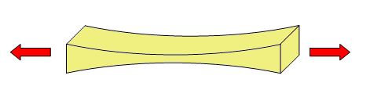
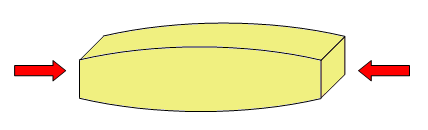
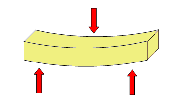

:Date: 10/12/2018
:Modified: 12/01/2026
:Author: Carlos Félix Pardo Martín
:License: Creative Commons Attribution-ShareAlike 4.0 International

.. _estructuras-esfuerzos:

Esfuerzos
=========
Las estructuras están diseñadas para soportar cargas externas sin
deformarse ni romperse. Como consecuencia de estas cargas,
las estructuras experimentan fuerzas internas llamadas **esfuerzos**.

Cargas y esfuerzos
------------------
.. glossary::

   Carga
      Fuerza externa que actúa sobre una estructura.
      Puede ser un peso, un empuje, una dilatación térmica, etc.

   Esfuerzo
      Tensión o fuerza interna
      que aparece en una estructura
      como resultado de las cargas externas.

Por ejemplo, una persona sentada en una silla es una carga para
la silla. Debido a esta carga, las patas de la silla soportan un
esfuerzo de compresión.

Existen 5 tipos de esfuerzos. A continuación se explica cada uno.

:index:`Tracción`
-----------------
El esfuerzo de tracción tiende a **estirar** la estructura:

Ejemplos de elementos que soportan este esfuerzo:

  * Cadenas de un columpio.
  * Cable de una grúa.

:index:`Compresión`
-------------------
El esfuerzo de compresión tiende a **comprimir** la estructura:

Ejemplos de elementos que soportan este esfuerzo:

  * Patas de una silla.
  * Columnas de un edificio.

:index:`Flexión`
----------------
El esfuerzo de flexión tiende a **doblar** la estructura:

Ejemplos de elementos que soportan este esfuerzo:

  * Tablero de una silla.
  * Suelos de edificios.
  * Brazo de una grúa.

:index:`Torsión`
----------------
El esfuerzo de torsión tiende a **retorcer** la estructura:

Ejemplos de elementos que soportan este esfuerzo:

  * Eje de un destornillador.
  * Llave al girar.
  * Eje de un grifo.

:index:`Corte o cizalla`
------------------------
El esfuerzo de corte o cizalla tiende a **cortar o deslizar**
una parte de la estructura respecto a la otra:

Ejemplos de elementos que soportan este esfuerzo:

  * Papel cortado con tijeras.
  * Viga horizontal que apoya sobre viga vertical.
  * Tornillo que sujeta un cuadro.

------------------

Ejercicios
----------
#. ¿Qué diferencia existe entre carga y esfuerzo?
#. Escribe tres ejemplos de esfuerzos de tracción.
#. Escribe tres ejemplos de esfuerzos de compresión.
#. Escribe tres ejemplos de esfuerzos de flexión.
#. Escribe tres ejemplos de esfuerzos de torsión.
#. Escribe tres ejemplos de esfuerzos de corte o cizalla.
#. Dibuja y nombra los esfuerzos que aparecen en
   un columpio cuando se sube un niño sobre el asiento.

   .. image:: mecan/_images/mecan-columpio.png
      :width: 340px
      :align: center

#. Analiza los esfuerzos que aparecen en una mesa
   cuando se coloca un peso encima de ella.

#. Analiza los esfuerzos que aparecen en la siguiente grúa
   cuando levanta una carga.

   .. figure:: mecan/_images/mecan-jib-crane.jpg
      :width: 340px
      :align: center

      `Origen de la imagen <https://commons.wikimedia.org/wiki/File:Jib_crane.jpg>`__

Test de la unidad
-----------------

`Test online de esfuerzos en las estructuras.
<../test/es-mecan-esfuerzos.html>`__

Preguntas de la unidad
----------------------
Unidad en formato imprimible, con preguntas.

| :download:`Las estructuras. Formato PDF.
  <mecan/mecan-estructuras.pdf>`
| :download:`Las estructuras. Formato DOC.
  <mecan/mecan-estructuras.doc>`
