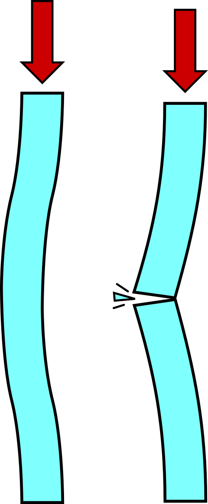

:Date: 10/12/2018
:Modified: 12/01/2026
:Author: Carlos Félix Pardo Martín
:License: Creative Commons Attribution-ShareAlike 4.0 International

.. _estructuras-estabilidad:

Estabilidad
===========
Las estructuras que estamos estudiando, además de ser rígidas
para soportar cargas sin romperse ni deformarse,
deben ser estables para no volcar, doblarse u oscilar ante
las fuerzas externas.

Existen varios problemas que pueden aparecer en una estructura
cuando no es suficientemente estable.
A continuación se explican los más comunes.

:index:`Vuelco`
---------------
El vuelco de una estructura se produce cuando su centro de
gravedad no se encuentra dentro de la base de apoyo.

:index:`Centro de gravedad`:
   Es el punto donde se concentra toda la masa de la estructura.
   Es el lugar donde, si la apoyamos, no caerá hacia ningún lado.

   En el caso de un martillo, por ejemplo, el centro de gravedad está
   en el mango, muy cerca de la cabeza, que es la parte más pesada.

   .. image:: mecan/_images/centro-gravedad-02.png
      :width: 240px
      :alt: Camión sin inclinación. Estable.

   .. image:: mecan/_images/centro-gravedad-03.png
      :width: 240px
      :alt: Camión críticamente estable.

   .. image:: mecan/_images/centro-gravedad-04.png
      :width: 240px
      :alt: Camión inestable.

   En el camión de la figura, el centro de gravedad está marcado
   con un punto rojo y se encuentra bastante alto.

   En la primera imagen, el centro de gravedad cae dentro de la
   base de apoyo, por lo que el camión es estable.

   En la segunda imagen, el camión está inclinado y el centro de
   gravedad está a punto de salir de la base. Está cerca de volcar.

   En la tercera imagen, el centro de gravedad ya no está sobre la
   base de apoyo. En este caso el camión es inestable y volcará.

Para que se produzca el **vuelco**, el centro de gravedad debe caer
fuera de la zona de apoyo de la estructura sobre el suelo.

Soluciones al vuelco
--------------------
Existen varias formas de evitar que una estructura vuelque.

Añadir un contrapeso
   Cuando una estructura se inclina demasiado hacia un lado,
   un contrapeso colocado en el lado contrario puede equilibrarla.

   Ejemplo: Contrapesos en las grúas de obra o en los camiones-grúa.

   .. figure:: mecan/_images/mecan-grua-obra.jpg
      :width: 640px
      :align: center

      Grúa de obra con contrapeso a la izquierda.

      Imagen de `Photomix <https://pixabay.com/es/users/photomix-company-1546875/>`__
      en `Pixabay <https://pixabay.com/es/photos/edificio-grua-sitio-de-construcci%c3%b3n-1804030/>`__.

Ampliar la base de apoyo
   Cuanto mayor sea la base de apoyo, más difícil será que el centro
   de gravedad salga de ella.

   Ejemplos: Camiones grúa con apoyos extensibles.
   Coches deportivos muy anchos.
   Las personas separan los pies para aumentar su estabilidad
   cuando el suelo se mueve.

   .. figure:: mecan/_images/mecan-camion-grua-bomberos.jpg
      :width: 420px
      :align: center

      Camión de bomberos con grúa y apoyos extensibles.

      Imagen de `Hermann Kollinger <https://pixabay.com/es/users/kollinger-15617407/>`__
      en `Pixabay <https://pixabay.com/es/photos/bomberos-pesado-r%c3%bcstfahrzeug-srf-5211377/>`__.

Bajar el centro de gravedad
   Cuanto más bajo esté el centro de gravedad, más difícil será que
   salga de la base de apoyo.

   Ejemplos: En un camión, colocar los objetos pesados abajo y los
   ligeros arriba.
   Los coches deportivos son bajos para tener un centro de gravedad
   bajo y ser más estables.

   .. figure:: mecan/_images/mecan-coche-carreras.jpg
      :width: 480px
      :align: center

      Fórmula 1 con centro de gravedad muy bajo.

      Imagen de `Nathan Wright <https://pixabay.com/es/users/cozmicphotos-2999334/>`__
      en `Pixabay <https://pixabay.com/es/photos/f1-coche-carreras-raza-velocidad-2722971/>`__.

Anclar la estructura al suelo
   Esta solución consiste en unir la estructura al suelo para
   aumentar su estabilidad.

   Ejemplos: Vientos de una tienda de campaña.
   Cables de anclaje de una antena.
   Farolas o mástiles fijados al suelo.

   .. figure:: mecan/_images/mecan-antenas-radio.jpg
      :width: 480px
      :align: center

      Antenas de radio con vientos para anclarlas al suelo.

      Imagen de `LoggaWiggler <https://pixabay.com/es/users/loggawiggler-15/>`__
      en `Pixabay <https://pixabay.com/es/photos/antenas-parab%c3%b3licas-inal%c3%a1mbrico-43232/>`__.

:index:`Pandeo`
---------------

El `pandeo <https://es.wikipedia.org/wiki/Pandeo>`__ es una inestabilidad
que se produce en barras y columnas **esbeltas** sometidas a compresión.

Cuando una barra es muy larga y estrecha (esbelta), corre el riesgo de
doblarse y perder resistencia. Si el pandeo continúa, la barra puede
llegar a partirse y fallar.

Soluciones al pandeo
--------------------

Hacer el perfil más grueso
   Si aumentamos el grosor del perfil de la barra o columna,
   dejará de ser esbelta y no pandeará.

   Por ejemplo, un tubo grueso con paredes finas puede ser más
   resistente al pandeo que una barra maciza del mismo peso.
   Por eso las bicicletas usan **barras tubulares** y las torres
   eléctricas emplean **barras en forma de L**.

Sujetar el centro de la barra
   Si se sujeta la barra por el centro para impedir que se mueva,
   el pandeo no llegará a producirse.

   Por ejemplo, una torre de alta tensión tiene cuatro barras
   verticales esbeltas y otras barras horizontales y oblicuas
   que las unen y evitan que puedan pandear.

Oscilaciones
------------
Las oscilaciones o vibraciones de una estructura pueden ser
beneficiosas o perjudiciales.

En algunos casos conviene que la estructura no sea completamente
rígida. Si puede flexionarse y oscilar ante una carga externa,
evita romperse. Esto ocurre en los rascacielos durante un terremoto
o con vientos fuertes.
Los mástiles de los barcos y las alas de los aviones también
oscilan para adaptarse a los esfuerzos.

En otros casos, las oscilaciones pueden aumentar poco a poco,
como en un columpio, hasta que la estructura se desmorona.
Esto ocurrió en el famoso puente de
`Tacoma Narrows
<https://es.wikipedia.org/wiki/Puente_de_Tacoma_Narrows>`__,
apodado *Gallopin' Gertie* por sus grandes oscilaciones.
Un viento de solo 64 km/h lo derribó pocos meses después de su
inauguración, sin causar víctimas.

Puedes ver una grabación del suceso en YouTube:

* Vídeo: `Tacoma Narrows Bridge Collapse "Gallopin' Gertie".
  <https://www.youtube-nocookie.com/embed/j-zczJXSxnw>`__

Las oscilaciones también pueden producir ruidos y vibraciones
molestas, especialmente cuando coinciden con la **frecuencia de
resonancia** de la estructura. Si una vibración se repite a esa
frecuencia, la oscilación puede aumentar mucho.

Soluciones a las oscilaciones
-----------------------------

Evitar las cargas oscilantes
   Esta solución la aplican los soldados al cruzar un puente poco
   rígido: dejan de caminar al mismo ritmo para evitar que el puente
   entre en resonancia [#f1]_ .

Amortiguar la estructura
   En vehículos y en edificios resistentes a terremotos se utilizan
   **amortiguadores**, que absorben la energía de las oscilaciones y
   reducen la resonancia.

* Vídeo: `amortiguador de masa sintonizada
  <https://www.youtube-nocookie.com/embed/7SCUGTA8xEI>`__

* Vídeo: `ejemplo didactico de estructura sismo resistente.
  <https://www.youtube-nocookie.com/embed/QUI7acilEJo>`__

Ejercicios
----------
#. Explica con tus palabras qué diferencia hay entre **estabilidad** y 
   **rigidez** en una estructura.
#. ¿Qué problemas de estabilidad pueden tener las estructuras?
#. ¿Cuándo vuelca una estructura?
   ¿Qué es el centro de gravedad de una estructura?
#. Dibuja una estructura poco estable al vuelco y otra que sea muy estable
   al vuelco.
#. ¿Qué soluciones hay para evitar que una estructura vuelque?
   Escribe un ejemplo de cada una.
#. Piensa en una estantería alta y estrecha. Enumera todos los problemas
   de estabilidad que puede tener y cómo los puedes solucionar.
#. ¿Qué es el pandeo?
#. ¿Qué soluciones hay para evitar el pandeo?
   Escribe un ejemplo de cada una.
#. En una torre de alta tensión, identifica qué elementos evitan el pandeo  
   y cuáles evitan el vuelco.
#. ¿Cómo se pueden evitar las oscilaciones perjudiciales en una
   estructura?
#. ¿Qué es un amortiguador y para qué sirve?

Test de la unidad
-----------------

`Test online de estabilidad de las estructuras.
<../test/es-mecan-estabilidad.html>`__

Preguntas de la unidad
----------------------
Unidad en formato imprimible, con preguntas.

| :download:`Las estructuras. Formato PDF.
  <mecan/mecan-estructuras.pdf>`
| :download:`Las estructuras. Formato DOC.
  <mecan/mecan-estructuras.doc>`

-------------

.. rubric:: Notas

.. [#f1] El `puente de Broughton
         <http://www.wikivia.org/wikivia/index.php?title=Puente_de_Broughton_(colapso_estructural)>`__
         fue un puente de suspensión en Manchester, Inglaterra, que en 1831
         colapsó a raíz del paso de una tropa de soldados caminando en
         formación.
