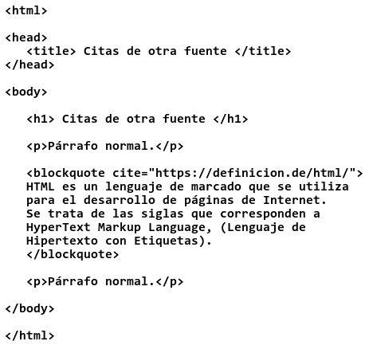
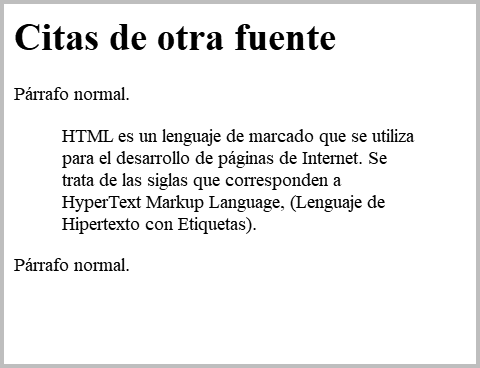

:date: 2018-12-13
:author: Carlos Félix Pardo Martín
:license: Creative Commons Attribution-ShareAlike 4.0 International

.. _html-blockquote:

Bloque de cita externa
======================

Etiquetas utilizadas
--------------------
``<blockquote cite="http://"> </blockquote>``
   Etiqueta que incluye una sección de texto que se ha
   copiado de otra página.
   La etiqueta blockquote contiene un atributo cite que
   describe la dirección de donde se ha tomado el texto.
   Normalmente esta sección aparece desplazada hacia la derecha.

Código de la página
-------------------

.. `Editor online de código HTML <https://html5-editor.net/>`__

Resultado
---------

