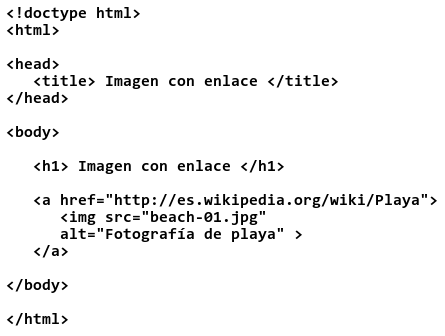

:Date: 13/12/2018
:Author: Carlos Félix Pardo Martín
:License: Creative Commons Attribution-ShareAlike 4.0 International

.. _html-combine2:

Combinar etiquetas imagen y link
================================
Estas etiquetas se pueden combinar entre sí para conseguir
ambos efectos.

En este Ejercicio HTML se insertará una imagen dentro de un
hipervínculo. Al pinchar sobre la imagen, el navegador saltará
a otra página.

Código de la página
-------------------

| Imágenes para descargar.
| :download:`Playa. <html/_images/beach-01.jpg>`

.. `Editor online de código HTML <https://html5-editor.net/>`__

Resultado
---------

