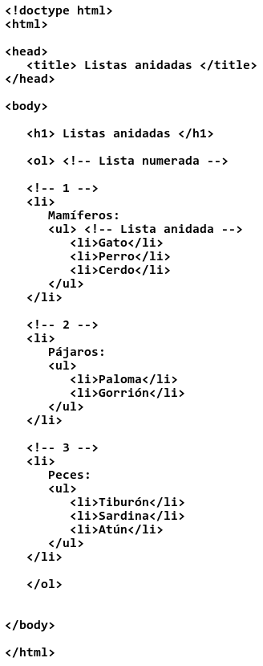

:Date: 13/12/2018
:Author: Carlos Félix Pardo Martín
:License: Creative Commons Attribution-ShareAlike 4.0 International

.. _html-combine3:

Listas anidadas
===============
Las listas se pueden combinar para hacer listas de listas.
La mayoría de las páginas web suelen agrupar los elementos del
menú de esta manera.

En esta práctica veremos cómo realizar una lista de animales
con jerarquía.

Código de la página
-------------------

.. `Editor online de código HTML <https://html5-editor.net/>`__

Resultado
---------

