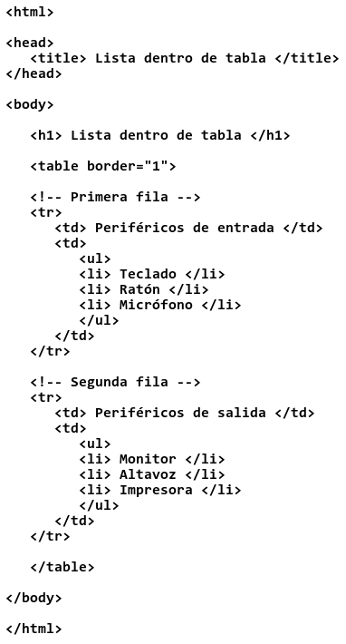
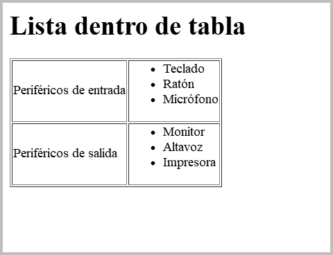

:date: 2018-12-13
:modified: 2026-06-13
:author: Carlos Félix Pardo Martín
:license: Creative Commons Attribution-ShareAlike 4.0 International
:license_url: https://creativecommons.org/licenses/by-sa/4.0/

.. _html-combine4:

Combinar etiquetas lista y tabla
================================

Estas etiquetas se pueden combinar para conseguir varios efectos
simultáneos.
En este Ejercicio HTML se insertará una lista dentro de una tabla.

Código de la página
-------------------

.. `Editor online de código HTML <https://html5-editor.net/>`__

Resultado
---------

