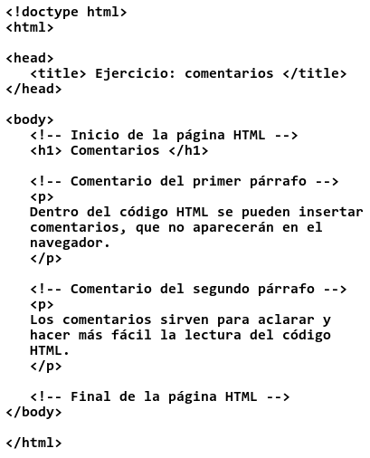
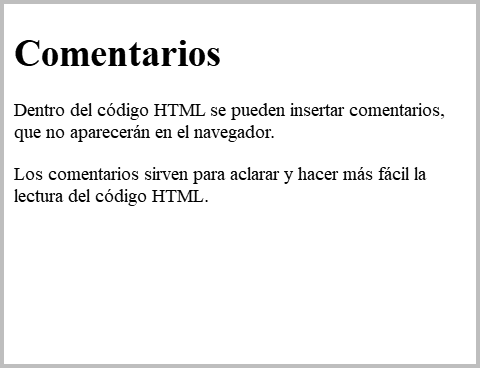

:Date: 13/12/2018
:Author: Carlos Félix Pardo Martín
:License: Creative Commons Attribution-ShareAlike 4.0 International

.. _html-comment:

Comentarios
===========

Etiquetas utilizadas
--------------------

``<!-- comentario -->``
   Etiqueta para incluir un comentario dentro del código HTML.
   Los comentarios sirven para explicar el código HTML pero
   no se visualizarán en la página web.

Código de la página
-------------------

.. `Editor online de código HTML <https://html5-editor.net/>`__

Resultado
---------

