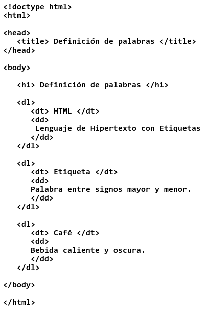
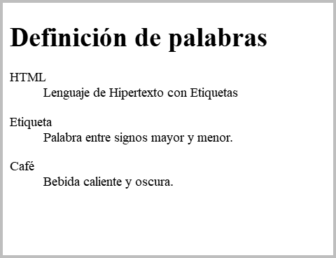

:Date: 13/12/2018
:Author: Carlos Félix Pardo Martín
:License: Creative Commons Attribution-ShareAlike 4.0 International

.. _html-definition:

Definición de palabras
======================

Etiquetas utilizadas
--------------------
``<dl> </dl>``
   Etiqueta de definición de palabras.

``<dt> </dt>``
   Palabra a definir.

``<dd> </dd>``
   Definición de una palabra.

Código de la página
-------------------

.. `Editor online de código HTML <https://html5-editor.net/>`__

Resultado
---------

