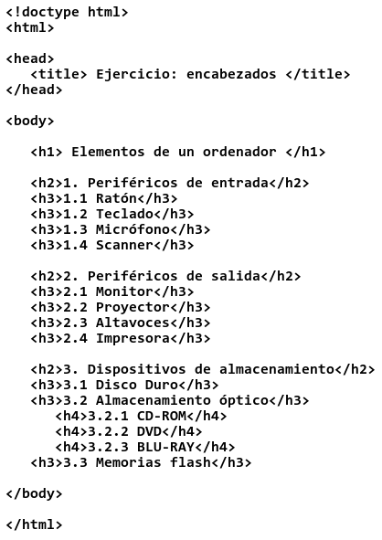
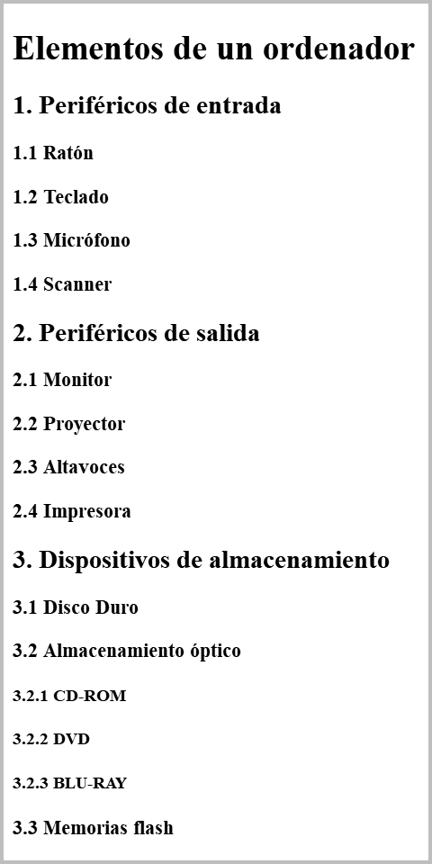

:Date: 13/12/2018
:Author: Carlos Félix Pardo Martín
:License: Creative Commons Attribution-ShareAlike 4.0 International

.. _html-head:

Encabezados de distintos niveles
================================
En esta práctica veremos cómo estructurar un contenido con
encabezados de diferente nivel.

En una misma página web no es recomendable utilizar más de cuatro
niveles de encabezados. El objetivo de los encabezados es
estructurar el contenido para que sea más sencillo de comprender.
Si se utilizan demasiadas divisiones, la comprensión se hace más
difícil.

Etiquetas utilizadas
--------------------
``<h1> </h1>``
   Encabezado de primer nivel. Equivale a un título de capítulo.

``<h2> </h2>``
   Encabezado de segundo nivel. Equivale a un título de sección.

``<h3> </h3>``
   Encabezado de tercer nivel. Equivale a un título de subsección.

``<h4> </h4>``
   Encabezado de cuarto nivel.

Código de la página
-------------------

.. `Editor online de código HTML <https://html5-editor.net/>`__

Resultado
---------

