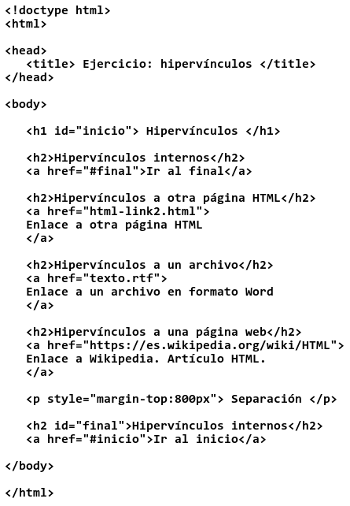
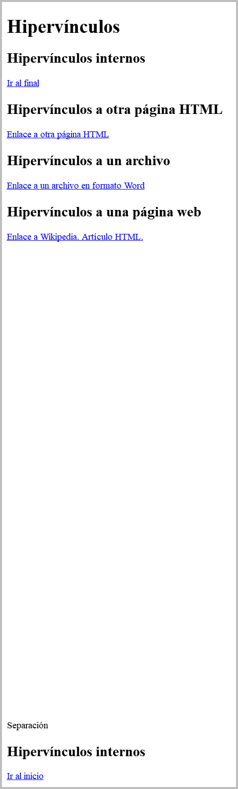

:Date: 13/12/2018
:Author: Carlos Félix Pardo Martín
:License: Creative Commons Attribution-ShareAlike 4.0 International

.. _html-link:

Hipervínculos
=============
Los hipervínculos son enlaces desde un documento a otro documento o
a otra parte del mismo documento y permiten navegar entre documentos
con facilidad.

La letra H del nombre HTML se refiere a los Hipervínculos.

Etiquetas utilizadas
--------------------

``<a href="salto"> Texto </a>``
   Hipervínculo. En el navegador aparecerá el texto que se encuentra
   entre las etiquetas. Al pinchar sobre el texto, saltará a la
   referencia que contiene href.

``id="nombre"``
   Este atributo aparece dentro de una etiqueta para darle nombre.
   el nombre tiene que ser único y no repetirse, para distinguir
   las etiquetas entre sí.

| Archivos para descargar y pegar en el mismo directorio que la
  página html que estamos escribiendo.
| :download:`texto.rtf <html/texto.rtf>`
| :download:`html-link2.html <html/html-link2.html>`

Código de la página
-------------------

.. `Editor online de código HTML <https://html5-editor.net/>`__

Resultado
---------

