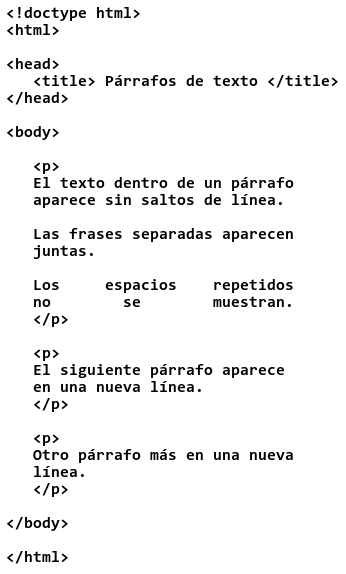

:Date: 13/12/2018
:Author: Carlos Félix Pardo Martín
:License: Creative Commons Attribution-ShareAlike 4.0 International

.. _html-paragraph:

Párrafos de texto
=================
Los párrafos agrupan palabras y frases que se muestran
juntas. Todos los espacios y nuevas líneas dentro de
un párrafo se eliminan.

Los párrafos siempre terminan en un punto y aparte
por lo que al final del párrafo se muestra una nueva
línea.

Etiquetas utilizadas
--------------------

``
 
``
   Etiqueta de párrafo. Engloba un párrafo de texto con varias
   frases consecutivas. Terminan en un punto y aparte.

.. `Editor online de código HTML <https://html5-editor.net/>`__

Código de la página
-------------------

Resultado
---------

