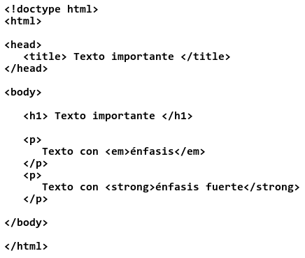
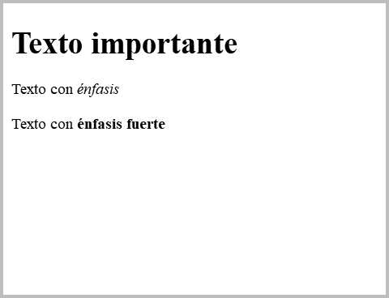

:Date: 13/12/2018
:Author: Carlos Félix Pardo Martín
:License: Creative Commons Attribution-ShareAlike 4.0 International

.. _html-strong:

Etiquetas de énfasis
====================
El texto destacado o las palabras clave se pueden indicar con
dos etiquetas preparadas para ese cometido <em> y <strong>.

Etiquetas utilizadas
--------------------
``<em> </em>``
   Texto destacado con énfasis.
   El tipo de letra será *itálica*.

``<strong> </strong>``
   Texto importante con énfasis fuerte.
   El tipo de letra será **negrita**.

Código de la página
-------------------

.. `Editor online de código HTML <https://html5-editor.net/>`__

Resultado
---------

