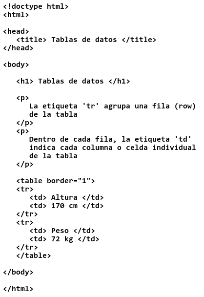
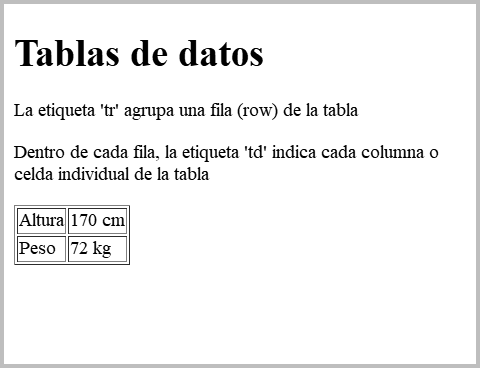
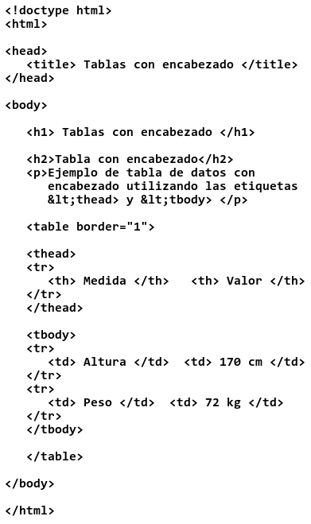
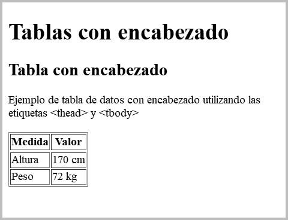

:Date: 13/12/2018
:Author: Carlos Félix Pardo Martín
:License: Creative Commons Attribution-ShareAlike 4.0 International

.. _html-table1:

Tablas de datos
===============

``<table> </table>``
   Etiqueta de tabla.

``<thead> </thead>``
   Etiqueta la cabecera de una tabla.
   Está en la primera fila de una tabla.

``<tr> </tr>``
   Etiqueta una fila dentro de una tabla.

``<th> </th>``
   Etiqueta cada uno de los elementos de una cabecera de tabla.

``<tbody> </tbody>``
   Cuerpo de una tabla, donde se encuentran los contenidos de la
   tabla. Permite separar la cabecera de los contenidos.

``<td> </td>``
   Etiqueta un elemento de una tabla. Debe estar dentro de una fila.

``<!-- comentario -->``
   Etiqueta para incluir un comentario dentro del código HTML.
   Los comentarios sirven para explicar el código HTML pero
   no se visualizarán en la página web.

Código de una tabla simple
--------------------------

Plantilla de tabla de datos sin cabecera.

.. code-block:: html

   <table border="1">
      <tbody>
         <tr>
            <td>Uno</td>  <td> 1 </td>
         </tr>
         <tr>
            <td>Dos</td>  <td> 2 </td>
         </tr>
      </tbody>
   </table>

.. `Editor online de código HTML <https://html5-editor.net/>`__

Resultado
---------

Código de una tabla con encabezado
----------------------------------

Plantilla de tabla de datos con cabecera.

.. code-block:: html

   <table border="1">
      <thead>
         <tr>
            <th>Columna 1</th>  <th>Columna 2</th>
         </tr>
      </thead>

      <tbody>
         <tr>
            <td>Uno</td>  <td> 1 </td>
         </tr>
         <tr>
            <td>Dos</td>  <td> 2 </td>
         </tr>
      </tbody>
   </table>

.. `Editor online de código HTML <https://html5-editor.net/>`__

Resultado
---------

