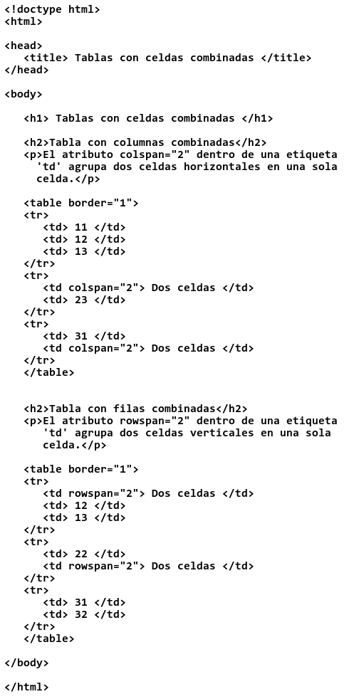
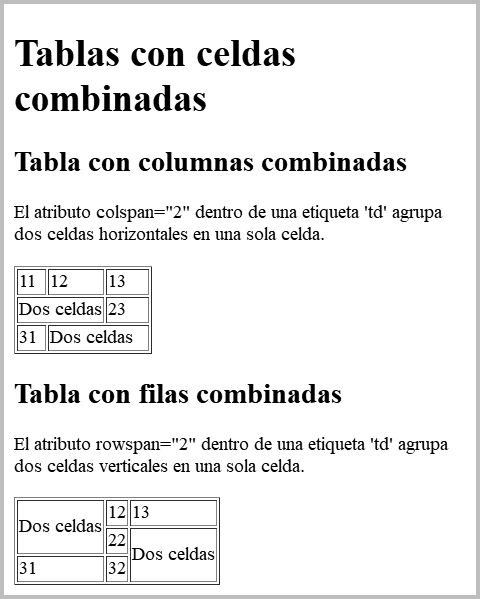

:Date: 13/12/2018
:Author: Carlos Félix Pardo Martín
:License: Creative Commons Attribution-ShareAlike 4.0 International

.. _html-table2:

Unir celdas de una tabla
========================

Etiquetas utilizadas
--------------------

``<td rowspan=2>``
   Este atributo aparece dentro de un elemento de tabla <td>.
   Permite unir la celda actual con las celdas de la derecha
   de la misma fila, para hacer una sola celda más grande.

``<td colspan=2>``
   Este atributo aparece dentro de un elemento de tabla <td>.
   Permite unir la celda actual con las celdas de abajo
   de la misma columna, para hacer una sola celda más grande.

Código de la página
-------------------

.. `Editor online de código HTML <https://html5-editor.net/>`__

Resultado
---------

