:Date: 25/04/2025
:Author: Carlos Félix Pardo Martín
:License: Creative Commons Attribution-ShareAlike 4.0 International
:tocdepth: 1

.. informatica-calc-ejercicios:

Ejercicios de Calc
==================
Esta sección consta de 20 ejercicios en los que aplicaremos varios de
los contenidos tratados en las prácticas guiadas.

Crea en el ordenador una carpeta con tu nombre en la que guardaremos
los documentos generados.

.. contents:: Índice de contenidos:
   :local:
   :depth: 2

Ejercicio 1: Lista numerada
---------------------------
En un nuevo archivo de Calc crea a partir de la celda **B2** una lista
vertical de 100 alumnos con el formato ALUMNO 1, ALUMNO 2, ...
ALUMNO 100.
Numera los alumnos en la columna A. A partir de la celda **C1** crea
una lista horizontal de 20 notas con el formato NOTA 1, NOTA 2, ...
NOTA 20.

Dale a la **Columna A** un ancho de 1cm y alinea su contenido a la
derecha.

Dale a la **Columna B** un ancho de 3cm y centra su contenido.

Dale a la **Fila 1** una altura de 2cm y centra su contenido
horizontal y verticalmente.

Guarda el archivo resultante como **"Ejercicio_01_NombreAlumno.ods"**.

.. note::

   Recuerda que ODS es la extensión del archivo por defecto, no es
   necesario que la escribas porque Calc la añade de modo automático.

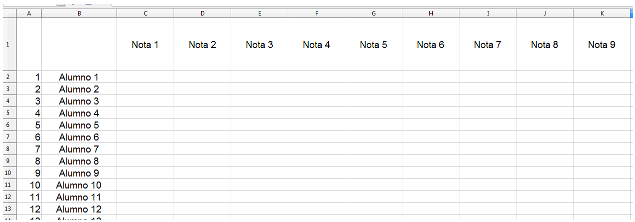

Ejercicio 2: Formato de archivo
-------------------------------
Abre la hoja de cálculo del ejercicio anterior
**"Ejercicio_01_NombreAlumno.ods"** y guárdala como:

   **Ejercicio_02_NombreAlumno.xls** (formato de MS Excel 2003)

   **Ejercicio_02_NombreAlumno.xlsx** (formato de MS Excel 2007)

Ejercicio 3: Formato de celdas
------------------------------
En un nuevo archivo de Calc dale a las celdas señaladas el formato que
observas en la imagen.

Guarda el archivo resultante como **"Ejercicio_03_NombreAlumno.ods"**.

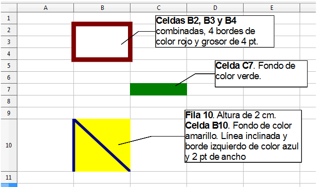

Ejercicio 4: Formato de texto
-----------------------------
En una nueva hoja de cálculo modifica el formato de las celdas y del
texto contenido en ellas tal y como se indica abajo, para obtener un
resultado igual al de la imagen.

Filas 2 y 3: Altura de 3cm.

Ancho de las columnas: B = 1cm, C = 2cm y D = 3cm.

Celdas B2 y B3 combinadas, con texto centrado horizontal y
verticalmente dispuesto en vertical. Formato de texto Arial tamaño
10 puntos, negrita, sombra y color azul.

Texto de la **celda C2** centrado, fuente Arial, tamaño 8 puntos,
estilo cursiva y color verde.

Texto de la **celda D2** alineado a la izquierda, fuente Times
New Roman, tamaño 11 puntos, subrayado.

Texto de la **celda C3** centrado, fuente Arial, tamaño 10 puntos,
negrita y color rojo oscuro.

Texto de la **celda D3** alineado horizontalmente a la derecha y
verticalmente abajo.

Guarda el archivo resultante como **"Ejercicio_04_NombreAlumno.ods"**.

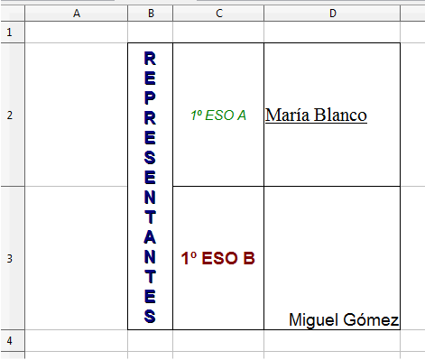

Ejercicio 5: Alquiler de videojuegos
------------------------------------
Imagina que tienes que crear una hoja de cálculo para una tienda de
alquiler de videojuegos. El modelo es el que puedes ver en la imagen
de abajo.

Cuando se introduzcan las fechas de alquiler y de devolución, la hoja
deberá calcular los días de préstamo y el importe a cobrar.

El precio diario normal se aplicará cuando la duración del préstamo
sea igual o inferior a 7 días. Para más días se aplicará el otro
precio.

Daremos a cada celda el formato apropiado (moneda, fecha o número).

Prueba el funcionamiento de la hoja introduciendo diferentes fechas
y precios diarios.

Guarda el archivo resultante como **"Ejercicio_05_NombreAlumno.ods"**.

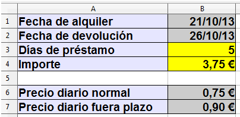

Ejercicio 6: Proteger celdas
----------------------------
Abre el archivo que creaste en la práctica anterior y protege todas
las celdas excepto las celdas **B1** y **B2** (en las que se
introducen las fechas de alquiler y devolución) con la contraseña
**12345**.

Guarda el archivo resultante como **"Ejercicio_06_NombreAlumno.ods"**.

Ejercicio 7: Superficie de los continentes
------------------------------------------
Crea una nueva hoja de cálculo. Renombra la primera hoja como
**"Continentes"**. Introduce un gráfico de columnas a partir de los
siguientes datos:

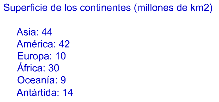

Dale a las celdas y al texto el formato que quieras.

Guarda el archivo resultante como **"Ejercicio_07_NombreAlumno.ods"**.

Ejercicio 8: Superficie de los océanos
--------------------------------------
Abre el archivo del ejercicio anterior. Introduce una nueva hoja
llamada **"Océanos"** e inserta en ella un gráfico de tarta (círculos)
a partir de los siguientes datos:

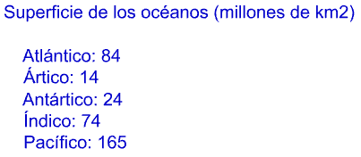

Guarda el archivo resultante como **"Ejercicio_08_NombreAlumno.ods"**
protegido con la contraseña de apertura **12345**.

Ejercicio 9: Ventas de comerciales
----------------------------------
Usando el "pegado especial" copia todo el contenido del documento de
texto `Ejercicio_09.odt <../_static/tutorial-calc/calc/cas/pract/almac/Ejercicio_09.odt>`__
en una nueva hoja de cálculo.
Dale a las celdas y al texto el formato que aparece en la imagen.
Obtén la suma de las ventas anuales de cada comercial y obtén los
valores de ventas "medio", "máximo" y "mínimo" de cada mes.

Guarda el archivo resultante como **"Ejercicio_09_NombreAlumno.ods"**.

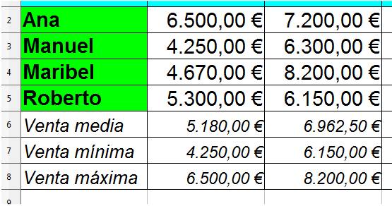

Ejercicio 10: Servicio de Atención Técnica
------------------------------------------
En una hoja de cálculo nueva introduce datos como los de la imagen y
un Fontwork (usa los diseños que quieras). Haz que Calc obtenga el
importe total que será la suma de las horas de servicio por su precio
más el precio del km por su importe. El costo del km tendrá dos
valores, uno para las distancias superiores a 10km y otro para las
inferiores.

Una vez diseñada la hoja introduce datos para probar su funcionamiento.

Guarda el archivo resultante como **"Ejercicio_10_NombreAlumno.ods"**.

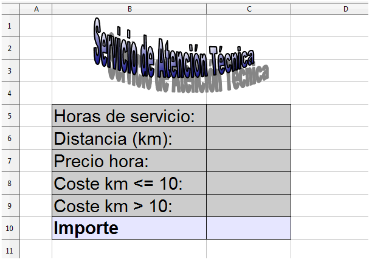

Ejercicio 11: Función logarítmica
---------------------------------
Basándote en la imagen, crea una hoja que proporcione los resultados y
el gráfico de una función logarítmica con base decidida por el usuario.
Personaliza el formato de las tablas y del gráfico.

Guarda el archivo resultante como **"Ejercicio_11_NombreAlumno.ods"**.

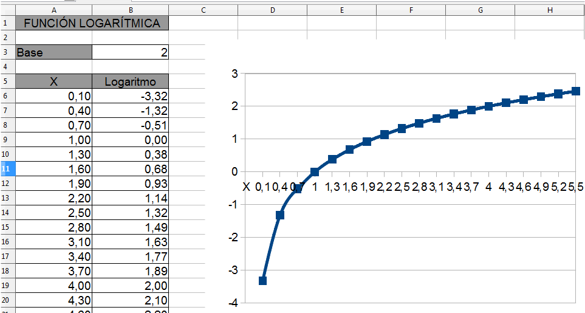

Ejercicio 12: Cálculo de notas
------------------------------
En una nueva hoja de cálculo introduce datos similares a los de la
imagen (usa el formato que quieras).
Introduce las siguientes ponderaciones a las notas:

* Tema 1: 20%
* Tema 2: 20%
* Tema 3: 30%
* Trabajo: 30%

Haz que Calc genere automáticamente las notas (del 1 al 10) y que
calcule la nota final sin decimales.

Guarda el archivo resultante como **"Ejercicio_12_NombreAlumno.ods"**.

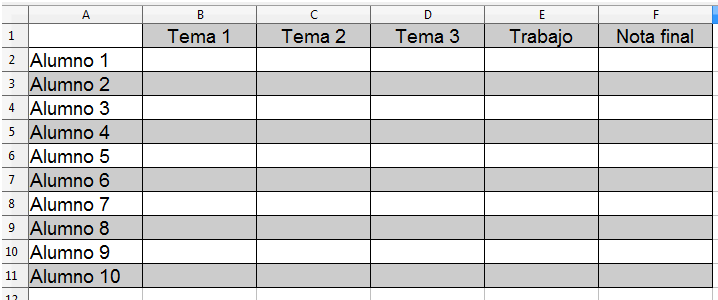

Ejercicio 13: Colores en inglés
-------------------------------
Basándote en la práctica guiada número 23 diseña una hoja de cálculo
en la que el usuario deberá introducir uno de los colores de la lista
y Calc le proporcionará su nombre en inglés.

Guarda el archivo resultante como **"Ejercicio_13_NombreAlumno.ods"**.

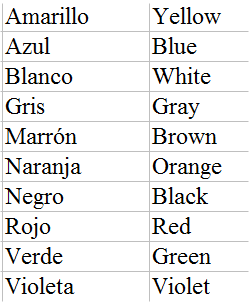

Ejercicio 14: Imágenes, formas e hiperenlaces
---------------------------------------------
En una nueva hoja de cálculo introduce:

* Tu nombre y apellidos en un **"Fontwork"**.
* La imagen `Ejercicio_14.jpg <../_static/tutorial-calc/calc/cas/pract/almac/Ejercicio_14.jpg>`__.
* Una **forma**, la que quieras, de la barra de herramientas de dibujo.

Gira la imagen 45º y ponla de fondo.

En la forma crea un **hiperenlace** a la definición de **"teclado"**
en Wikipedia.

Guarda el archivo resultante como **"Ejercicio_14_NombreAlumno.ods"**.

Ejercicio 15: Temperaturas
--------------------------
Sabiendo que:

* Para pasar de ºC a ºF hay que multiplicar por 9, dividir entre 5
  y después sumar 32.

* Para pasar de ºF a ºC hay que restar 32, después multiplicar por 5
  y al final dividir entre 9.

Crea una hoja de cálculo en la que el usuario introduzca grados
centígrados y Calc proporcione los grados farenheit y viceversa.

Guarda el archivo resultante como **"Ejercicio_15_NombreAlumno.ods"**.

Ejercicio 16: Evolución de la población
---------------------------------------
Copia y pega los datos contenidos en el documento
`Ejercicio_16.odt <../_static/tutorial-calc/calc/cas/pract/almac/Ejercicio_16.odt>`__
en un nuevo archivo de Calc usando el "pegado especial".

Inserta un gráfico (escoge el que consideres más adecuado) y
personalizalo poniéndole fondo, formato de texto, etc.

Guarda el archivo resultante como **"Ejercicio_16_NombreAlumno.ods"**.

Ejercicio 17: Ordenar datos
---------------------------
Abre el archivo `Ejercicio_17.ods <../_static/tutorial-calc/calc/cas/pract/almac/Ejercicio_17.ods>`__
que contiene cuatro hojas.
Copia y pega la lista de alumnos y notas de la primera hoja en las otras
tres hojas y ordena como sigue estos datos:

* Hoja "alfabético": orden alfabético **ascendente**.
* Hoja "mate": orden **ascendente** por la nota de matemáticas.
* Hoja "física": orden **descendente** primero por la nota de física y
  segundo por la nota de ciencias.
* Hoja "ciencias": orden **ascendente** primero por la nota de ciencias,
  segundo por la nota de física y tercero por la nota de matemáticas.

Guarda el archivo resultante como **"Ejercicio_17_NombreAlumno.ods"**.

Ejercicio 18: Filtrar datos
---------------------------
Abre el archivo `Ejercicio_18.ods <../_static/tutorial-calc/calc/cas/pract/almac/Ejercicio_18.ods>`__.

Imagina que contiene datos de los usuarios de una red social.
Usa el filtro para contestar a la información que se solicita en las
cuestiones de las tres primeras filas.

Una vez contestadas las cuestiones, guarda el archivo resultante como
**"Ejercicio_18_NombreAlumno.ods"**.

Ejercicio 19: Evaluación
------------------------
Abre el archivo que creaste en el ejercicio 12. Después de la columna de
"Nota final" añade la columna **"Evaluación"** en la que Calc deberá
poner, en función del valor de la "Nota final":

* "Insuficiente" si la nota es menor de 5.
* "Suficiente" si la nota es igual o superior a 5 e inferior a 6.
* "Bien" si la nota es igual o superior a 6 e inferior a 7.
* "Notable" si la nota es igual o superior a 7 e inferior a 9.
* "Sobresaliente" si la nota es igual o mayor que 9.

Pulsa la combinación de teclas SHIFT+CTRL+F9 para
probar el funcionamiento de la hoja de cálculo.

Guarda el archivo resultante como **"Ejercicio_19_NombreAlumno.ods"**.

Ejercicio 20: Formato condicional
---------------------------------
Abre el archivo generado en el ejercicio anterior y crea cinco nuevos
estilos de celda: insuficiente, suficiente, bien, notable y sobresaliente.
Cada estilo tendrá un formato de celda (bordes, color, etc.) y de texto
(fuente, tamaño, etc.) distinto del resto.

Usando el formato condicional aplica los nuevos estilos a las celdas de
la columna "Evaluación".
Pulsa la combinación de teclas SHIFT+CTRL+F9 para
probar el funcionamiento de la hoja de cálculo.

Guarda el archivo resultante como **"Ejercicio_20_NombreAlumno.ods"**.

Créditos
--------

Autor de los ejercicios originales: José Manuel Blanco Guimarey

Licencia: `Creative Commons BY-NC-SA <https://creativecommons.org/licenses/by-nc-sa/4.0/>`__

Fuente: `Ejercicios propuestos <../_static/tutorial-calc/calc/index.html>`__

Créditos del tutorial: `Créditos <../_static/tutorial-calc/calc/docs/creditos.html>`__
