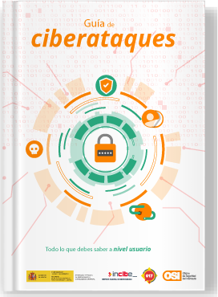
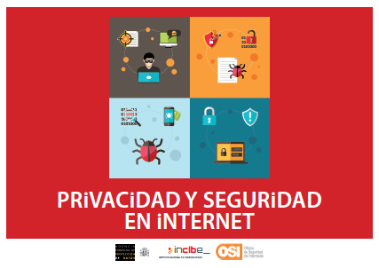

:Date: 24/06/2021
:Author: Carlos Félix Pardo Martín
:License: Creative Commons Attribution-ShareAlike 4.0 International
:tocdepth: 1

.. informatica-ciberseguridad-guias:

Guías de ciberseguridad
=======================
Diversas guías sobre ciberseguridad.

Guía de navegación segura
-------------------------
Guía para el alumnado sobre una navegación segura por Internet.

`Guía para navegación segura.
<../_static/document/guia-navegacion-segura.pdf>`__

Autor de la guía
   Directoras: Isabel Serrano Maillo (UCM), Esther Martínez Pastor (URJC).
   
   Equipo: Isabel Serrano Maillo (UCM), Esther Martínez Pastor (URJC), 
   Ángela Moreno Bobadilla (UCM), Mª Ángeles Blanco Ruiz (URJC),
   Mª Dolores Serrano Tárraga (UNED), Jorge Abaurrea Velarde (UCM).

   © Comunidad de Madrid

Sitio web
   `Revista Digital Educamadrid 
   <https://www.educa2.madrid.org/web/revista-digital/inicio/-/visor/guia-para-el-alumnado-sobre-una-navegacion-segura>`__

Guía de ciberataques
--------------------
Guía de ciberataques a nivel usuario.

`Guía de ciberataques. 
<../_static/document/ciberataques-guia-osi.pdf>`__

Autor de la guía
   La presente publicación pertenece al
   Instituto Nacional de Ciberseguridad (INCIBE) y al
   servicio de la Oficina de Seguridad del Internauta (OSI).

Sitios web
  * https://www.incibe.es
  * https://www.osi.es

Licencia
   `Creative Commons
   Reconocimiento-No comercial-CompartirIgual 4.0 Internacional
   <https://creativecommons.org/licenses/by-nc-sa/4.0/>`__

`Web origen del tutorial <https://www.osi.es/es/guia-ciberataques>`__

Guía de Privacidad y Seguridad en Internet
------------------------------------------

`Guía de Privacidad y Seguridad en Internet.
<../_static/document/guia-privacidad-seguridad-internet.pdf>`__

Autor de la guía
   La presente es una publicación conjunta pertenece a la
   Agencia Española de Protección de Datos (AEPD) y al
   Instituto Nacional de Ciberseguridad (INCIBE).

Licencia
   `Creative Commons
   Reconocimiento-No comercial-CompartirIgual 3.0 Internacional
   <https://creativecommons.org/licenses/by-nc-sa/3.0/>`__

Sitios web
  * `Agencia Española de Protección de Datos (AEPD)
    <https://www.aepd.es/es/prensa-y-comunicacion/blog/la-guia-de-privacidad-y-seguridad-en-Internet-de-la-aepd-e-incibe-se>`__
  * `Oficina de Seguridad del Internauta (OSI)
    <https://www.osi.es/es/guia-de-privacidad-y-seguridad-en-Internet>`__
