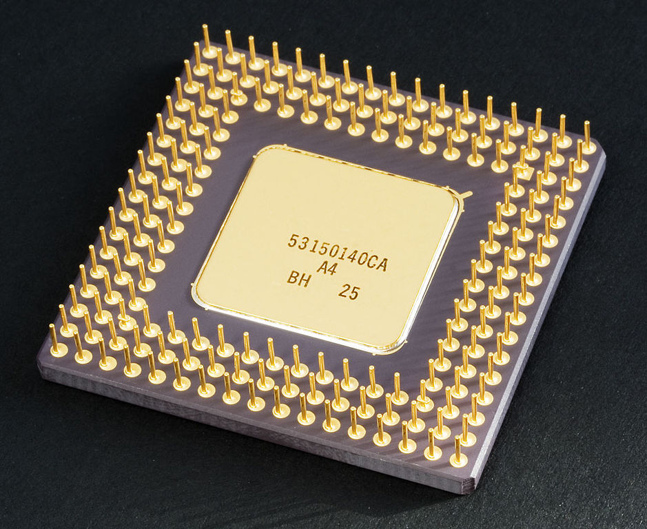

:Date: 08/06/2022
:Author: Carlos Félix Pardo Martín
:License: Creative Commons Attribution-ShareAlike 4.0 International

.. informatica-hardware-cpu:

Procesadores
============
Los procesadores son el "cerebro" de los ordenadores, los componentes
que realizan las operaciones dictadas por los programas o aplicaciones.

Los tipos de procesadores más habituales son la CPU y la GPU, aunque
hay algunos más que se estudiarán a continuación como la TPU, el DSP,
los microcontroladores o la FPGA.

.. contents:: Índice de contenidos:
   :local:
   :depth: 2

Unidad central de procesamiento (:index:`CPU`)
----------------------------------------------
Una `CPU o unidad central de procesamiento
<https://es.wikipedia.org/wiki/Unidad_central_de_procesamiento>`__,
también llamada **microprocesador**, es un componente de ordenador
dedicado a interpretar las instrucciones de los programas informáticos.
Pueden realizar operaciones lógicas, aritméticas y de movimiento de datos.

Es el componente más complejo de un ordenador.
Una CPU de ordenador personal, en 2022, tiene
de `25 000 millones a 100 000 millones de transistores
<https://en.wikipedia.org/wiki/Transistor_count>`__.

Las CPU más conocidas y usadas en la actualidad son las de
la empresa Intel (i3, i5, i7, i9, Xeon) o
las de la empresa AMD (Ryzen)
para ordenadores personales y servidores.

Los teléfonos inteligentes, tabletas, televisores y otros dispositivos
inteligentes (smart) utilizan CPU basadas en arquitectura ARM
(Dimensity, Snapdragon, Kirin, etc.)

   CPU 80486DX típica de los PC de mediados de los años 90.

   `Solipsist <https://commons.wikimedia.org/wiki/File:Intel_80486DX2_bottom.jpg>`__,
   `CC BY-SA 2.0 Generic <https://creativecommons.org/licenses/by-sa/2.0/deed.en>`__,
   via Wikimedia Commons.

Coprocesador matemático (:index:`FPU`)
--------------------------------------
El `coprocesador matemático o unidad de coma flotante
<https://es.wikipedia.org/wiki/Unidad_de_coma_flotante>`__
es un tipo de procesador que está especializado en realizar operaciones
matemáticas en coma flotante (con decimales), tales como multiplicaciones
divisiones, operaciones trigonométricas, logaritmos y exponenciales.

En sus comienzos eran circuitos separados de la CPU, pero hoy en día
se encuentran integradas dentro del mismo chip de las CPU más potentes.

Este coprocesador o FPU permite acelerar los programas que necesitan
realizar gran cantidad de operaciones matemáticas tales como los
programas de diseño por ordenador en 2 y en 3 dimensiones, los
programas de hojas de cálculo o el software científico.

Hay coprocesadores especializados en realizar operaciones matemáticas
orientadas a multimedia (MMX) que aceleran la compresión y descompresión
de audio y vídeo. Gracias a estos coprocesadores, los programas de edición
o de visualización de vídeo pueden trabajar velozmente y sin problemas
en alta definición.

Unidad de procesamiento gráfico (:index:`GPU`)
----------------------------------------------
Una `GPU o unidad de procesamiento gráfico
<https://es.wikipedia.org/wiki/Unidad_de_procesamiento_gr%C3%A1fico>`__
es un procesador especializado, dedicado a calcular gráficos de forma
intensiva para aligerar la carga del procesador central.
Es capaz de calcular muy rápido operaciones de dibujo en tres dimensiones
tales como el antialiasing (suavizar bordes de las figuras)
dibujar triángulos, cuadrados, elipses, etc.

:index:`Tarjeta gráfica`
   La mayoría de las CPUs actuales tienen ya integradas pequeñas GPUs
   con una capacidad limitada para manejar gráficos. Es suficiente para
   manejar programas ofimáticos o navegar por Internet, pero no tienen
   bastante capacidad para manejar videojuegos, programas de diseño, etc.
   Por esa razón en los ordenadores de mayor potencia se utilizan
   `tarjetas gráficas
   <https://es.wikipedia.org/wiki/Tarjeta_gr%C3%A1fica>`__
   especializadas, que llegan a consumir mucha más potencia eléctrica que
   la propia CPU y realizan un mayor número de operaciones por segundo.

.. figure:: informatica/_images/informatica-tarjeta-video.jpg
   :align: center
   :width: 480px

   Tarjeta gráfica Radeon HD 5570.

   `Evan-Amos <https://commons.wikimedia.org/wiki/File:Sapphire-Radeon-HD-5570-Video-Card.jpg>`__,
   Public Domain, via Wikimedia Commons.

Unidad de procesamiento tensorial (:index:`TPU`)
------------------------------------------------
Una `TPU o unidad de procesamiento tensorial
<https://es.wikipedia.org/wiki/Unidad_de_procesamiento_tensorial>`__
es un procesador dedicado al cálculo intensivo de operaciones de
redes neuronales, usadas en Inteligencia Artificial.

El término TPU se utiliza por Google para un circuito inventado por la
empresa, pero cada vez más circuitos incorporan capacidades semejantes
para el cálculo de redes neuronales, por ejemplo, en los teléfonos
inteligentes.

Esta unidad TPU acelera procesos tales como el reconocimiento facial,
el procesamiento de voz u otras operaciones basadas en inteligencia
artificial.

Procesador de señales digitales (:index:`DSP`)
----------------------------------------------
Un `DSP o procesador de señales digitales
<https://es.wikipedia.org/wiki/Procesador_de_se%C3%B1ales_digitales>`__
es un procesador especializado en ejecutar operaciones numéricas
relacionadas con el tratamiento de señales, a muy alta velocidad.

Sus aplicaciones típicas son el tratamiento en tiempo real de señales de
audio, voz, imagen, vídeo, etc.
Con estas aplicaciones se puede eliminar el eco en las líneas de
comunicación, hacer más claras las imágenes de órganos en los equipos de
diagnóstico médico por ultrasonidos o por resonancia magnética,
realizar ajustes de **auto-tune** en la voz de los cantantes,
decodificar canciones en los reproductores mp3, comprimir fotografías
en cámaras digitales, y una larga lista de aplicaciones que están
relacionadas con el proceso de señales.

:index:`Microcontroladores`
---------------------------
Un `microcontrolador <https://es.wikipedia.org/wiki/Microcontrolador>`__
es un pequeño ordenador contenido en un solo chip.
Incorpora la CPU, la memoria RAM, memoria Flash ROM y periféricos de
entrada/salida en un espacio pequeño y a bajo precio.

Estos procesadores se utilizan para controlar periféricos tales como
el teclado, el ratón, la cámara web, el monitor, los discos duros, etc.

Gracias a los microcontroladores, la CPU principal del ordenador se
descarga de las tareas de control de los periféricos, que serían muy
costosas en tiempo y recursos si tuviera que administrarlas directamente.

Otra aplicación de los microcontroladores es automatizar con una pequeña
capacidad de cálculo dispositivos cotidianos como el microondas, la
lavadora, el ABS de un automóvil, una cerradura electrónica, etc.

:index:`FPGA`
-------------
Una `FPGA
<https://es.wikipedia.org/wiki/Field-programmable_gate_array>`__
es un procesador basado en puertas lógicas programables.
Todos los procesadores y todos los circuitos digitales están hechos de
puertas lógicas. En el caso de las FPGA, estas puertas lógicas se pueden
conectar de manera programable, con lo cual se puede construir un
circuito a medida de las necesidades del usuario.

Estos circuitos pueden programarse para resolver tareas especializadas
de forma mucho más rápida que con una CPU convencional.
Aplicaciones típicas son, sistemas de visión por ordenador, minado de
criptomonedas, emulación de hardware antiguo, aprendizaje automático,
realización de prototipos de circuitos a medida (ASIC), etc.

Al ejecutar las operaciones de forma paralela, las FPGA pueden acelerar
los cálculos y ser varias veces más rápidas que una CPU en operaciones
tales como la compresión de audio y vídeo.

Los lenguajes más utilizados para programar las FPGA son VHDL y Verilog.

Características de un procesador
--------------------------------
A continuación se presentan las características que se utilizan para
comparar distintos procesadores y evaluar su desempeño.

Consumo energético
   El consumo de un procesador es cada vez más importante.

   Por una parte, cuanto menor consumo tenga un procesador, más tiempo va
   a durar la batería del dispositivo que lo contiene.

   Por otro lado, en los ordenadores conectados a la red eléctrica,
   cuanto menor sea el consumo de electricidad menor será
   el costo de mantener el ordenador funcionando.
   Este consumo eléctrico es tan elevado para los ordenadores de alto
   rendimiento, que la electricidad llega a costar anualmente más que el
   precio del propio procesador.
   Esa es la razón por la que se cambian los procesadores de los
   servidores antes de que acabe su vida útil. Es más barato instalar un
   procesador nuevo más eficiente, que mantener el antiguo funcionando.

   El consumo de potencia, también llamado TDP, se mide en vatios.
   Una CPU típica de un ordenador personal consume alrededor de 100 vatios
   en funcionamiento normal.
   Por el contrario una CPU típica de un teléfono inteligente
   consume alrededor de 5 vatios.

Frecuencia de reloj
   Es la frecuencia a la que funciona un procesador y determina la
   cantidad de instrucciones que podrá ejecutar en un segundo.
   Las frecuencias típicas de los procesadores actuales para ordenadores
   personales y teléfonos inteligentes varían desde
   los 1000MHz hasta los 4000MHz. Cuanto mayor sea la velocidad de reloj,
   más rápido será un procesador, si el resto de parámetros se mantienen
   iguales.

   El :index:`overclocking` es una técnica que consiste en hacer
   funcionar a un procesador a una frecuencia más elevada que la
   frecuencia para la que está diseñado.
   El overclocking se usa para acelerar el funcionamiento del ordenador
   y que procese información más rápido.
   Muchos procesadores admiten trabajar a mayor frecuencia que la
   nominal, pero esta técnica conlleva un mayor consumo energético y
   la posibilidad de fallos en el sistema.

Número de núcleos
   Los procesadores actuales están compuestos por varios procesadores
   individuales llamados núcleos.
   Cuantos más núcleos tenga un procesador, más operaciones podrá realizar
   en paralelo.

   Los procesadores pueden dividir el cálculo de algunas tareas entre
   varios núcleos. Por lo tanto, cuantos más núcleos tenga el procesador,
   más rápida será la ejecución de estas tareas.
   Por otro lado, la realización de ciertas tareas no se puede compartir
   entre varios núcleos y la velocidad final no será mayor por muchos
   núcleos que tenga el procesador.

   En 2022 un procesador de tamaño medio para ordenador personal
   suele tener de 6 a 12 núcleos.

Número de hilos de ejecución
   Los hilos de ejecución son la cantidad de programas diferentes
   que se pueden ejecutar a la vez por parte del procesador.
   En realidad un procesador solo podrá ejecutar un programa por núcleo,
   pero los hilos permiten duplicar de forma virtual el número de
   tareas y acelerar un poco más la velocidad de ejecución.

   En 2022 un procesador típico de Intel suele tener dos hilos de
   ejecución por núcleo. Es decir, una CPU de 8 núcleos tendrá 16
   hilos de ejecución.

Memoria caché
   Es una memoria intermedia que permite acceder a los datos y programas
   de manera más rápida cuando el procesador tiene que acceder
   repetidamente a los mismos datos de la memoria RAM.

   Los procesadores deben leer información de la memoria RAM para realizar
   su tarea, tanto información del programa a ejecutar como de los datos a
   procesar.
   La velocidad de transferencia de la memoria RAM suele ser más
   lenta que la velocidad de proceso del procesador. La memoria caché se
   utiliza como una memoria intermedia que almacena los
   contenidos de la memoria RAM que se leen de forma repetida.
   De esta forma se puede disponer de los datos más rápido mientras se
   están procesando.

   Cuanto mayor sea el tamaño de la memoria caché mayor será la velocidad
   final del procesador.

   La mayoría de las CPU tienen varios niveles de memoria caché incluidos.
   Cada nivel de memoria caché es más lento que el anterior,
   pero de mayor tamaño.
   Se suele dar el valor del mayor de ellos.
   Una CPU típica de un ordenador personal en 2022 suele tener un tamaño
   de memoria caché en torno a los 6 Megabytes.

Número de bits
   Cada procesador puede manejar a la vez un número concreto de bits.
   El número de bits determina la cantidad de memoria a la que se puede
   acceder y la rapidez  con la que se ejecutarán ciertas operaciones.
   Un procesador de 8 bits tratará la información cuatro veces más lento
   que uno de 32 bits.

   Los procesadores más simples, como los que incorpora un teclado de
   ordenador o un horno microondas, son de 8 bits.

   Por encima de ellas están las CPU de 32 bits, mucho más potentes y
   rápidas. Son las utilizadas en smartphones, smartTV, impresoras, etc.

   Los ordenadores personales actuales utilizan, en la mayoría de los
   casos, procesadores y software de 64 bits.

Tipo de buses
   Es el tipo de comunicación con el que se transfiere información entre
   el procesador y el resto de elementos del ordenador.
   Cuantos más buses tenga un procesador y más rápidos sean, mayor
   será su rendimiento.

   Actualmente los procesadores de ordenador personal tienen tres
   buses de comunicaciones con el exterior, para mejorar la velocidad
   de transferencia:

   * Bus directo con la memoria RAM.
   * Bus directo con los puertos PCI Express.
   * Bus DMI para conectar con el resto de dispositivos
     (USB, PCI, Sata, Ethernet, etc).

Pruebas de rendimiento
----------------------
Las pruebas de rendimiento, también llamadas
`benchmark <https://es.wikipedia.org/wiki/Benchmark_(inform%C3%A1tica)>`__,
son una técnica para medir el rendimiento de un sistema informático o
de sus componentes por separado.

Son pruebas muy útiles a la hora de comparar procesadores entre sí.
Debido a la gran cantidad de parámetros o características que definen
a un procesador, no es sencillo calcular su rendimiento final.
Sin embargo las pruebas benchmark darán un simple número que representa
aproximadamente la potencia de un procesador.

Test clásicos muy conocidos son los siguientes.

.. glossary::

   MIPS
      Los `MIPS <https://es.wikipedia.org/wiki/Millones_de_instrucciones_por_segundo>`__
      o millones de instrucciones por segundo.

      Es un test muy útil para comparar de forma relativa procesadores a lo
      largo de la historia y ver cómo crece la potencia de cómputo de forma
      exponencial con el tiempo.
      A pesar de todo es un test con ciertos problemas a la hora de
      comparar diferentes arquitecturas, por lo que ha caído en desuso.

      Un ordenador personal típico de 2022 tiene aproximadamente 200 000
      MIPS.

   FLOPS
      Los `FLOPS <https://es.wikipedia.org/wiki/Operaciones_de_coma_flotante_por_segundo>`__
      u operaciones de coma flotante por segundo, mide cuántas operaciones
      matemáticas con decimales es capaz de realizar un ordenador.
      Son habituales los múltiplos, así un MFLOPS es igual a 1 millón
      de operaciones en coma flotante por segundo.

      Esta medida es útil para conocer cómo es de rápida una máquina
      para resolver problemas científicos y de cálculo intensivo.

      Un ordenador personal típico de 2022 tiene aproximadamente 50 000
      MFLOPS.

   SPECint y SPECfp
      `Standard Performance Evaluation Corporation (SPEC)
      <https://es.wikipedia.org/wiki/Standard_Performance_Evaluation_Corporation>`__
      es un consorcio sin fines de lucro que incluye a vendedores de
      computadoras, integradores de sistemas, universidades, grupos de
      investigación, publicadores y consultores de todo el mundo.
      Tiene dos objetivos:
      crear un benchmark estándar para medir el rendimiento de
      computadoras y controlar y
      `publicar los resultados de estos tests <http://www.spec.org/>`__.

Otros test:

PassMark
   El `Test PassMark <https://www.cpubenchmark.net/>`__
   es uno de los test comerciales más conocidos para ordenadores
   personales.

Test de la unidad
-----------------

`Test de procesadores I
<../test/es-hardware-procesadores-1.html>`__

`Test de procesadores II
<../test/es-hardware-procesadores-2.html>`__

`Test de procesadores III
<../test/es-hardware-procesadores-3.html>`__

`Test de procesadores IV
<../test/es-hardware-procesadores-4.html>`__
