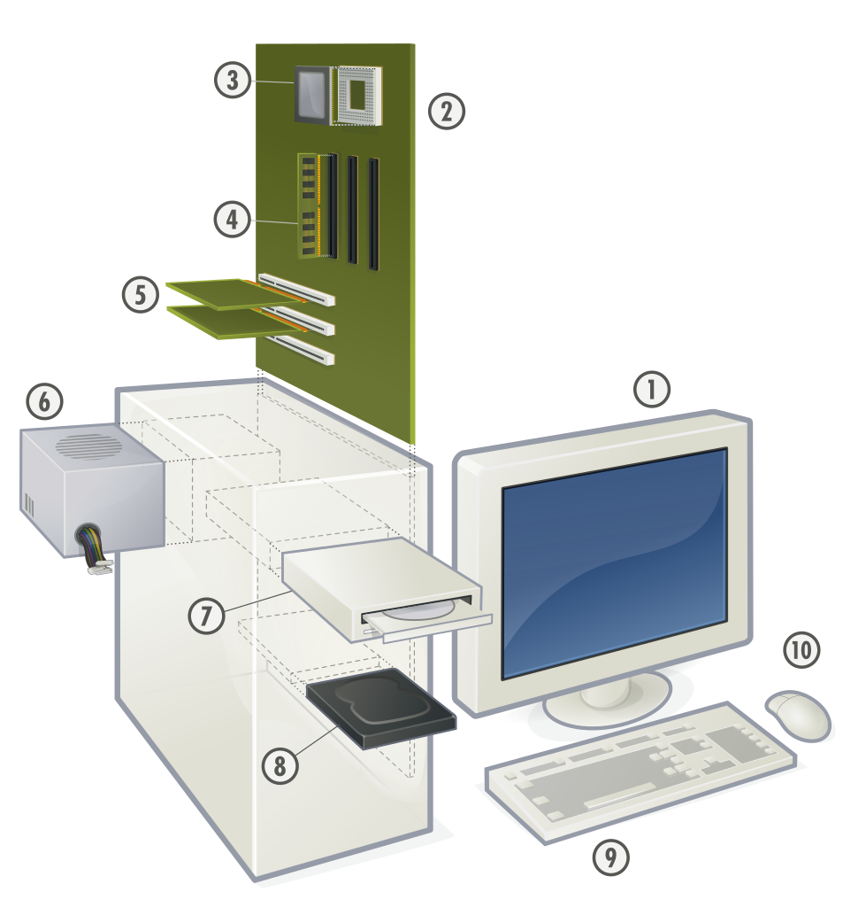
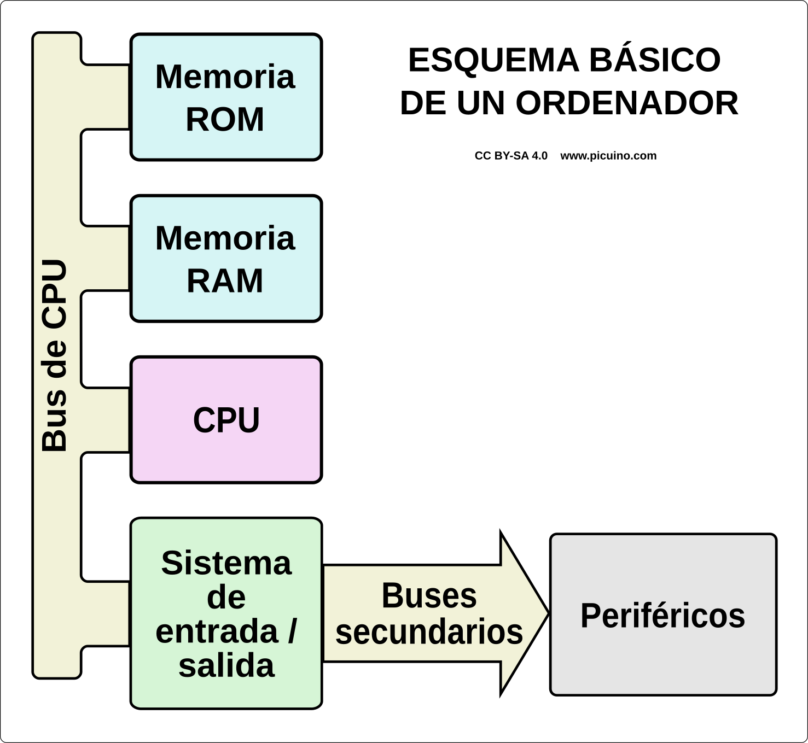
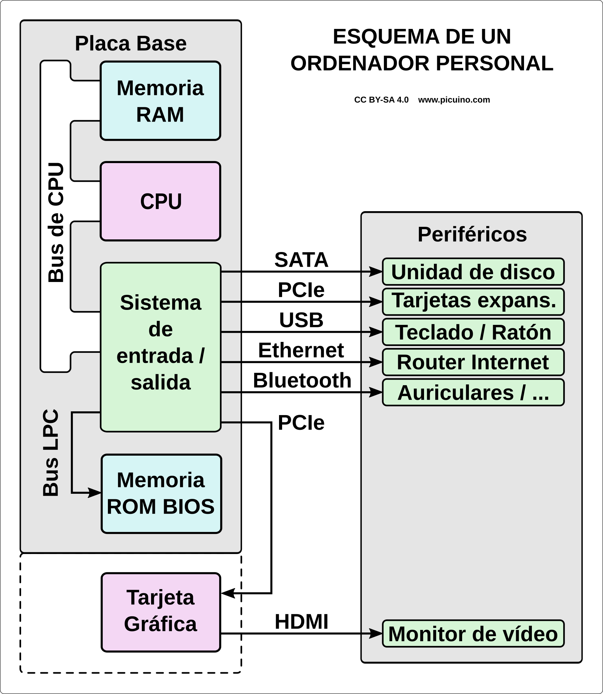

:Date: 25/08/2022
:Author: Carlos Félix Pardo Martín
:License: Creative Commons Attribution-ShareAlike 4.0 International

.. informatica-hardware-esquema-ordenador:

Hardware de un ordenador personal
=================================

   `Gustavb <https://commons.wikimedia.org/wiki/File:Personal_computer,_exploded_5.svg>`__,
   `CC BY-SA 3.0 Unported <https://creativecommons.org/licenses/by-sa/3.0/deed.en>`__,
   via Wikimedia Commons.

1. Monitor.
2. Placa base.
3. Microprocesador (CPU) y zócalo.
4. Módulo de memoria RAM y ranuras DIMM.
5. Tarjetas y ranuras de expansión PCI.
6. Fuente de alimentación.
7. Unidad de disco óptico (CD, DVD, BD).
8. Unidad de disco duro o unidad de estado sólido.
9. Teclado.
10. Ratón.

Esquema general de un ordenador
-------------------------------
En el gráfico siguiente se pueden ver los elementos principales de
un ordenador.

Estos elementos son los siguientes:

 * La **memoria ROM**, es la encargada de almacenar a largo plazo
   los programas y los datos, aunque el ordenador esté apagado.
 * La **memoria RAM**, es la encargada de almacenar los programas y los
   datos para que el procesador pueda trabajar con ellos.
 * La **CPU o unidad central de proceso** es el "cerebro" del ordenador,
   el elemento que procesa los programas y los datos.
 * El **bus de CPU** se encarga de transportar los datos
   entre la CPU, la memoria y el sistema de entrada/salida.
 * El **sistema de entrada/salida** conecta el ordenador con el
   exterior y se encarga de transportar información entre el bus de CPU
   y varios buses de conexión secundarios, que suelen ser
   estándar, como USB, HDMI o Ethernet.
 * Los **periféricos** se encargan de realizar 3 tareas fundamentales.

    * Entrada de datos al ordenador (por ejemplo, un teclado)
    * Salida de datos del ordenador (por ejemplo, una pantalla)
    * Almacenamiento externo (por ejemplo, una memoria USB)

La siguiente figura representa el esquema de un ordenador personal.

En este caso la memoria ROM, barata y de baja velocidad, se conecta a la
CPU mediante el bus LPC de baja velocidad.
Cuando el ordenador arranca, la información de la ROM es transferida
a la memoria RAM, donde se ejecuta el programa de arranque del PC.

Test de la unidad
-----------------

`Test de hardware de un ordenador personal I.
<../test/es-hardware-pc-1.html>`__

`Test de hardware de un ordenador personal II.
<../test/es-hardware-pc-2.html>`__
