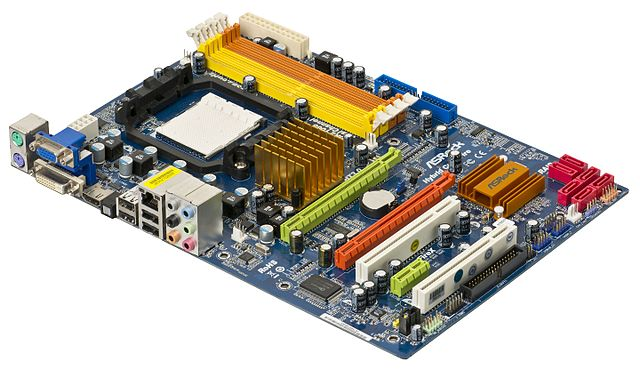

:Date: 08/06/2022
:Author: Carlos Félix Pardo Martín
:License: Creative Commons Attribution-ShareAlike 4.0 International

.. _informatica-hardware-index:

***********************
 Hardware de ordenador
***********************

En informática se denomina **hardware** al conjunto de componentes físicos
que componen un ordenador.

   `Evan-Amos <https://commons.wikimedia.org/wiki/File:A790GXH-128M-Motherboard.jpg>`__,
   `CC BY-SA 3.0 <https://creativecommons.org/licenses/by-sa/3.0/deed.en>`__,
   via Wikimedia Commons.

.. toctree::
   :maxdepth: 1
   :titlesonly:

   informatica-hardware-intro.rst
   informatica-hardware-clasificacion.rst
   informatica-hardware-unidades.rst
   informatica-hardware-ley-moore.rst
   informatica-hardware-esquema-ordenador.rst
   informatica-hardware-placabase.rst
   informatica-hardware-cpu.rst
   informatica-hardware-perifericos.rst
   informatica-hardware-almacenamiento.rst
   informatica-hardware-comunicaciones.rst
   informatica-hardware-auxiliares.rst
