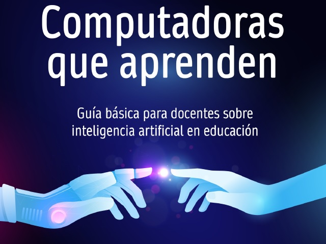

:Date: 06/09/2022
:Author: Carlos Félix Pardo Martín
:License: Creative Commons Attribution-ShareAlike 4.0 International
:tocdepth: 1

.. informatica-machine-learning:

Inteligencia Artificial
=======================

Curso de Inteligencia Artificial
--------------------------------
Curso online gratuito `Elementos de IA <https://course.elementsofai.com/es/>`__.

* `Capítulo 1: ¿Qué es la IA? <https://course.elementsofai.com/es/1>`__
* `Capítulo 2: Resolución de problemas con IA <https://course.elementsofai.com/es/2>`__
* `Capítulo 3: La IA del mundo real <https://course.elementsofai.com/es/3>`__
* `Capítulo 4: Aprendizaje automático <https://course.elementsofai.com/es/4>`__
* `Capítulo 5: Las redes neuronales <https://course.elementsofai.com/es/5>`__
* `Capítulo 6: Trascendencia <https://course.elementsofai.com/es/6>`__

Libro Computadoras que aprenden
-------------------------------
El mundo de la inteligencia artificial ha generado una gran cantidad de
debates y opiniones entre expertos y personalidades influyentes, ya en
el 2014, Stephen Hawking, uno de los científicos más renombrados de
nuestro tiempo, advirtió sobre los peligros potenciales de la IA y su
capacidad para superar a la humanidad.
Más cerca en el tiempo, Elon Musk, innovador empresario, ha abogado por
un enfoque responsable y ético en el desarrollo de la IA, argumentando
que puede ser una herramienta valiosa para resolver problemas de nuestro
mundo pero siempre bajo una estricta regulación.

Ambos puntos de vista son importantes a la hora de comprender los
desafíos y oportunidades que ofrece esta tecnología, sobre todo cuando
es aplicada a la educación.

Es por eso lo valioso que representa este libro escrito por Diego Craig,
un profesional con una sólida formación y amplia experiencia en el campo
de la tecnología educativa, quién pretende introducir al lector en los
conceptos claves de la inteligencia artificial y su aplicación en el
ámbito educativo.

Se abordan temas como el impacto de ChatGPT, explorando las opiniones y
debates que rodean su uso; cuestiones éticas, privacidad, definiciones,
su uso para el diálogo y se examinan aplicaciones prácticas en una
variedad de contextos.

Diego Craig brinda una introducción a los conceptos clave de la IA y
su aplicación en la educación, abordando tanto los aspectos positivos
como los potenciales desafíos y riesgos.

`Libro Computadoras que aprenden, de Diego F. Craig. Formato PDF.
<../_static/document/computadoras-que-aprenden-2023.pdf>`__

Vídeos de DotCSV
----------------

* Vídeo: `¿Tiene la IA de Google CONSCIENCIA? 👉 NO, pero me preocupa... (LaMDA).
  <https://www.youtube-nocookie.com/embed/Ko7WFx4rUw0>`__

* Vídeo: `DotCSV. GATO: La nueva IA de DeepMind que lo aprende TODO.
  <https://www.youtube-nocookie.com/embed/EoZFxj-qhUY>`__

* Vídeo: `DotCSV. Esta Inteligencia Artificial ESCRIBE MEJOR QUE TÚ... GPT-3.
  <https://www.youtube-nocookie.com/embed/C1eOiOkD_8A>`__

Vídeos de Jaime Altozano
------------------------

* Vídeo: `¿Qué significa realmente "Inteligencia Artificial"? Subespacios,
  pareidolias y creatividad.
  <https://www.youtube-nocookie.com/embed/3eMmmj3roOs>`__

* Vídeo: `Jaime Altozano. Hablemos de inteligencias artificiales.
  <https://www.youtube-nocookie.com/embed/GqKnlBq2MA4>`__

Vídeos TED
----------

* Vídeo: `Jeremy Howard. Las maravillosas y pavorosas consecuencias de los
  computadores que pueden aprender.
  <https://www.youtube-nocookie.com/embed/t4kyRyKyOpo>`__

Vídeos de Veritasium
--------------------
Computadoras e Inteligencia Artificial.

* Vídeo: `El Futuro de las Computadoras Será Radicalmente Diferente.
  <https://www.youtube-nocookie.com/embed/qNtxODk_Lmk>`__

