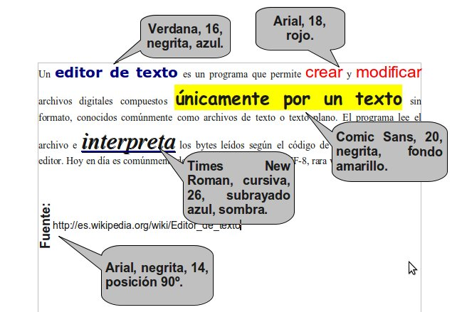
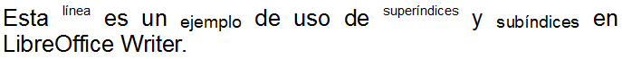
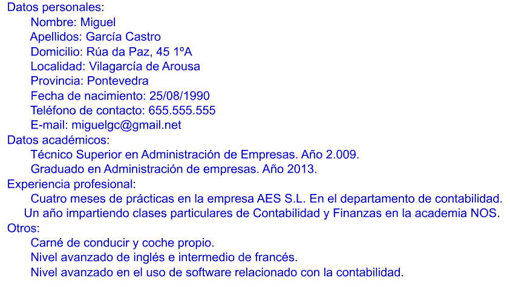
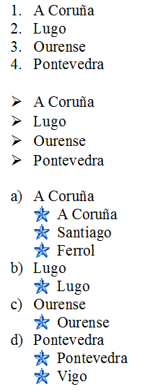
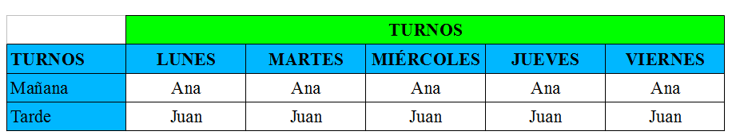
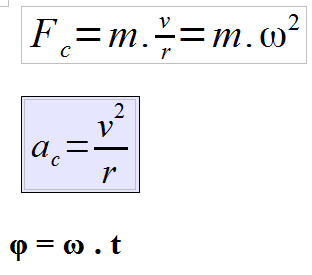
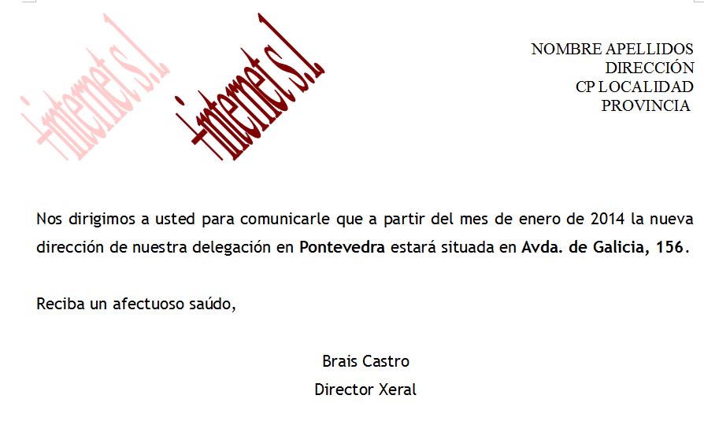

:Date: 29/04/2025
:Author: Carlos Félix Pardo Martín
:License: Creative Commons Attribution-ShareAlike 4.0 International
:tocdepth: 1

.. informatica-writer-ejercicios:

Ejercicios de Writer
====================
Esta sección consta de 30 ejercicios en los que aplicaremos varios de
los contenidos tratados en las prácticas guiadas.

Crea en el ordenador una carpeta con tu nombre en la que guardaremos
los documentos generados.

.. contents:: Índice de contenidos:
   :local:
   :depth: 2

Ejercicio 1: Formato de archivo
-------------------------------
Abre el archivo
`Ejercicio_01.odt <../_static/tutorial-writer/writer/cas/Ejercicio_01.odt>`__
y guárdalo en formato **.DOC**, **.DOCX** y expórtalo en formato **.PDF**
de modo que obtengas los siguientes archivos:

* Ejercicio_01_NombreAlumno.doc
* Ejercicio_01_NombreAlumno.docx
* Ejercicio_01_NombreAlumno.pdf

Ejercicio 2: Formato de texto
-----------------------------
Abre el archivo
`Ejercicio_01.odt <../_static/tutorial-writer/writer/cas/Ejercicio_01.odt>`__
y modifica el formato del texto tal y como observas en la imagen.

Guarda el archivo resultante como **"Ejercicio_02_NombreAlumno.odt"**.

Ejercicio 3: Subíndices y superíndices
--------------------------------------
En un nuevo documento escribe el siguiente texto en formato Arial,
tamaño 16. Dale a los subíndices un tamaño relativo del 75% y a los
superíndices del 58%.

Guarda el archivo resultante como **"Ejercicio_03_NombreAlumno.odt"**.

Ejercicio 4: Formato de párrafo
-------------------------------
El archivo
`Ejercicio_04.odt <../_static/tutorial-writer/writer/cas/Ejercicio_04.odt>`__
contiene cuatro párrafos.
Dale a cada párrafo el formato indicado en su enunciado.

Necesitarás usar también la imagen
`Ejercicio_04.jpg <../_static/tutorial-writer/writer/cas/Ejercicio_04.jpg>`__

Guarda el archivo resultante como **"Ejercicio_04_NombreAlumno.odt"**.

Ejercicio 5: Comentarios
------------------------
Abre el documento que creaste en el ejercicio anterior
**"Ejercicio_04_NombreAlumno.odt"** y añade los siguientes comentarios:

* En el párrafo 1: "Cambiar la fuente Arial por Verdana".
* En el párrafo 2: "Debe eliminarse esta imagen de fondo y poner un color".

Guarda el archivo resultante como **"Ejercicio_05_NombreAlumno.odt"**.

Ejercicio 6: Formato de página y formas
---------------------------------------
Abre un documento nuevo, dale tamaño A4 y **orientación horizontal**.
Ponle **bordes** y un **color de fondo** a la página
(usa los valores que quieras).

Introduce **cinco formas** de la barra de herramientas de dibujo de
distintas categorías. Dales distintos formatos a las formas
(relleno, línea, extrusión, ...) y en una de ellas escribe tu
**nombre y apellidos**.

Guarda el archivo resultante como **"Ejercicio_06_NombreAlumno.odt"**.

Ejercicio 7: Corrector
----------------------
En el documento
`Ejercicio_07.odt <../_static/tutorial-writer/writer/cas/Ejercicio_07.odt>`__
hay tres errores ortográficos. Usa la herramienta de
**ortografía y gramática** para corregirlos.

Selecciona las palabras corregidas y cambia su formato a
negrita tamaño 14.

Guarda el archivo resultante como **"Ejercicio_07_NombreAlumno.odt"**.

Ejercicio 8: Columnas
---------------------
Abre el archivo corregido del ejercicio anterior.
Distribuye su texto en columnas con las siguientes características:

* **Primer párrafo:** Dos columnas de igual ancho, espaciadas 1 cm
  con una línea de separación de 1 punto de ancho y color verde.

* **Segundo párrafo:** Dos columnas, la de la izquierda de 5 cm de
  ancho y la de la derecha de 11,50 cm con un espacio entre ellas
  de 0,50 cm.

* **Tercer párrafo:** Tres columnas de igual ancho con un espacio
  entre ellas de 0,30 cm.

Guarda el archivo resultante como **"Ejercicio_08_NombreAlumno.odt"**.

Ejercicio 9: Pegado especial
----------------------------
Busca información en Wikipedia sobre un escritor o escritora que te
guste. Usando el "pegado especial" copia parte del contenido de la
Wikipedia en un nuevo documento de texto, sin que se copien los
hiperenlaces ni el formato original.

Guarda el archivo resultante como **"Ejercicio_09_NombreAlumno.odt"**.

Ejercicio 10: Imágenes e hiperenlaces
-------------------------------------
Abre el documento de texto del ejercicio anterior. Pega en él la
**fotografía** del escritor o escritora que has buscado en Wikipedia
y sitúala en la esquina superior derecha de la primera página.

Al final del documento introduce una forma **"flecha hacia la
derecha"** de la barra de herramientas de dibujo e introduce en ella
un hiperenlace a la página web de la que has obtenido la información.

Guarda el archivo resultante como **"Ejercicio_10_NombreAlumno.odt"**.

Ejercicio 11: Curriculum
------------------------
Te han encargado redactar el currículum de una persona.

Sus datos son:

Inserta la imagen
`Ejercicio_11.jpg <../_static/tutorial-writer/writer/cas/Ejercicio_11.jpg>`__
en el currículum.

El diseño será libre. Usa los formatos de texto y de párrafo que
desees.

Guarda el archivo resultante como **"Ejercicio_11_NombreAlumno.odt"**.

Ejercicio 12: Encabezado y pie de página
----------------------------------------
Abre el documento de texto
`Ejercicio_12.odt <../_static/tutorial-writer/writer/cas/Ejercicio_12.odt>`__.
Inserta en todas sus páginas el siguiente encabezado:
**"Preámbulo de la Ley Orgánica 2/2006, de 3 de Mayo, de
Educación"**.

Cambia el formato de este encabezado a Arial, tamaño 9, estilo
cursiva y alineación derecha.

Inserta en el pie de página **"Página X de Y"** donde X será el
campo **"número de página"** e Y será el campo **"total de
páginas"**.

Guarda el archivo resultante como **"Ejercicio_12_NombreAlumno.odt"**.

Ejercicio 13: Notas al pie y al final
-------------------------------------
Abre el documento que creaste en el ejercicio anterior.

Al final del primer párrafo escribe la siguiente nota a pie de
página: **"BOE 04 de Mayo de 2006"**.

Al final del segundo párrafo escribe la siguiente nota a pie de
página: **"Puedes acceder al BOE clicando aquí"**. En la palabra
"aquí" inserta un hiperenlace a la página web: **"www.boe.es"**.

Guarda el archivo resultante como **"Ejercicio_13_NombreAlumno.odt"**.

Ejercicio 14: Tabuladores
-------------------------
En un nuevo documento crea tabuladores en las posiciones:

* 1 cm
* 5 cm
* 12 cm
* 20 cm

Con el contenido alineado a la izquierda.

Pulsando la tecla TAB introduce los siguientes campos:

* NOMBRE
* LOCALIDAD
* EMAIL
* EDAD

Debajo modifica los tabuladores para que estén separados por puntitos.

Escribe los datos inventados de cinco personas.

Guarda el archivo resultante como **"Ejercicio_14_NombreAlumno.odt"**.

Ejercicio 15: Buscar y reemplazar
---------------------------------
Abre el documento
`Ejercicio_15.odt <../_static/tutorial-writer/writer/cas/Ejercicio_15.odt>`__.

Con la herramienta **"buscar y reemplazar"** busca todos los
términos "Galicia" del documento y sustituye su formato actual
por el siguiente:

* Fuente: Arial
* Tamaño: 16
* Estilo: Negrita
* Color: Azul

Guarda el archivo resultante como **"Ejercicio_15_NombreAlumno.odt"**.

Ejercicio 16: Numeración y viñetas
----------------------------------
Escribe el nombre de las cuatro provincias gallegas en un nuevo
documento.

Copia y pega debajo dos veces esa lista y usa la herramienta
"Numeración y viñetas" para obtener un resultado como el de la
siguiente imagen:

Guarda el archivo resultante como **"Ejercicio_16_NombreAlumno.odt"**.

Ejercicio 17: Tablas
--------------------
Crea una tabla como la de la siguiente imagen en un nuevo documento.
Puedes usar otros formatos de texto y colores de fondo.

Guarda el archivo resultante como **"Ejercicio_17_NombreAlumno.odt"**.

Ejercicio 18: Tablas (II)
-------------------------
Crea una tabla con tu horario de clase en un nuevo documento.
Usa los formatos que desees.

Guarda el archivo resultante como **"Ejercicio_18_NombreAlumno.odt"**.

Ejercicio 19: Filtros de imagen
-------------------------------
Crea una tabla de dos filas y dos columnas. En cada una de las celdas
inserta la imagen
`Ejercicio_04.jpg <../_static/tutorial-writer/writer/cas/Ejercicio_04.jpg>`__.

Céntralas horizontal y verticalmente y aplícale a cada una un filtro
distinto.

Guarda el archivo resultante como **"Ejercicio_19_NombreAlumno.odt"**.

Ejercicio 20: Secciones
-----------------------
Abre el documento
`Ejercicio_20.odt <../_static/tutorial-writer/writer/cas/Ejercicio_20.odt>`__.

El documento está compuesto por seis apartados. Inserta saltos de
página de modo que cada apartado ocupe solo una página.

A continuación inserta seis secciones y a cada una aplícale un formato
de página (orientación, color de fondo, bordes, etc.) distinto del
resto.

Guarda el archivo resultante como **"Ejercicio_20_NombreAlumno.odt"**.

Ejercicio 21: Índice
--------------------
Abre el archivo **"Ejercicio_20_NombreAlumno.odt"** que creaste en el
ejercicio anterior y añade un índice de los apartados del documento.

Guarda el archivo resultante como **"Ejercicio_21_NombreAlumno.odt"**.

Ejercicio 22: Portada
---------------------
Abre el archivo **"Ejercicio_21_NombreAlumno.odt"** que creaste en el
ejercicio anterior e introduce una portada.
En ella inserta un **"Fontwork"** con el texto: **"Periféricos
del ordenador"**. Añade también tu **nombre y apellidos**.

Guarda el archivo resultante como **"Ejercicio_22_NombreAlumno.odt"**.

Ejercicio 23: Convertir tabla en texto
--------------------------------------
Abre el documento
`Ejercicio_23.odt <../_static/tutorial-writer/writer/cas/Ejercicio_23.odt>`__.

Convierte la tabla en un texto usando el punto y coma como separador.

Guarda el archivo resultante como **"Ejercicio_23_NombreAlumno.odt"**.

Ejercicio 24: Proteger un documento
-----------------------------------
Abre el archivo **"Ejercicio_23_NombreAlumno.odt"** que creaste en el
ejercicio anterior.

Guárdalo como **"Ejercicio_24_NombreAlumno.odt"** protegido con la
contraseña **12345**.

Ejercicio 25: Formulario
------------------------
Imagina que un equipo deportivo de tu localidad (fútbol,
baloncesto, ...) te encarga diseñar un formulario para recoger
los datos de los nuevos socios.

Crea un formulario que incluya una imagen del escudo del equipo
y varios campos con los datos personales de los socios
(nombre, apellidos, domicilio, teléfono, etc.).

Introduce tres botones de opción para el pago de la cuota:

* Mensual
* Trimestral
* Anual

Los socios solo podrán marcar una de las tres opciones.

Guarda el archivo resultante como **"Ejercicio_25_NombreAlumno.odt"**.

Ejercicio 26: Formulario (II)
-----------------------------
Abre el archivo **"Ejercicio_25_NombreAlumno.odt"** que creaste en el
ejercicio anterior.

Protege con la contraseña **12345** todas las partes del formulario
salvo los campos que deben ser cubiertos por los socios.

Guarda el archivo resultante como **"Ejercicio_26_NombreAlumno.odt"**.

Ejercicio 27: Formulario (III)
------------------------------
Abre el archivo **"Ejercicio_26_NombreAlumno.odt"** que creaste en el
ejercicio anterior.

Genera un PDF para que los socios puedan rellenarlo e imprimirlo.

Guarda el archivo resultante como **"Ejercicio_27_NombreAlumno.pdf"**.

Ejercicio 28: Caracteres especiales y fórmulas
----------------------------------------------
Insertando caracteres especiales y usando el asistente de fórmulas
escribe en un nuevo documento las siguientes fórmulas:

Guarda el archivo resultante como **"Ejercicio_28_NombreAlumno.odt"**.

Ejercicio 29: Combinar correspondencia
--------------------------------------
Crea un documento de texto que contenga una carta similar a la de la
siguiente imagen, dirigida a todos los clientes que figuran en la
hoja de cálculo `Ejercicio_29.ods
<../_static/tutorial-writer/writer/cas/Ejercicio_29.ods>`__.

Usa los formatos de Fontwork, texto, párrafo y página que quieras.

Guarda el archivo resultante como **"Ejercicio_29_NombreAlumno.odt"**.

Ejercicio 30: Combinar correspondencia (II)
-------------------------------------------
Crea un documento de texto que contenga la misma carta que en el
ejercicio anterior, pero dirigida solo a los clientes de la provincia
de Pontevedra.

Guarda el archivo resultante como **"Ejercicio_30_NombreAlumno.odt"**.

Créditos
--------

Autor de los ejercicios originales: José Manuel Blanco Guimarey

Licencia: `Creative Commons BY-NC-SA <https://creativecommons.org/licenses/by-nc-sa/4.0/>`__

Fuente: `Ejercicios propuestos <../_static/tutorial-writer/writer/index.html>`__

Créditos del tutorial: `Créditos <../_static/tutorial-writer/writer/docs/creditos.html>`__
