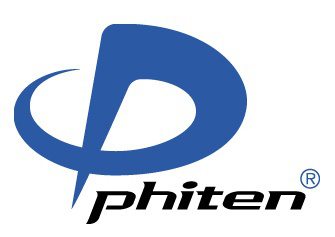

:Date: 27/11/2021
:Author: Carlos Félix Pardo Martín
:License: Creative Commons Attribution-ShareAlike 4.0 International

.. include:: inkscape-subs.rst

.. _inkscape-logo-10:

Logotipo Phiten
===============

|br|

1. Descargamos e instalamos la fuente Add City Boy antes de abrir
   Inkscape, para que esté disponible posteriormente.

   :download:`Fuente Add City Boy. <inkscape/Add_city_boy.ttf>`

   `Fuente Add City Boy en Dafont.com <https://www.dafont.com/es/add-city-boy.font>`__

   La fuente no es la misma que la del logotipo original, pero se
   parece lo suficiente para que nos sirva en este ejercicio.

   |br|

#. Abrimos un nuevo documento con Inkscape.

   |br|

#. Copiamos el logotipo de más arriba en Inkscape para que nos
   sirva de modelo.

   |br|

#. Dibujamos dos elipses y con la herramienta de edición las redimensionamos
   y situamos aproximadamente para que coincidan con el comienzo del logotipo.
   Habrá que dar a las elipses un relleno de color con transparencia
   para poder ver los dos dibujos a la vez y poder ajustarles.

   No importa si no coinciden exactamente las formas, más adelante las haremos
   coincidir con la edición de los nodos.

   .. image:: inkscape/_images/inkscape-logo-10-a.png
      :align: center

   .. image:: inkscape/_images/inkscape-logo-10-b.png
      :align: center

   |br|

#. Ahora nos aseguramos de que la elipse más pequeña esté encima de la
   elipse más grande y restamos las dos elipses con la herramienta del
   menú ``Trayecto... Diferencia``.

   .. image:: inkscape/_images/inkscape-logo-10-c.png
      :align: center

   |br|

#. Convertimos el nuevo objeto en trayecto con la
   herramienta del menú ``Trayecto... Objeto a trayecto``
   y editamos los nodos con la herramienta de edición de nodos
   |button-edit-nodes|.

   .. image:: inkscape/_images/inkscape-logo-10-d.png
      :align: center

   |br|

#. Hacemos coincidir los primeros nodos de la izquierda con la esquina
   del logotipo y la primera curva editando los tiradores de cada nodo.

   .. image:: inkscape/_images/inkscape-logo-10-e.png
      :align: center

   Continuamos editando los nodos para hacer coincidir la forma con el
   logotipo

   .. image:: inkscape/_images/inkscape-logo-10-f.png
      :align: center

   |br|

#. Llegado este momento no hay más nodos que editar y todavía queda
   un buen tramo del logotipo por dibujar. La solución está en añadir
   nuevos nodos.

   Debemos seleccionar dos nodos del final y añadir un nuevo nodo entre
   ellos con el botón correspondiente de la barra superior.

   .. image:: inkscape/_images/inkscape-logo-10-g.png
      :align: center

   .. image:: inkscape/_images/inkscape-logo-10-h.png
      :align: center

   |br|

#. Con los nuevos nodos, seguimos ampliando el dibujo hasta completar el
   logotipo.

   .. image:: inkscape/_images/inkscape-logo-10-i.png
      :align: center

   .. image:: inkscape/_images/inkscape-logo-10-j.png
      :align: center

   .. image:: inkscape/_images/inkscape-logo-10-k.png
      :align: center

   .. image:: inkscape/_images/inkscape-logo-10-l.png
      :align: center

   Es posible que durante el proceso de dibujado necesitemos convertir
   los nodos en esquina o suavizar el nodo de una esquina.
   Se puede hacer con los siguientes botones de la barra de herramientas
   superior.

   .. image:: inkscape/_images/inkscape-logo-10-m.png
      :align: center

   |br|

#. Ahora podemos escribir el texto del logotipo con la fuente instalada
   al comienzo, Add City Boy.

   |br|

   Escribimos el caracter '®' (puedes copiarlo y pegarlo en Inkscape)
   con fuente Arial azul.

   .. image:: inkscape/_images/inkscape-logo-10-n.png
      :align: center

   |br|

#. Ya podemos mover más abajo el logotipo en formato de mapa de bits.
   Nos servirá de modelo para dar color a los dibujos y textos que hemos
   dibujado, con la herramienta de Relleno y borde, copiar color.

   Y el logotipo estará terminado.

   .. image:: inkscape/_images/inkscape-logo-10-o.png
      :align: center

