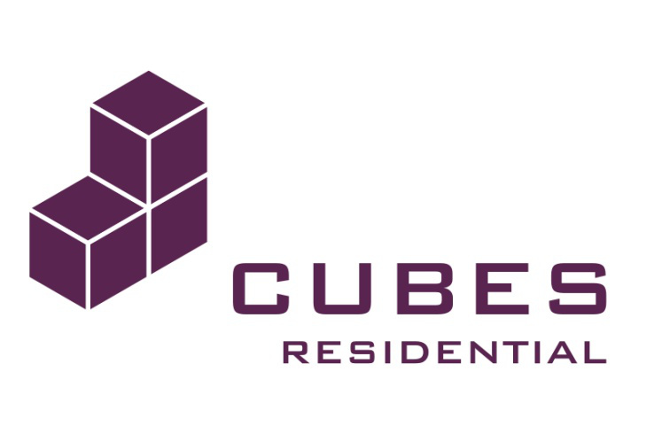

:Date: 27/11/2021
:Author: Carlos Félix Pardo Martín
:License: Creative Commons Attribution-ShareAlike 4.0 International

.. include:: inkscape-subs.rst

.. _inkscape-logo-12:

Logotipo Cubes
==============

|br|

1. Abrimos un nuevo documento con Inkscape.

   |br|

#. Comenzamos dibujando un triángulo con la herramienta de dibujar
   polígonos |button-polygon|.

   .. image:: inkscape/_images/inkscape-logo-12-a.png
      :align: center

   Y le damos un color de relleno morado.

   |br|

#. A continuación duplicamos el triángulo dibujado y le reflejamos
   en horizontal con el menú ``Objeto... Reflejo horizontal``.

   .. image:: inkscape/_images/inkscape-logo-12-b.png
      :align: center

   |br|

#. Después seleccionamos los dos triángulos y les alineamos para que
   coincidan sus caras verticales.
   Menú ``Objeto... Alinear y distribuir``.

   .. image:: inkscape/_images/inkscape-logo-12-d.png
      :align: center

   .. image:: inkscape/_images/inkscape-logo-12-c.png
      :align: center

   |br|

#. Una vez alineados, vamos a unir los dos triángulos en una sola pieza
   con el menú ``Trayecto... Unión``

   .. image:: inkscape/_images/inkscape-logo-12-e.png
      :align: center

   Ya tenemos la pieza básica con la que dibujar los cubos.

   |br|

#. Ahora vamos a duplicar el rombo y a girarle 120º con la herramienta
   ``Objeto... Transformar...`` Pestaña rotar.

   Rotaremos el rombo duplicado 120º hacia la derecha.

   .. image:: inkscape/_images/inkscape-logo-12-g.png
      :align: center

   .. image:: inkscape/_images/inkscape-logo-12-f.png
      :align: center

   |br|

#. Movemos el nuevo rombo a su sitio, asegurándonos de que está activada
   la herramienta de ajustar nodos |button-ajustar-nodos| de manera que los
   vértices se junten automáticamente.

   .. image:: inkscape/_images/inkscape-logo-12-h.png
      :align: center

   |br|

#. Repetimos la operación de duplicar el rombo superior y rotar el rombo,
   esta vez hacia la izquierda.

   .. image:: inkscape/_images/inkscape-logo-12-i.png
      :align: center

   A continuación movemos el rombo a su posición.

   .. image:: inkscape/_images/inkscape-logo-12-j.png
      :align: center

   |br|

#. Ahora seleccionamos los tres rombos y cambiamos su borde exterior
   en el menú ``Objeto... Relleno y borde`` por una línea blanca de
   1,2 milímetros de grosor.

   .. image:: inkscape/_images/inkscape-logo-12-l.png
      :align: center

   .. image:: inkscape/_images/inkscape-logo-12-k.png
      :align: center

   |br|

#. Para terminar esta parte del diseño, duplicamos los rombos necesarios
   y les colocamos en su lugar uno a uno, hasta que el diseño en tres
   dimensiones esté terminado.

   .. image:: inkscape/_images/inkscape-logo-12-m.png
      :align: center

   .. image:: inkscape/_images/inkscape-logo-12-n.png
      :align: center

   .. image:: inkscape/_images/inkscape-logo-12-o.png
      :align: center

   |br|

#. Añadimos el texto 'CUBES' con fuente Agency FB, estilo Bold,
   tamaño 48 puntos y separación entre caracteres de 10.

   .. image:: inkscape/_images/inkscape-logo-12-p.png
      :align: center

   .. image:: inkscape/_images/inkscape-logo-12-q.png
      :align: center

   Con la herramienta de selección y edición |button-selection|
   colocamos el texto en su sitio y le estiramos horizontalmente.

   .. image:: inkscape/_images/inkscape-logo-12-r.png
      :align: center

   |br|

#. Para terminar, añadimos el texto RESIDENTIAL con la misma fuente
   Agency FB, estilo Bold, tamaño 25 puntos y separación entre
   caracteres de 10.

   Estiramos el nuevo texto en horizontal.

   Y alineamos los bordes derechos de ambos textos para que coincidan.

   El logotipo estará terminado.

   .. image:: inkscape/_images/inkscape-logo-12-s.png
      :align: center

