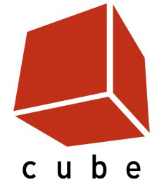

:Date: 04/12/2021
:Author: Carlos Félix Pardo Martín
:License: Creative Commons Attribution-ShareAlike 4.0 International

.. include:: inkscape-subs.rst

.. _inkscape-logo-17:

Logotipo Cube
=============

|br|

1. Abrimos un nuevo documento con Inkscape.

   |br|

#. Si analizamos el logotipo del inicio de esta página,
   podemos ver que todas las líneas del cubo en perspectiva
   se concentran en tres puntos diferentes.

   .. image:: inkscape/_images/inkscape-logo-17-a.png
      :align: center

   Este tipo de perspectiva se denomina cónica y en ella todas
   las líneas horizontales o todas las líneas verticales
   se dirigen hacia un punto denominado `punto de fuga
   <https://es.wikipedia.org/wiki/Punto_de_fuga>`__.

   |br|

#. Para representar esta figura utilizaremos la herramienta para
   dibujar cubos en perspectiva |button-perspective|.

   Primero nos aseguramos de que haya tres puntos de fuga cercanos
   deseleccionando las líneas paralelas en los tres ejes.

   .. image:: inkscape/_images/inkscape-logo-17-b.png
      :align: center

   A continuación dibujamos el cubo, moviendo los puntos de fuga como
   muestra la imagen.

   .. image:: inkscape/_images/inkscape-logo-17-c.png
      :align: center

   Puedes copiar la imagen anterior en Inkscape para utilizarla como
   modelo para dibujar el cubo.

   |br|

#. Para continuar, desagrupamos los elementos del cubo en perspectiva.
   Primero seleccionamos el cubo y después en el menú
   ``Objeto... Desagrupar``.

   .. image:: inkscape/_images/inkscape-logo-17-d.png
      :align: center

   Nos encontramos con las seis caras del cubo, por lo que habrá que
   separarlas entre sí y borrar las caras traseras.

   .. image:: inkscape/_images/inkscape-logo-17-e.png
      :align: center

   .. image:: inkscape/_images/inkscape-logo-17-f.png
      :align: center

   |br|

#. Volvemos a unir las tres caras delanteras y reducimos su tamaño
   seleccionándolas una a una y aplicando la herramienta del menú
   ``Trayecto... Reducir``.

   .. image:: inkscape/_images/inkscape-logo-17-g.png
      :align: center

   .. image:: inkscape/_images/inkscape-logo-17-h.png
      :align: center

   |br|

#. Ahora cambiamos el color de las caras del cubo por el color
   naranja del cubo original.

   .. image:: inkscape/_images/inkscape-logo-17-i.png
      :align: center

   |br|

#. Para terminar, añadimos la palabra Cube con letra Arial de 36 puntos
   y espacio entre letras de 20 puntos.

   Y el logotipo estará acabado.

   .. image:: inkscape/_images/inkscape-logo-17-j.png
      :align: center

