:Date: 10/12/2018
:Author: Carlos Félix Pardo Martín
:License: Creative Commons Attribution-ShareAlike 4.0 International

.. _legal-attribution:

Derechos de autor y propiedad intelectual
=========================================

Contenidos
----------

Copyright © 2013-2025 por Carlos Félix Pardo Martín.

Los contenidos publicados, tales como **textos, imágenes,
planos, gráficos, fotografías, etc.** se distribuyen bajo una
`licencia Creative Commons Reconocimiento-CompartirIgual 4.0 Internacional
(CC BY-SA 4.0) <https://creativecommons.org/licenses/by-sa/4.0/deed.es>`__,
a menos que se indique lo contrario.

Puede leer un `resumen de la licencia CC BY-SA 4.0
<https://creativecommons.org/licenses/by-sa/4.0/deed.es>`__
o el `texto completo de la licencia CC BY-SA 4.0
<https://creativecommons.org/licenses/by-sa/4.0/legalcode.es>`__.

Para **reconocer la autoría** del contenido debe añadir un enlace
a la página donde se encuentra el contenido, citar el nombre del
autor y citar la licencia utilizada por el contenido original
`CC BY-SA 4.0 Internacional
<https://creativecommons.org/licenses/by-sa/4.0/deed.es>`__.

Programas de ordenador
----------------------

Los programas de ordenador se distribuyen bajo una
**licencia GPL v3**, a menos que se indique lo contrario.

Puede leer una copia de la `licencia GPL v3.0
<https://www.gnu.org/licenses/gpl-3.0.html>`__
en la página web de la Free Software Foundation.

Librerías de software
---------------------

Las librerías para Arduino se distribuyen bajo licencia
GNU Lesser General Public License Version 3,
a menos que se indique lo contrario.

|  Puede leer una copia de la licencia en la siguiente dirección web:
|  https://www.gnu.org/licenses/lgpl-3.0.html

Página web
----------
La página web está creada con `Sphinx <http://sphinx-doc.org/>`__
usando un `tema <https://github.com/rtfd/sphinx_rtd_theme>`__
proporcionado por `Read the Docs <https://readthedocs.org/>`__

El logotipo y el nombre de Picuino que aparecen en la página web
son una marca registrada.

Imágenes externas
-----------------

Las imágenes que se muestran a continuación están tomadas de fuentes
externas a esta página. Cada imagen muestra junto a ella los créditos.

Materiales
^^^^^^^^^^

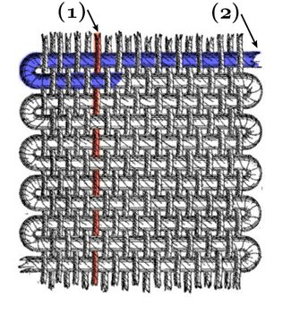

`Imagen <https://commons.wikimedia.org/wiki/File:Kette_und_Schu%C3%9F_num_col.png>`__
de Kette_und_Schuß.png
bajo `licencia Creative Commons Attribution-Share Alike 3.0 <https://creativecommons.org/licenses/by-sa/3.0/deed.en>`__

----

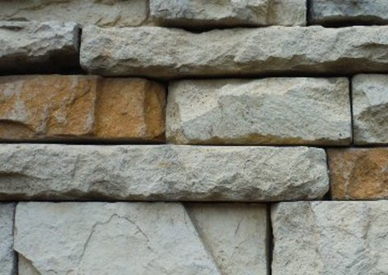

`Imagen <https://www.pexels.com/photo/abstract-architecture-background-brick-194096/>`__
de `Miguel Á. Padriñán <https://www.pexels.com/@padrinan>`__
bajo `licencia libre de Pexels <https://www.pexels.com/license/>`__

----

`Imagen Temperguss-Schraubzwinge <https://commons.wikimedia.org/wiki/File:Temperguss-Schraubzwinge.jpg>`__
de BESSEY Tool GmbH & Co. KG
bajo `licencia Creative Commons Attribution-Share Alike 3.0 Germany <https://creativecommons.org/licenses/by-sa/3.0/de/deed.en>`__

----

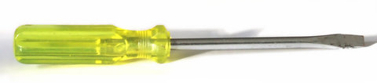

`Imagen Yellow-flathead-screwdriver <https://commons.wikimedia.org/wiki/File:Temperguss-Schraubzwinge.jpg>`__
de `Iainf <https://commons.wikimedia.org/wiki/User:Iainf>`__
bajo `licencia Creative Commons Attribution-Share Alike 3.0 Unported <https://creativecommons.org/licenses/by-sa/3.0/deed.en>`__

----

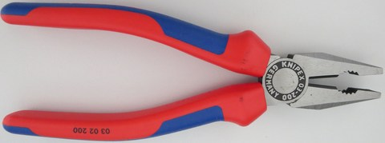

`Imagen Kombinationszange <https://commons.wikimedia.org/wiki/File:Kombinationszange.jpg>`__
de Stefan Pohl
bajo licencia de dominio público.

----

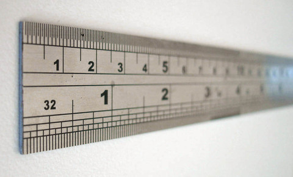

`Imagen Steel ruler closeup <https://commons.wikimedia.org/wiki/File:Steel_ruler_closeup.jpg>`__
de `Ejay <https://commons.wikimedia.org/wiki/User:Ejay>`__
bajo `licencia Creative Commons Attribution-Share Alike 4.0 International <https://creativecommons.org/licenses/by-sa/4.0/>`__

Mecánica
^^^^^^^^

`Imagen Logotipo FreeCAD <https://es.m.wikipedia.org/wiki/Archivo:FreeCAD-logo.svg>`__
de Yorik van Havre
bajo `Licencia Pública General Reducida de GNU <https://en.wikipedia.org/wiki/es:GNU_Lesser_General_Public_License>`__

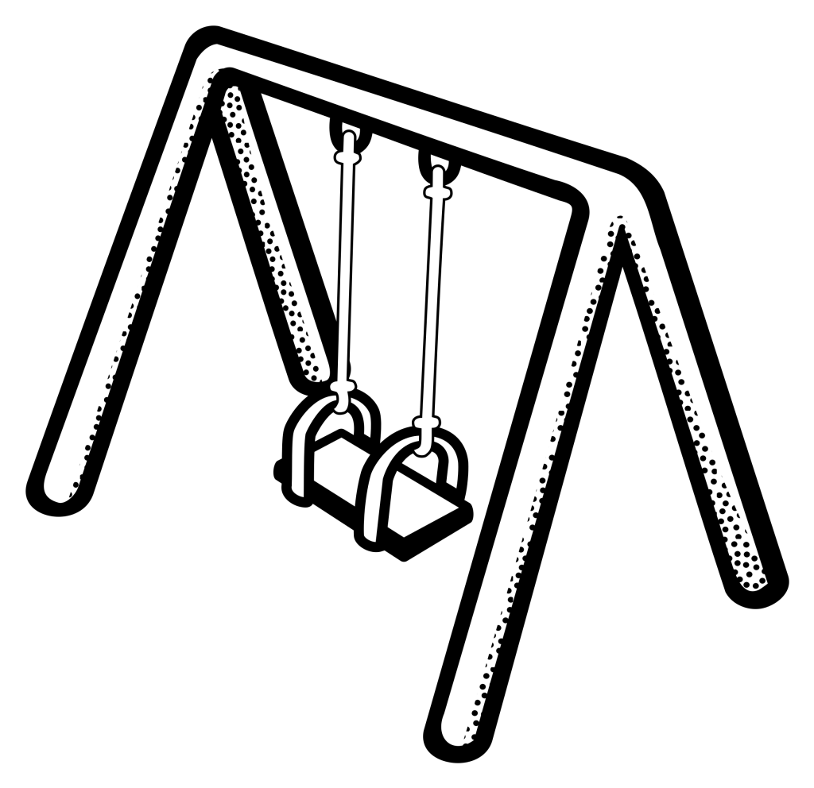

`Imagen line art swing <https://openclipart.org/detail/216037/swing-lineart>`__
de `frankes <https://openclipart.org/artist/frankes>`__
bajo `licencia Creative Commons Zero 1.0 Public Domain License <http://creativecommons.org/publicdomain/zero/1.0/>`__

----

.. image:: mecan/_images/mecan-jib-crane.jpg
   :width: 120px

`Imagen Jib crane <https://commons.wikimedia.org/wiki/File:Jib_crane.jpg>`__
bajo `licencia Creative Commons Attribution-Share Alike 4.0 International <https://creativecommons.org/licenses/by-sa/4.0/deed.en>`__

----

`Imagen banner graphic 1 <http://bridgedesigner.org/>`__
de Stephen J. Ressler con todos los derechos reservados.

----

Programación
^^^^^^^^^^^^

`Imagen Python logo <https://commons.wikimedia.org/wiki/File:Python-logo-notext.svg>`__
de `Python Software Foundation <https://www.python.org/community/logos/>`__
bajo `licencia PSF Trademark Usage Policy <https://www.python.org/psf/trademarks/>`__

----

`Imagen Processing logo <https://de.wikipedia.org/wiki/Datei:Processing_Logo_Clipped.svg>`__
de `Processing Foundation <https://processingfoundation.org/>`__
protegida como Marca Registrada.

----

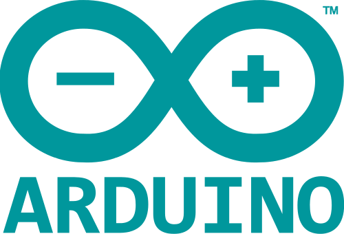

`Imagen Arduino logo <https://commons.wikimedia.org/wiki/File:Arduino_Logo.svg>`__
de Autor desconocido
protegida como Marca Registrada.

----

----

`Imagen Scratch logo <https://commons.wikimedia.org/wiki/File:Scratch_Logo.svg>`__
de `MIT <https://scratch.mit.edu/>`__
bajo licencia `Creative Commons Attribution-Share Alike 3.0 Unported <https://creativecommons.org/licenses/by-sa/3.0/deed.en>`__
y protegida como Marca Registrada.

----

`Imagen Makeblock logo <https://mblock.makeblock.com/en-us/download//>`__

----

`Imagen App Inventor logo <https://commons.wikimedia.org/wiki/File:Mit_app_inventor.png>`__
de Massachusetts Institute of Technology
bajo `licencia Creative Commons Attribution-Share Alike 3.0 Unported <https://creativecommons.org/licenses/by-sa/3.0/deed.en>`__

----

.. image:: prog/_images/applab-logo.png
   :width: 120px
   :target: https://code.org/educate/applab

----

`Imagen Bandera Olímpica <https://commons.wikimedia.org/wiki/File:Olympic_flag.svg>`__
de Pierre de Coubertin
bajo licencia de dominio público.

Informática
^^^^^^^^^^^

`Imagen Computer <https://openclipart.org/detail/17924/computer>`__
de `AJ <https://openclipart.org/artist/AJ>`__
bajo `licencia Creative Commons Zero 1.0 Public Domain License <http://creativecommons.org/publicdomain/zero/1.0/>`__

----

.. image:: html/_thumbs/beach-01.jpg
   :width: 120px

`Imagen Beach calm clouds idyllic <https://www.pexels.com/photo/beach-calm-clouds-idyllic-457882/>`__
de `Asad Photo Maldivas <https://www.pexels.com/@asadphotography>`__
bajo `licencia libre de Pexels <https://www.pexels.com/license/>`__

----

.. image:: html/_thumbs/chart-01.png
   :width: 120px

`Imagen Spa elec gen <https://commons.wikimedia.org/wiki/File:Spa_elec_gen.PNG>`__
de Zmzmzm2
bajo `licencia Creative Commons Attribution-Share Alike 4.0 International <https://creativecommons.org/licenses/by-sa/4.0/deed.en>`__

----

`Imagen Portrait <https://www.flaticon.com/free-icon/portrait_175062>`__
de `Metropolicons <https://www.flaticon.com/authors/metropolicons>`__
desde `Flaticon <https://www.flaticon.com/>`__
bajo `licencia Freepik <https://www.freepikcompany.com/legal#nav-flaticon>`__

----

.. image:: html/_thumbs/html5-logo.png
   :width: 120px

`Imagen Logotipo oficial HTML5 <https://commons.wikimedia.org/wiki/File:HTML5_logo_and_wordmark.svg>`__
de `W3C <http://www.w3.org/html/logo/index.html>`__
bajo `licencia Creative Commons Attribution 3.0 Unported <https://creativecommons.org/licenses/by/3.0/deed.en>`__

----

`Imagen Logotipo oficial CSS3 <https://commons.wikimedia.org/wiki/File:CSS.3.svg>`__
de W3C
bajo `licencia Creative Commons Attribution 4.0 International <https://creativecommons.org/licenses/by-sa/4.0/deed.en>`__

----

`Imagen Logotipo oficial actual de Inkscape <https://commons.wikimedia.org/wiki/File:Inkscape_Logo.svg>`__
de Andrew Michael Fitzsimon
bajo `licencia Creative Commons Attribution-Share Alike 3.0 Unported <https://creativecommons.org/licenses/by-sa/3.0/deed.en>`__

----

`Imagen Computer keyboard ES layout <https://commons.wikimedia.org/wiki/File:Computer_keyboard_ES_layout.svg>`__
de `Oona Räisänen (Mysid) <https://en.wikipedia.org/wiki/User:Mysid>`__
bajo `licencia Creative Commons CC0 1.0 Universal Public Domain Dedication <https://creativecommons.org/publicdomain/zero/1.0/deed.en>`__

----

`Imagen LibreOffice 6.1 Writer Icon <https://commons.wikimedia.org/wiki/File:LibreOffice_6.1_Writer_Icon.svg>`__
de The Document Foundation
bajo `licencia Creative Commons Attribution-Share Alike 4.0 International <https://creativecommons.org/licenses/by-sa/4.0/deed.en>`__

----

`Imagen ODT File Format free icon <https://www.flaticon.com/free-icon/odt-file-format_28832>`__
de `Freepik <https://www.freepik.com>`__
desde `Flaticon <https://www.flaticon.com/>`__
bajo `licencia Freepik <https://www.freepikcompany.com/legal#nav-flaticon>`__

Comunicaciones
^^^^^^^^^^^^^^

.. image:: comm/_thumbs/comm-punto-acceso.jpg
   :width: 120

`Imagen Belkin Wireless G Router F5D7231-4 Version 1000de-1121
<https://commons.wikimedia.org/wiki/File:Belkin_Wireless_G_Router_F5D7231-4_Version_1000de-1121.jpg>`__
de `Raimond Spekking <https://commons.wikimedia.org/wiki/User:Raymond>`__
bajo `licencia Creative Commons Attribution-Share Alike 4.0 <https://creativecommons.org/licenses/by-sa/4.0/>`__

----

.. image:: comm/_thumbs/comm-optical-fiber.jpg
   :width: 120

`Imagen Optical fiber cable
<https://commons.wikimedia.org/wiki/File:Optical_fiber_cable.jpg>`__
de `Srleffler <https://commons.wikimedia.org/wiki/User:Srleffler>`__
bajo `licencia Creative Commons Attribution-Share Alike 3.0 <https://creativecommons.org/licenses/by-sa/3.0/deed.en>`__

----

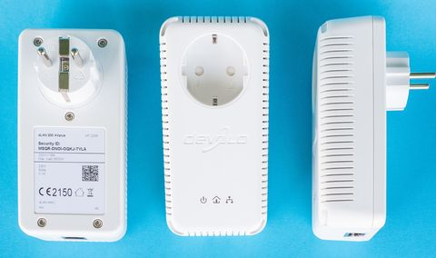

`Imagen Devolo dLAN 200 AVplus - 5016
<https://commons.wikimedia.org/wiki/File:2016-08-17_Devolo_dLAN_200_AVplus_-_5016.jpg>`__
de Sven Teschke / Lizenz
bajo `licencia Creative Commons Attribution-Share Alike 3.0 de <https://creativecommons.org/licenses/by-sa/3.0/de/>`__

----

`Imagen Coaxial cable cut
<https://commons.wikimedia.org/wiki/File:Coaxial_cable_cut.jpg>`__
de FDominec
bajo `licencia Creative Commons Attribution-Share Alike 3.0 <https://creativecommons.org/licenses/by-sa/3.0/>`__

Taller
^^^^^^

.. image:: taller/_thumbs/taller-herramientas.jpg
   :width: 120px

`Imagen herramientas de mano colgadas en el banco de trabajo <https://www.pexels.com/es-es/foto/herramientas-de-mano-colgadas-en-el-banco-de-trabajo-909256/>`__
de `Kim Stiver <https://www.pexels.com/es-es/@wordsurfer>`__
bajo `licencia libre de Pexels <https://www.pexels.com/license/>`__

----

.. image:: taller/_thumbs/taller-herramientas-02.jpg
   :width: 120px

`Imagen llave de cierre de acero inoxidable con llave <https://www.pexels.com/es-es/foto/llave-de-cierre-de-acero-inoxidable-con-llave-210881/>`__
de `Pixabay <https://www.pexels.com/es-es/@pixabay>`__
bajo `licencia libre de Pexels <https://www.pexels.com/license/>`__

Otras imágenes
^^^^^^^^^^^^^^

..
   source: electric-circuito.rst

   Pilas eléctricas.

   `Lead Holder <https://commons.wikimedia.org/wiki/File:AA_AAA_AAAA_A23_battery_comparison-1.jpg>`__,
   `CC BY-SA 3.0 <https://creativecommons.org/licenses/by-sa/3.0/deed.en>`__,
   via Wikimedia Commons.

----

..
   source: electric-circuito.rst

   Alternador eléctrico de un automóvil.

   `El Guarito <https://commons.wikimedia.org/wiki/File:Alternador_003.jpg>`__,
   `CC BY-SA 3.0 <https://creativecommons.org/licenses/by-sa/3.0/deed.en>`__,
   via Wikimedia Commons.

----

..
   source: electric-circuito.rst

   Panel fotovoltaico de generación eléctrica solar.

   `Saintfevrier <https://commons.wikimedia.org/wiki/File:Solar_tracker_in_Lixouri.jpg>`__,
   Public domain, via Wikimedia Commons.

----

..
   source: electric-circuito.rst

   Cable de cobre con 3 hilos de 2.5mm2 de sección cada uno.

   `Petar Milošević <https://commons.wikimedia.org/wiki/File:Electric_guide_3%C3%972.5_mm.jpg>`__,
   `CC BY-SA 4.0 <https://creativecommons.org/licenses/by-sa/4.0/deed.en>`__,
   via Wikimedia Commons.

----

..
   source: electric-circuito.rst

   Cable de alta tensión, de aluminio y acero.

   `Albarubescens <https://commons.wikimedia.org/wiki/File:High_voltage_cables_with_glass_insulators.jpg>`__,
   `CC BY-SA 4.0 <https://creativecommons.org/licenses/by-sa/4.0/deed.en>`__,
   via Wikimedia Commons.

----

..
   source: electric-circuito.rst

   Disco SSD con conectores bañados en oro.

   `Phiarc <https://commons.wikimedia.org/wiki/File:M.2_2230_M-key_SSD_in_comparison_with_Micro-SD_card.jpg>`__,
   `CC BY-SA 4.0 <https://creativecommons.org/licenses/by-sa/4.0/deed.en>`__,
   via Wikimedia Commons.

----

..
   source: electric-circuito.rst

   Componentes SMD unidos a la PCB con soldaduras de estaño-plomo.

   `Phiarc <https://commons.wikimedia.org/wiki/File:Many_different_SMD_capacitors.jpg>`__,
   `CC BY-SA 4.0 <https://creativecommons.org/licenses/by-sa/4.0/deed.en>`__,
   via Wikimedia Commons.

----

..
   source: electric-circuito.rst

   Lámpara led. Produce luz a partir de la electricidad.

   `Mcapdevila <https://commons.wikimedia.org/wiki/File:60_LED_3W_Spot_Light_eq_25W.jpg>`__,
   `CC BY-SA 3.0 <https://creativecommons.org/licenses/by-sa/3.0/deed.en>`__,
   via Wikimedia Commons.

----

..
   source: electric-circuito.rst

   Resistencia eléctrica de una vitrocerámica, produciendo calor.

   `A.Savin <https://commons.wikimedia.org/wiki/File:Electric_stove_coil_with_glass_ceramic_cooktop.jpg>`__,
   `CC BY-SA 3.0 <https://creativecommons.org/licenses/by-sa/3.0/deed.en>`__,
   via Wikimedia Commons.

----

..
   source: electric-circuito.rst

   Interruptor de encendido/apagado.

   `Jszack <https://en.wikipedia.org/wiki/File:On-Off_Switch.jpg>`__,
   `CC BY-SA 2.5 <https://creativecommons.org/licenses/by-sa/2.5/deed.en>`__,
   via Wikimedia Commons.

----

..
   source: electric-circuito.rst

   Interruptor diferencial. Protege a las personas de descargas eléctricas.

   `Raimond Spekking <https://commons.wikimedia.org/wiki/File:Moeller_Xpole_PXF-40-4-003-A-2289.jpg>`__,
   `CC BY-SA 4.0 <https://creativecommons.org/licenses/by-sa/4.0/deed.en>`__,
   via Wikimedia Commons.

----

..
   source: electric-circuito.rst

.. figure:: _thumbs/electric-ascensor.jpg
   :alt: Puerta automática de un ascensor.

   Puerta automática de un ascensor.

   `MMFE <https://commons.wikimedia.org/wiki/File:Lift_Luxembourg_Ville-Haute_-_Grund_01.jpg>`__,
   `CC BY-SA 4.0 <https://creativecommons.org/licenses/by-sa/4.0/deed.en>`__,
   via Wikimedia Commons.

----

..
   source: electric-componentes-index.rst

   `Sebastian Stabinger
   <https://commons.wikimedia.org/wiki/File:Kommutator_universalmotor_stab.jpg>`__,
   `CC BY-SA 3.0 <https://creativecommons.org/licenses/by-sa/3.0/>`__,
   via Wikimedia Commons.

----

..
   source: electric-energia.rst

   Presa de arco de Aldeadávila desembalsando debido a una crecida
   del río.

   `Raiden32
   <https://commons.wikimedia.org/wiki/File:Presa_Aldead%C3%A1vila_desembalsando.JPG>`__,
   `CC BY-SA 4.0 International <https://creativecommons.org/licenses/by-sa/4.0/deed.en>`__,
   via Wikimedia Commons.

----

..
   source: electric-energia.rst

.. figure:: _thumbs/electric-energia-aerogeneradores.jpg

   Aerogeneradores en Thornton Bank a 28km de la costa (off shore),
   en la parte belga del mar del norte.

   `Hans Hillewaert
   <https://commons.wikimedia.org/wiki/File:Windmills_D1-D4_(Thornton_Bank).jpg>`__,
   `CC BY-SA 4.0 International <https://creativecommons.org/licenses/by-sa/4.0/deed.en>`__,
   via Wikimedia Commons.

----

..
   source: electric-energia.rst

   Junta de cardan giratoria, utilizada para transmitir energía.

   `Silberwolf
   <https://commons.wikimedia.org/wiki/File:Cardan-joint_intermediate-shaft_topview_animated.gif>`__,
   `CC BY-SA 2.5 Generic <https://creativecommons.org/licenses/by-sa/2.5/deed.en>`__,
   via Wikimedia Commons.

----

..
   source: electric-energia.rst

   Fuego de cocina a gas.

   `Ivan Radic
   <https://commons.wikimedia.org/wiki/File:Gas_stove_flame.jpg>`__,
   `CC BY-SA 2.0 Generic <https://creativecommons.org/licenses/by-sa/2.0/deed.en>`__,
   via Wikimedia Commons.

----

..
   source: electric-energia.rst

   Surtidor de gasolina cargando el depósito de un automóvil.

   `Rama
   <https://commons.wikimedia.org/wiki/File:Petrol_pump_mp3h0355.jpg>`__,
   `CC BY-SA 2.0 France <https://creativecommons.org/licenses/by-sa/2.0/fr/deed.en>`__,
   via Wikimedia Commons.

----

..
   source: electric-energia.rst

   Central nuclear de José Cabrera en Guadalajara.

   `Mr. Tickle
   <https://commons.wikimedia.org/wiki/File:Nuclear_power_station_in_Almonacid_de_Zorita_(Spain).jpg>`__,
   `CC BY-SA 3.0 Unported <https://creativecommons.org/licenses/by-sa/3.0/deed.en>`__,
   via Wikimedia Commons.

----

..
   source: electric-energia.rst

   Paneles solares en el tejado de una casa.

   `David Hawgood
   <https://commons.wikimedia.org/wiki/File:Installation_of_solar_PV_panels_-_panels_in_place_-_geograph.org.uk_-_2624288.jpg>`__,
   `CC BY-SA 2.0 Generic <https://creativecommons.org/licenses/by-sa/2.0/deed.en>`__,
   via Wikimedia Commons.

----

..
   source: electric-energia.rst

.. figure:: _thumbs/electric-energia-rayo.jpg

   Rayo cayendo en Toronto.

   `John R. Southern
   <https://commons.wikimedia.org/wiki/File:Krunkwerke_-_IMG_4515_(by-sa).jpg>`__,
   `CC BY-SA 2.0 Generic <https://creativecommons.org/licenses/by-sa/2.0/deed.en>`__,
   via Wikimedia Commons.

----

..
   source: electric-energia.rst

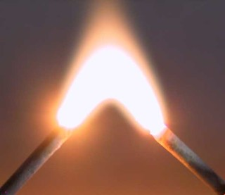

   Arco eléctrico de 3000 voltios.

   `Achim Grochowski
   <https://commons.wikimedia.org/wiki/File:Lichtbogen_3000_Volt.jpg>`__,
   `CC BY-SA 3.0 Unported <https://creativecommons.org/licenses/by-sa/3.0/deed.en>`__,
   via Wikimedia Commons.

----

..
   source: electric-motor.rst

   Partes de un motor de inducción de corriente alterna, abierto para
   poder observar su interior.

   `S. J. de Waard
   <https://commons.wikimedia.org/wiki/File:Rotterdam_Ahoy_Europort_2011_(14).JPG>`__,
   `CC BY-SA 3.0 <https://creativecommons.org/licenses/by-sa/3.0/>`__,
   via Wikimedia Commons.

----

..
   source: electric-motor.rst

   Rotor de un motor de corriente continua.

   `Sebastian Stabinger
   <https://commons.wikimedia.org/wiki/File:Kommutator_universalmotor_stab.jpg>`__,
   `CC BY-SA 3.0 <https://creativecommons.org/licenses/by-sa/3.0/>`__,
   via Wikimedia Commons.

----

..
   source: electric-rele.rst

   Esquema de un relé

   `Digigalos <https://commons.wikimedia.org/wiki/File:Relay_principle_horizontal_new.gif>`__,
   `CC BY-SA 3.0 <https://creativecommons.org/licenses/by/3.0/deed.en>`__,
   via Wikimedia Commons.

----

..
   source: electronic-diodo.rst

   Fotografía de un diodo semiconductor.

   `John Maushammer <https://es.wikipedia.org/wiki/Archivo:Diode-closeup.jpg>`__,
   `CC BY-SA 2.5 <https://creativecommons.org/licenses/by-sa/2.5/deed.es>`__,
   via Wikimedia Commons.

----

..
   source: estructuras-estabilidad.rst

   Grúa de obra con contrapeso a la izquierda.

   Imagen de `Photomix <https://pixabay.com/es/users/photomix-company-1546875/>`__
   en `Pixabay <https://pixabay.com/es/photos/edificio-grua-sitio-de-construcci%c3%b3n-1804030/>`__.

----

..
   source: estructuras-estabilidad.rst

   Camión de bomberos con grúa y apoyos extensibles.

   Imagen de `Hermann Kollinger <https://pixabay.com/es/users/kollinger-15617407/>`__
   en `Pixabay <https://pixabay.com/es/photos/bomberos-pesado-r%c3%bcstfahrzeug-srf-5211377/>`__.

----

..
   source: estructuras-estabilidad.rst

   Fórmula 1 con centro de gravedad muy bajo.

   Imagen de `Nathan Wright <https://pixabay.com/es/users/cozmicphotos-2999334/>`__
   en `Pixabay <https://pixabay.com/es/photos/f1-coche-carreras-raza-velocidad-2722971/>`__.

----

..
   source: estructuras-estabilidad.rst

   Antenas de radio con vientos para anclarlas al suelo.

   Imagen de `LoggaWiggler <https://pixabay.com/es/users/loggawiggler-15/>`__
   en `Pixabay <https://pixabay.com/es/photos/antenas-parab%c3%b3licas-inal%c3%a1mbrico-43232/>`__.

----

..
   source: estructuras-intro.rst

   Presa de agua de Hoover.

   `Adam Kliczek <https://commons.wikimedia.org/wiki/File:Hoover_Dam,_02.jpg>`__,
   `CC BY-SA 3.0 International <https://creativecommons.org/licenses/by-sa/3.0/deed.en>`__,
   via Wikimedia Commons.

----

..
   source: estructuras-intro.rst

   Arcos del acueducto de Segovia.

   `Carlos Delgado <https://commons.wikimedia.org/wiki/File:Acueducto_de_Segovia_-_21.jpg>`__,
   `CC BY-SA 3.0 International <https://creativecommons.org/licenses/by-sa/3.0/deed.en>`__,
   via Wikimedia Commons.

----

..
   source: estructuras-intro.rst

   Puente con estructura triangulada.

   `Waz8 <https://commons.wikimedia.org/wiki/File:Shelburne_Falls_-_truss_bridge_over_Deerfield_River.jpg>`__,
   `CC0 1.0  <https://creativecommons.org/publicdomain/zero/1.0/deed.en>`__,
   via Wikimedia Commons.

----

..
   source: estructuras-intro.rst

   Grúa en forma de pórtico.

   `Richard Humphrey <https://commons.wikimedia.org/wiki/File:Travelling_beam_crane_at_Tallington_concrete_works_-_geograph.org.uk_-_4292023.jpg>`__,
   `CC BY-SA 2.0 International <https://creativecommons.org/licenses/by-sa/2.0/deed.en>`__,
   via Wikimedia Commons.

----

..
   source: estructuras-intro.rst

   Puente colgante de San Francisco.

   `Mikebhuang <https://commons.wikimedia.org/wiki/File:San_Francisco%E2%80%93Oakland_Bay_Bridge_at_Night.jpg>`__,
   `CC BY-SA 4.0 International <https://creativecommons.org/licenses/by-sa/4.0/deed.en>`__,
   via Wikimedia Commons.

----

..
   source: estructuras-intro.rst

   Casco para motorista.

   `Stefania Anghelea <https://commons.wikimedia.org/wiki/File:Moto_Days_2013.jpg>`__,
   `CC BY-SA 4.0 International <https://creativecommons.org/licenses/by-sa/4.0/deed.en>`__,
   via Wikimedia Commons.

----

..
   source: informatica-hardware-almacenamiento.rst

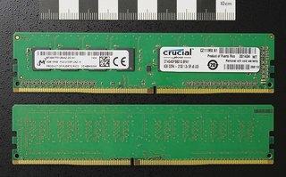

   Módulo de memoria RAM DDR4

   `Smial <https://commons.wikimedia.org/wiki/File:DDR4_DIMM_4GB_-2133_IMGP5813_smial_wp.jpg>`__,
   `GNU Free Documentation License <https://commons.wikimedia.org/wiki/Commons:GNU_Free_Documentation_License,_version_1.2>`__,
   via Wikimedia Commons.

----

..
   source: informatica-hardware-almacenamiento.rst

   Memoria ROM Phoenix BIOS de una placa base de ordenador personal.

   `Raimond Spekking
   <https://commons.wikimedia.org/wiki/File:Elitegroup_755-A2_-_Phoenix_Bios_D686-6679.jpg>`__,
   `CC BY-SA 4.0 <https://creativecommons.org/licenses/by-sa/4.0/>`__,
   via Wikimedia Commons.

----

..
   source: informatica-hardware-almacenamiento.rst

   Unidad de disco duro (HDD) con conexión SATA, vista desde abajo.

   `Dmitry Makeev <https://commons.wikimedia.org/wiki/File:3.5%22_-_hard_disks.jpg>`__,
   `CC BY-SA 4.0 <https://creativecommons.org/licenses/by-sa/4.0/deed.en>`__,
   via Wikimedia Commons.

----

..
   source: informatica-hardware-almacenamiento.rst

   Unidad de almacenamiento de estado sólido (SSD) con conexión
   PCI Express.

   `D-Kuru <https://commons.wikimedia.org/wiki/File:Samsung_980_PRO_PCIe_4.0_NVMe_SSD_1TB-top_PNr%C2%B00915.jpg>`__,
   `CC BY-SA 4.0 <https://creativecommons.org/licenses/by-sa/4.0/deed.en>`__,
   via Wikimedia Commons.

----

..
   source: informatica-hardware-almacenamiento.rst

   Memoria USB (pendrive).

   `Evan-Amos <https://commons.wikimedia.org/wiki/File:SanDisk-Cruzer-USB-4GB-ThumbDrive.jpg>`__,
   Public Domain,
   via Wikimedia Commons.

----

..
   source: informatica-hardware-almacenamiento.rst

   Tarjetas de memoria microSD de varias capacidades.

   `Afrank99 <https://commons.wikimedia.org/wiki/File:MicroSD_cards_2GB_4GB_8GB.jpg>`__,
   `CC BY-SA 3.0 <https://creativecommons.org/licenses/by-sa/3.0/deed.en>`__,
   via Wikimedia Commons.

----

..
   source: informatica-hardware-almacenamiento.rst

.. figure:: _thumbs/informatica-cdrom.jpg

   Disco óptico CD-ROM.

   `Don-vip <https://commons.wikimedia.org/wiki/File:Windows_2000_SP4_install_disc_(French).jpg>`__,
   `CC BY-SA 4.0 <https://creativecommons.org/licenses/by-sa/4.0/deed.en>`__,
   via Wikimedia Commons.

----

..
   source: informatica-hardware-almacenamiento.rst

   Micrografía de la superficie de un CD-ROM en la que se pueden
   ver los surcos con las marcas.

   `Freiermensch <https://commons.wikimedia.org/wiki/File:Afm_cd-rom.jpg>`__,
   `CC BY-SA 3.0 <https://creativecommons.org/licenses/by-sa/3.0/deed.en>`__,
   via Wikimedia Commons.

----

..
   source: informatica-hardware-almacenamiento.rst

   Discos ópticos Blu-ray.

   `Racer009 <https://commons.wikimedia.org/wiki/File:SanDisk-Cruzer-USB-4GB-ThumbDrive.jpg>`__,
   `CC0 1.0 <https://creativecommons.org/publicdomain/zero/1.0/deed.en>`__,
   via Wikimedia Commons.

----

..
   source: informatica-hardware-almacenamiento.rst

   Cinta magnética LTO-2.

   `Hannes Grobe <https://commons.wikimedia.org/wiki/File:400gb-lto-tape_hg.jpg>`__,
   `CC BY-SA 3.0 <https://creativecommons.org/licenses/by/3.0/deed.en>`__,
   via Wikimedia Commons.

----

..
   source: informatica-hardware-almacenamiento.rst

   Discos flexibles (floppy disks) de diferentes tamaños.

   `George Chernilevsky <https://commons.wikimedia.org/wiki/File:Floppy_disk_2009_G1.jpg>`__,
   Public Domain,
   via Wikimedia Commons.

----

..
   source: informatica-hardware-almacenamiento.rst

   Synology DiskStation NAS (Network Attached Storage) de 6 bahías.

   `Radha 1100 <https://commons.wikimedia.org/wiki/File:Synology_DS1621xs%2B_6_Bay_Network_Attached_Storage.png>`__,
   `CC BY-SA 4.0 <https://creativecommons.org/licenses/by/4.0/deed.en>`__,
   via Wikimedia Commons.

----

..
   source: informatica-hardware-auxiliares.rst

   Vista delantera y trasera de un SAI marca APC.

   `AnthDaniel <https://commons.wikimedia.org/wiki/File:UPSAPC.jpg>`__,
   `CC BY-SA 3.0 <https://creativecommons.org/licenses/by-sa/3.0/deed.en>`__,
   via Wikimedia Commons.

----

..
   source: informatica-hardware-auxiliares.rst

   Interior de un ordenador personal con refrigeración líquida.

   `Llama roja <https://commons.wikimedia.org/wiki/File:Refrigeraci%C3%B3n_l%C3%ADquida_en_un_computador.jpg>`__,
   `CC BY-SA 4.0 <https://creativecommons.org/licenses/by-sa/4.0/deed.en>`__,
   via Wikimedia Commons.

----

..
   source: informatica-hardware-auxiliares.rst

   Pila botón CR-2032, la más común en las placas base.

   `Krzysztof Woźnica <https://commons.wikimedia.org/wiki/File:Battery-lithium-cr2032.jpg>`__,
   Public Domain,
   via Wikimedia Commons.

----

..
   source: informatica-hardware-auxiliares.rst

.. figure:: _thumbs/informatica-modding.jpg

   Modificación del chasis con aluminio, acrílico y ledes RGB.

   `Acuantico <https://commons.wikimedia.org/wiki/File:For_the_Horde_Mod_by_Acu%C3%A1ntico_Power.jpg>`__,
   `CC BY-SA 4.0 <https://creativecommons.org/licenses/by-sa/4.0/deed.en>`__,
   via Wikimedia Commons.

----

..
   source: informatica-hardware-clasificacion.rst

   Apple Watch Serie 6 Navy Blue.

   `Avia Husk <https://commons.wikimedia.org/wiki/File:Apple_Watch_Series_6.jpg>`__,
   `CC BY-SA 4.0 International <https://creativecommons.org/licenses/by-sa/4.0/deed.en>`__,
   via Wikimedia Commons.

----

..
   source: informatica-hardware-clasificacion.rst

   Raspberry Pi 2 model B.

   `Evan-Amos <https://commons.wikimedia.org/wiki/File:Raspberry-Pi-2-Bare-BR.jpg>`__,
   Public Domain, via Wikimedia Commons.

----

..
   source: informatica-hardware-clasificacion.rst

   Amazon Fire TV 4K.

   `PAG DEV <https://commons.wikimedia.org/wiki/File:Amazon_Fire_TV_4k.jpg>`__,
   `CC BY-SA 4.0 International <https://creativecommons.org/licenses/by-sa/4.0/deed.en>`__,
   via Wikimedia Commons.

----

..
   source: informatica-hardware-clasificacion.rst

   Sony PlayStation 4 de 2014.

   `Evan-Amos <https://commons.wikimedia.org/wiki/File:PS4-Console-wDS4.jpg>`__,
   Public Domain, via Wikimedia Commons.

----

..
   source: informatica-hardware-clasificacion.rst

   Apple iPhone 13.

   `SimonWaldherr <https://commons.wikimedia.org/wiki/File:IPhone_13_Pro.jpg>`__,
   `CC BY-SA 4.0 <https://creativecommons.org/licenses/by-sa/4.0/deed.en>`__,
   via Wikimedia Commons.

----

..
   source: informatica-hardware-clasificacion.rst

   Imagen de `OpenClipart-Vectors <https://pixabay.com/es/users/openclipart-vectors-30363/>`__
   en `Pixabay <https://pixabay.com/es/vectors/computadora-escritorio-158675/>`__

----

..
   source: informatica-hardware-clasificacion.rst

.. figure:: _thumbs/informatica-cluster-nec.jpg

   `Hindermath <https://commons.wikimedia.org/wiki/File:Nec-cluster.jpg>`__,
   `CC BY-SA 3.0 <https://creativecommons.org/licenses/by-sa/3.0/deed.en>`__,
   via Wikimedia Commons.

----

..
   source: informatica-hardware-clasificacion.rst

   Supercomputador MareNostrum 4 en el centro de supercomputación
   de Barcelona.

   `Vcarceler <https://commons.wikimedia.org/wiki/File:BSC-MareNostrum4-F.jpg>`__,
   `CC BY-SA 4.0 <https://creativecommons.org/licenses/by/4.0/deed.en>`__,
   via Wikimedia Commons.

----

..
   source: informatica-hardware-comunicaciones.rst

   Bus de placa base.

   `Chrihern
   <https://commons.wikimedia.org/wiki/File:Motherboard_bus.jpg>`__,
   via Wikimedia Commons.

----

..
   source: informatica-hardware-comunicaciones.rst

   Conectores SATA de datos y de alimentación de dos discos duros.

   `Dsimic
   <https://commons.wikimedia.org/wiki/File:2.5-inch_SATA_drive_on_top_of_a_3.5-inch_SATA_drive,_close-up_of_data_and_power_connectors.jpg>`__,
   `CC BY-SA 3.0 <https://creativecommons.org/licenses/by-sa/3.0/>`__,
   via Wikimedia Commons.

----

..
   source: informatica-hardware-comunicaciones.rst

.. figure:: _thumbs/informatica-cable-sata.jpg

   Cable de SATA de datos.

   `Swiki
   <https://commons.wikimedia.org/wiki/File:SATA_Data_Cable.jpg>`__,
   `CC BY-SA 3.0 <https://creativecommons.org/licenses/by-sa/3.0/>`__,
   via Wikimedia Commons.

----

..
   source: informatica-hardware-comunicaciones.rst

   Conectores PCI Express x4, x16, x1, x16.

   El conector inferior es PCI x32 (no Express, ya obsoleto).

   `Jona
   <https://commons.wikimedia.org/wiki/File:PCI-E_%26_PCI_slots_on_DFI_LanParty_nF4_SLI-DR_20050531.jpg>`__,
   `CC BY-SA 3.0 <https://creativecommons.org/licenses/by-sa/3.0/>`__,
   via Wikimedia Commons.

----

..
   source: informatica-hardware-comunicaciones.rst

   Módulo de memoria SO-DIMM DDR3 para portátil.

   `Tobias B. Köhler
   <https://commons.wikimedia.org/wiki/File:4GB_DDR3_SO-DIMM.jpg>`__,
   `CC BY-SA 3.0 <https://creativecommons.org/licenses/by-sa/3.0/>`__,
   via Wikimedia Commons.

----

..
   source: informatica-hardware-comunicaciones.rst

   Módulo de memoria DIMM DDR y módulo DDR2 con diferente número de
   pines y distintas ranuras de seguridad.

   `Wagner51
   <https://commons.wikimedia.org/wiki/File:Notch_position_between_DDR_and_DDR2.jpg>`__,
   `CC BY-SA 3.0 <https://creativecommons.org/licenses/by-sa/3.0/>`__,
   via Wikimedia Commons.

----

..
   source: informatica-hardware-comunicaciones.rst

   Zócalo para CPU de tipo LGA 1151, también conocido como
   `Socket H4 <https://es.wikipedia.org/wiki/LGA_1151>`__.

   `Xaar
   <https://commons.wikimedia.org/wiki/File:Socket_1151_closed_01.jpg>`__,
   `CC BY-SA 4.0 <https://creativecommons.org/licenses/by-sa/4.0/>`__,
   via Wikimedia Commons.

----

..
   source: informatica-hardware-comunicaciones.rst

   Conectores USB. Micro tipo B, UC-E6, mini tipo B, hembra tipo A,
   macho tipo A, macho tipo B.

   `Viljo Viitanen
   <https://commons.wikimedia.org/wiki/File:Usb_connectors.JPG>`__,
   via Wikimedia Commons.

----

..
   source: informatica-hardware-comunicaciones.rst

   `Conector USB C <https://es.wikipedia.org/wiki/USB-C>`__
   reversible.

   `Author
   <https://commons.wikimedia.org/wiki/File:USB-C_plug,_focus_stacked.jpg>`__,
   `CC BY-SA 4.0 <https://creativecommons.org/licenses/by-sa/4.0/>`__,
   via Wikimedia Commons.

----

..
   source: informatica-hardware-comunicaciones.rst

   Conectores de audio analógico de 3.5 mm de un ordenador personal.

   `Jud McCranie
   <https://commons.wikimedia.org/wiki/File:Computer_mike,_audio_out,_and_audio_in_jacks.jpg>`__,
   `CC BY-SA 4.0 <https://creativecommons.org/licenses/by-sa/4.0/>`__,
   via Wikimedia Commons.

----

..
   source: informatica-hardware-comunicaciones.rst

   Puertos PS/2 para teclado (morado) y para ratón (verde).

   `Norman Rogers
   <https://commons.wikimedia.org/wiki/File:Ps-2-ports.jpg>`__,
   via Wikimedia Commons.

----

..
   source: informatica-hardware-comunicaciones.rst

   Conector RS-232 (DB-9 hembra).

   `Faxe
   <https://commons.wikimedia.org/wiki/File:RS-232.jpeg>`__,
   `CC BY-SA 3.0 <https://creativecommons.org/licenses/by-sa/3.0/>`__,
   via Wikimedia Commons.

----

..
   source: informatica-hardware-comunicaciones.rst

   Conector VGA macho.

   `Afrank99
   <https://commons.wikimedia.org/wiki/File:VGA_Stecker.jpg>`__,
   `CC BY-SA 2.5 <https://creativecommons.org/licenses/by-sa/2.5/deed.en>`__,
   via Wikimedia Commons.

----

..
   source: informatica-hardware-comunicaciones.rst

   Conector DVI macho.

   `Greg Ebdon
   <https://commons.wikimedia.org/wiki/File:DVI_Connector.jpg>`__,
   `CC BY-SA 3.0 <https://creativecommons.org/licenses/by-sa/3.0/>`__,
   via Wikimedia Commons.

----

..
   source: informatica-hardware-comunicaciones.rst

   Conector HDMI macho.

   `Evan-Amos
   <https://commons.wikimedia.org/wiki/File:HDMI-Connector.jpg>`__,
   via Wikimedia Commons.

----

..
   source: informatica-hardware-comunicaciones.rst

   Conector Ethernet RJ-45 hembra.

   `Amin
   <https://commons.wikimedia.org/wiki/File:Ethernet_port.jpg>`__,
   `CC BY-SA 4.0 <https://creativecommons.org/licenses/by-sa/4.0/>`__,
   via Wikimedia Commons.

----

..
   source: informatica-hardware-comunicaciones.rst

   Cable UTP de Ethernet con conector RJ-45 macho.

   `David Monniaux
   <https://commons.wikimedia.org/wiki/File:Ethernet_RJ45_connector_p1160054.jpg>`__,
   `CC BY-SA 3.0 <https://creativecommons.org/licenses/by-sa/3.0/>`__,
   via Wikimedia Commons.

----

..
   source: informatica-hardware-comunicaciones.rst

   Cable UTP de Ethernet, con cuatro pares de cable de cobre
   trenzados y sin apantallar.

   `Baran Ivo
   <https://commons.wikimedia.org/wiki/File:UTP_cable.jpg>`__,
   via Wikimedia Commons.

----

..
   source: informatica-hardware-comunicaciones.rst

   Logotipo del estándar Wifi.

   `Autor
   <https://commons.wikimedia.org/wiki/File:WiFi_Logo.svg>`__,
   via Wikimedia Commons.

----

..
   source: informatica-hardware-comunicaciones.rst

   Logotipo del estándar Bluetooth.

   `Bluetooth SIG, Inc.
   <https://commons.wikimedia.org/wiki/File:BluetoothLogo.svg>`__,
   via Wikimedia Commons.

----

..
   source: informatica-hardware-cpu.rst

.. figure:: _thumbs/informatica-cpu-486dx2-b.jpg

   CPU 80486DX típica de los PC de mediados de los años 90.

   `Solipsist <https://commons.wikimedia.org/wiki/File:Intel_80486DX2_bottom.jpg>`__,
   `CC BY-SA 2.0 Generic <https://creativecommons.org/licenses/by-sa/2.0/deed.en>`__,
   via Wikimedia Commons.

----

..
   source: informatica-hardware-cpu.rst

.. figure:: _thumbs/informatica-tarjeta-video.jpg

   Tarjeta gráfica Radeon HD 5570.

   `Evan-Amos <https://commons.wikimedia.org/wiki/File:Sapphire-Radeon-HD-5570-Video-Card.jpg>`__,
   Public Domain, via Wikimedia Commons.

----

..
   source: informatica-hardware-esquema-ordenador.rst

.. figure:: _thumbs/informatica-pc-exploded.png

   `Gustavb <https://commons.wikimedia.org/wiki/File:Personal_computer,_exploded_5.svg>`__,
   `CC BY-SA 3.0 Unported <https://creativecommons.org/licenses/by-sa/3.0/deed.en>`__,
   via Wikimedia Commons.

----

..
   source: informatica-hardware-index.rst

   `Evan-Amos <https://commons.wikimedia.org/wiki/File:A790GXH-128M-Motherboard.jpg>`__,
   `CC BY-SA 3.0 <https://creativecommons.org/licenses/by-sa/3.0/deed.en>`__,
   via Wikimedia Commons.

----

..
   source: informatica-hardware-ley-moore.rst

   `Max Roser, Hannah Ritchie <https://commons.wikimedia.org/wiki/File:Moore%27s_Law_Transistor_Count_1970-2020.png>`__,
   `CC BY-SA 4.0 <https://creativecommons.org/licenses/by-sa/4.0/deed.en>`__,
   via Wikimedia Commons.

----

..
   source: informatica-hardware-perifericos.rst

   Ratón con cable.

   `Nzeemin
   <https://commons.wikimedia.org/wiki/File:Microsoft_IntelliMouse_Explorer_40A.jpg>`__,
   `CC BY-SA 3.0 <https://creativecommons.org/licenses/by/3.0/deed.en>`__,
   via Wikimedia Commons.

----

..
   source: informatica-hardware-perifericos.rst

   Teclado español.

   `Oona Räisänen
   <https://commons.wikimedia.org/wiki/File:Computer_keyboard_ES_layout.svg>`__,
   `CC0 1.0 <https://creativecommons.org/publicdomain/zero/1.0/deed.en>`__,
   via Wikimedia Commons.

----

..
   source: informatica-hardware-perifericos.rst

.. figure:: _thumbs/informatica-escaner.jpg

   Escaner.

   `Arpingstone
   <https://commons.wikimedia.org/wiki/File:Scanner.view.750pix.jpg>`__,
   Public Domain,
   via Wikimedia Commons.

----

..
   source: informatica-hardware-perifericos.rst

.. figure:: _thumbs/informatica-camara-web.jpg

   Cámara web externa.

   `Entereczek
   <https://commons.wikimedia.org/wiki/File:Creative.webcam.jpg>`__,
   `CC BY-SA 3.0 <https://creativecommons.org/licenses/by/3.0/deed.en>`__,
   via Wikimedia Commons.

----

..
   source: informatica-hardware-perifericos.rst

   Micrófono magneto-dinámico de marca Sennheiser.

   `ChrisEngelsma
   <https://commons.wikimedia.org/wiki/File:SennMicrophone.jpg>`__,
   `CC BY-SA 3.0 <https://creativecommons.org/licenses/by/3.0/deed.en>`__,
   via Wikimedia Commons.

----

..
   source: informatica-hardware-perifericos.rst

   Tableta gráfica.

   `David Revoy
   <https://commons.wikimedia.org/wiki/File:Penciling_on_Wacom_Cintiq_13HD_by_David_Revoy.jpg>`__,
   `CC BY-SA 4.0 <https://creativecommons.org/licenses/by/4.0/deed.en>`__,
   via Wikimedia Commons.

----

..
   source: informatica-hardware-perifericos.rst

.. figure:: _thumbs/informatica-monitor.jpg

   Monitor LCD.

   `Zzubnik
   <https://commons.wikimedia.org/wiki/File:Computer_monitor.jpg>`__,
   Public Domain,
   via Wikimedia Commons.

----

..
   source: informatica-hardware-perifericos.rst

   Proyector de vídeo.

   `Christian Herzog
   <https://commons.wikimedia.org/wiki/File:Projectiondesign_(Barco_Fredrikstad)_video_projector_at_HighEnd-2009_(3556283833).jpg>`__,
   `CC BY 2.0 <https://creativecommons.org/licenses/by/2.0/deed.en>`__,
   via Wikimedia Commons.

----

..
   source: informatica-hardware-perifericos.rst

   Impresora láser.

   `Alex Muñoz1
   <https://commons.wikimedia.org/wiki/File:Samsung_ML-2010.jpg>`__,
   `CC BY 2.0 <https://creativecommons.org/licenses/by/2.0/deed.en>`__,
   via Wikimedia Commons.

----

..
   source: informatica-hardware-perifericos.rst

   DAC de audio.

   `Vg30et
   <https://commons.wikimedia.org/wiki/File:DAC_in_the_box.jpg>`__,
   `CC BY-SA 3.0 <https://creativecommons.org/licenses/by/3.0/deed.en>`__,
   via Wikimedia Commons.

----

..
   source: informatica-hardware-perifericos.rst

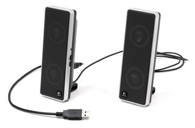

   Altavoces USB.

   `Evan-Amos
   <https://commons.wikimedia.org/wiki/File:Logitech-usb-speakers.jpg>`__,
   Public Domain,
   via Wikimedia Commons.

----

..
   source: informatica-hardware-perifericos.rst

   Pilotos LED de un teclado.

   `Daniel Beardsmore
   <https://commons.wikimedia.org/wiki/File:Lock_LEDs.jpg>`__,
   Public Domain,
   via Wikimedia Commons.

----

..
   source: informatica-hardware-perifericos.rst

   Motor que produce vibración.

   `Raimond Spekking
   <https://commons.wikimedia.org/wiki/File:Nokia_X2-02_-_vibrating_alert_motor-2410.jpg>`__,
   `CC BY-SA 4.0 <https://creativecommons.org/licenses/by/4.0/deed.en>`__,
   via Wikimedia Commons.

----

..
   source: informatica-hardware-perifericos.rst

   Dispositivo de braille.

   `Ixitixel
   <https://commons.wikimedia.org/wiki/File:Refreshable_Braille_display.jpg>`__,
   `CC BY-SA 3.0 <https://creativecommons.org/licenses/by/3.0/deed.en>`__,
   via Wikimedia Commons.

----

..
   source: informatica-hardware-perifericos.rst

.. figure:: _thumbs/informatica-pantalla-tactil.jpg

   Pantalla táctil de un smartphone.

   `Victorgrigas
   <https://commons.wikimedia.org/wiki/File:Bangalore_Wikipedian_on_phone_5_closeup.jpg>`__,
   `CC BY-SA 3.0 <https://creativecommons.org/licenses/by/3.0/deed.en>`__,
   via Wikimedia Commons.

----

..
   source: informatica-hardware-perifericos.rst

   Impresora multifuncion.

   `Eduardo Torres
   <https://commons.wikimedia.org/wiki/File:Multifuncional.jpg>`__,
   `CC BY 2.0 <https://creativecommons.org/licenses/by/2.0/deed.en>`__,
   via Wikimedia Commons.

----

..
   source: informatica-hardware-perifericos.rst

   Casco de realidad virtual.

   `Samwalton9
   <https://commons.wikimedia.org/wiki/File:Oculus_Consumer_Version_1.jpg>`__,
   `CC BY-SA 4.0 <https://creativecommons.org/licenses/by/4.0/deed.en>`__,
   via Wikimedia Commons.

----

..
   source: informatica-hardware-perifericos.rst

   Tarjeta de sonido externa.

   `Woookie
   <https://commons.wikimedia.org/wiki/File:Soundblaster_Live_USB.png>`__,
   `CC BY-SA 3.0 <https://creativecommons.org/licenses/by/3.0/deed.en>`__,
   via Wikimedia Commons.

----

..
   source: informatica-hardware-placabase.rst

   Placa base ASRock A70GXH-128M de 2012.

   `Evan-Amos <https://commons.wikimedia.org/wiki/File:A790GXH-128M-Motherboard.jpg>`__,
   `CC BY-SA 3.0 Unported <https://creativecommons.org/licenses/by-sa/3.0/deed.en>`__,
   via Wikimedia Commons.

----

..
   source: informatica-software-imagenes.rst

.. figure:: _thumbs/informatica-bitmap-svg.svg

   Diferencia entre una imagen de mapa de bits (Raster) y una imagen
   vectorial (SVG).

   `Yug <https://commons.wikimedia.org/wiki/File:Bitmap_VS_SVG.svg>`__,
   `CC BY-SA 2.5 <https://creativecommons.org/licenses/by-sa/2.5/deed.en>`__,
   via Wikimedia Commons.

----

..
   source: informatica-software-imagenes.rst

   `Zaqwerdx <https://commons.wikimedia.org/wiki/File:Rotating_earth_mini.gif>`__,
   `CC BY-SA 3.0 <https://creativecommons.org/licenses/by-sa/3.0/deed.en>`__,
   via Wikimedia Commons.

----

..
   source: informatica-software-imagenes.rst

   `Stephen Winsor <https://commons.wikimedia.org/wiki/File:Tomate.svg>`__,
   `GNU General Public License v3 <https://www.gnu.org/licenses/gpl-3.0.html>`__,
   via Wikimedia Commons.

----

..
   source: material-madera.rst

.. figure:: _thumbs/material-duramen.jpg
   :alt: Tronco de tejo en el que se distingue bien el duramen de la albura

   Tronco de tejo en el que se distingue bien el duramen de la albura.

   `MPF <https://commons.wikimedia.org/wiki/File:Taxus_wood.jpg>`__,
   `CC BY-SA 3.0 <https://creativecommons.org/licenses/by-sa/3.0/deed.en>`__,
   via Wikimedia Commons.

----

..
   source: material-metales.rst

   `2012rc <https://commons.wikimedia.org/wiki/File:Periodic_table_large-es-updated-2018.svg>`__,
   `CC BY 3.0 <https://creativecommons.org/licenses/by/3.0/deed.en>`__,
   via Wikimedia Commons.

----

..
   source: material-petreos.rst

   `Lysippos <https://commons.wikimedia.org/wiki/File:Milv.jpg>`__,
   `CC BY-SA 2.0 DE <https://creativecommons.org/licenses/by-sa/2.0/de/deed.en>`__,
   via Wikimedia Commons.

----

..
   source: material-petreos.rst

   `Rojinegro81 <https://commons.wikimedia.org/wiki/File:Roca_Granito.JPG>`__,
   `CC BY-SA 3.0 <https://creativecommons.org/licenses/by-sa/3.0>`__,
   via Wikimedia Commons.

----

..
   source: material-petreos.rst

   `Dontworry <https://commons.wikimedia.org/wiki/File:St.leonhard-ffm002.jpg>`__,
   `CC BY-SA 3.0 <https://creativecommons.org/licenses/by-sa/3.0/deed.en>`__,
   via Wikimedia Commons.

----

..
   source: material-petreos.rst

   Gran Pirámide de Guiza. Recubierta por completo de piedra caliza.

   `Berthold Werner <https://commons.wikimedia.org/wiki/File:Gizeh_Cheops_BW_1.jpg>`__,
   `CC BY-SA 3.0 <https://creativecommons.org/licenses/by-sa/3.0/deed.en>`__,
   via Wikimedia Commons.

----

..
   source: material-petreos.rst

   `Sarranpa <https://commons.wikimedia.org/wiki/File:Arenisca.jpg>`__,
   `CC BY-SA 4.0 <https://creativecommons.org/licenses/by-sa/4.0/deed.en>`__,
   via Wikimedia Commons.

----

..
   source: material-petreos.rst

         hormigón, todavía líquido, por el suelo.

   `Dafran <https://commons.wikimedia.org/wiki/File:Hormigon-autonivelante.png>`__,
   `CC BY-SA 4.0 <https://creativecommons.org/licenses/by-sa/4.0/deed.en>`__,
   via Wikimedia Commons.

----

..
   source: material-petreos.rst

   `Siim Sepp <https://commons.wikimedia.org/wiki/File:Clay-ss-2005.jpg>`__,
   `CC BY-SA 3.0 <https://creativecommons.org/licenses/by-sa/3.0/deed.en>`__,
   via Wikimedia Commons.

----

..
   source: material-petreos.rst

   `Lourdes Cardenal <https://commons.wikimedia.org/wiki/File:Cuenco_barro_ceramica_popular_lou.jpg>`__,
   `CC BY-SA 3.0 <https://creativecommons.org/licenses/by-sa/3.0/deed.en>`__,
   via Wikimedia Commons.

----

..
   source: material-petreos.rst

   Gres usado en la industria química.

   `Patrick Charpiat <https://commons.wikimedia.org/wiki/File:Beau_021.jpg>`__,
   `CC BY-SA 3.0 <https://creativecommons.org/licenses/by-sa/3.0/deed.en>`__,
   via Wikimedia Commons.

----

..
   source: material-plasticos.rst

   Fotografía de un polímero real usando un microscopio de fuerza atómica.

   `Yurko <https://commons.wikimedia.org/wiki/File:Single_Polymer_Chains_AFM.jpg>`__,
   `CC BY-SA 3.0 <https://creativecommons.org/licenses/by-sa/3.0/deed.es>`__,
   via Wikimedia Commons.

----

..
   source: material-plasticos.rst

.. figure:: _thumbs/material-pet.jpg
   :alt: Botella de agua mineral, fabricada con PET.

   Botella de agua mineral, fabricada con PET.

   `Feralbt <https://commons.wikimedia.org/wiki/File:Botella_de_pl%C3%A1stico_-_PET.jpg>`__,
   `CC BY-SA 3.0 <https://creativecommons.org/licenses/by-sa/3.0/deed.es>`__,
   via Wikimedia Commons.

----

..
   source: material-plasticos.rst

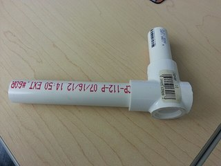

   Tubería y codo de PVC.

   `UsKhalid <https://commons.wikimedia.org/wiki/File:The_PVC_pipe.jpg>`__,
   `CC BY-SA 3.0 <https://creativecommons.org/licenses/by-sa/3.0/deed.es>`__,
   via Wikimedia Commons.

----

..
   source: material-plasticos.rst

   Caja de CD hecha de polipropileno.

   `Hispalois <https://commons.wikimedia.org/wiki/File:Caja_CD_polipropileno.JPG>`__,
   `CC BY-SA 3.0 <https://creativecommons.org/licenses/by-sa/3.0/deed.es>`__,
   via Wikimedia Commons.

----

..
   source: material-plasticos.rst

   Poliestireno expandido o poliexpan, también llamado "corcho blanco".

   `Phyrexian <https://commons.wikimedia.org/wiki/File:Polistirolo.JPG>`__,
   `CC BY-SA 3.0 <https://creativecommons.org/licenses/by-sa/3.0/deed.es>`__,
   via Wikimedia Commons.

----

..
   source: material-plasticos.rst

   Abrazaderas de nailon.

   `Emilian Robert <https://www.flickr.com/photos/28958738@N06/4817475598>`__,
   `Public Domain <https://en.wikipedia.org/wiki/Public_domain>`__,
   via Wikimedia Commons.

----

..
   source: material-plasticos.rst

   Cinta de teflón para prevenir fugas.

   `Miya.m <https://commons.wikimedia.org/wiki/File:PTFE_tape01.jpg>`__,
   `CC BY-SA 3.0 <https://creativecommons.org/licenses/by-sa/3.0/deed.es>`__,
   via Wikimedia Commons.

----

..
   source: material-plasticos.rst

   Gafas protectoras de policarbonato.

   `DJSparky <https://commons.wikimedia.org/wiki/File:Safety_Eyewear.jpg>`__,
   `CC BY-SA 4.0 <https://creativecommons.org/licenses/by-sa/4.0/deed.es>`__,
   via Wikimedia Commons.

----

..
   source: material-plasticos.rst

   Bromo puro rodeado de un cubo de metacrilato.

   `Alchemist-hp <https://commons.wikimedia.org/wiki/File:Safety_Eyewear.jpg>`__,
   `CC BY-SA 3.0 Germany <https://creativecommons.org/licenses/by-sa/3.0/de/deed.es>`__,
   via Wikimedia Commons.

----

..
   source: material-plasticos.rst

   Teléfono fabricado con baquelita.

   `Holger Ellgaard <https://es.wikipedia.org/wiki/Archivo:Ericsson_bakelittelefon_1931.jpg>`__,
   `CC BY-SA 3.0 <https://creativecommons.org/licenses/by-sa/3.0/deed.es>`__,
   via Wikimedia Commons.

----

..
   source: material-plasticos.rst

   Tablero de madera recubierto de melamina.

   `Laidler139 <https://commons.wikimedia.org/wiki/File:MFBs.jpg>`__,
   `CC BY-SA 3.0 <https://creativecommons.org/licenses/by-sa/3.0/deed.es>`__,
   via Wikimedia Commons.

----

..
   source: material-plasticos.rst

   Contenedor de fibra de vidrio con resina epoxi.

   `Diario de Madrid <https://commons.wikimedia.org/wiki/File:Comienza_la_recogida_de_vidrio_%E2%80%98puerta_a_puerta%E2%80%99_en_zonas_de_alta_densidad_hostelera_(02).jpg>`__,
   `CC BY-SA 3.0 <https://creativecommons.org/licenses/by-sa/3.0/deed.es>`__,
   via Wikimedia Commons.

----

..
   source: material-plasticos.rst

   Esponja de poliuretano.

   `Pieria <https://commons.wikimedia.org/wiki/File:Urethane_sponge1.jpg>`__,
   `Public Domain <https://en.wikipedia.org/wiki/Public_domain>`__,
   via Wikimedia Commons.

----

..
   source: material-plasticos.rst

   Guante de látex.

   `Melkom <https://commons.wikimedia.org/wiki/File:PVC-Handschuh.jpg>`__,
   `CC BY-SA 3.0 <https://creativecommons.org/licenses/by-sa/3.0/deed.es>`__,
   via Wikimedia Commons.

----

..
   source: material-plasticos.rst

   Traje de neopreno para buzos.

   `Mark.murphy <https://commons.wikimedia.org/wiki/File:Diving_suit_neoprene.jpg>`__,
   `Public Domain <https://en.wikipedia.org/wiki/Public_domain>`__,
   via Wikimedia Commons.

----

..
   source: material-plasticos.rst

   Pasta de silicona para sellar.

   `Achim Hering <https://commons.wikimedia.org/wiki/File:Caulking.jpg>`__,
   `CC BY-SA 3.0 <https://creativecommons.org/licenses/by-sa/3.0/deed.es>`__,
   via Wikimedia Commons.

----

..
   source: mecan-neumatic-valvula-antirretorno.rst

.. figure:: _thumbs/neumatic-simbolo-valvula-antirretorno-4.png
   :alt: Válvula antirretorno cerrada.

   Válvula antirretorno cerrada.

   `Chris828
   <https://commons.wikimedia.org/wiki/File:Checkvalveclosed.svg>`__,
   `CC BY-SA 3.0 <https://creativecommons.org/licenses/by-sa/3.0/>`__,
   via Wikimedia Commons.

----

..
   source: mecan-neumatic-valvula-antirretorno.rst

.. figure:: _thumbs/neumatic-simbolo-valvula-antirretorno-5.png
   :alt: Válvula antirretorno abierta.

   Válvula antirretorno abierta.

   `Chris828
   <https://commons.wikimedia.org/wiki/File:Checkvalveopen.svg>`__,
   `CC BY-SA 3.0 <https://creativecommons.org/licenses/by-sa/3.0/>`__,
   via Wikimedia Commons.

----

..
   source: mecan-neumatic-valvula-antirretorno.rst

.. figure:: _thumbs/neumatic-simbolo-valvula-estranguladora-3.png
   :alt: Visión interna de una válvula estranguladora o reguladora de caudal.

   Visión interna de una válvula estranguladora o reguladora de caudal.

   `H Padleckas
   <https://commons.wikimedia.org/wiki/File:Valve_cross-section.PNG>`__,
   `CC BY-SA 3.0 <https://creativecommons.org/licenses/by-sa/3.0/>`__,
   via Wikimedia Commons.

----

..
   source: mecan-tornillos.rst

   Tornillo y tuerca hexagonal.

   `Afrank99 <https://commons.wikimedia.org/wiki/File:M4_Inbusschraube_focusstacked.jpg>`__,
   `CC BY-SA 3.0 <https://creativecommons.org/licenses/by-sa/3.0/deed.en>`__,
   via Wikimedia Commons.

----

..
   source: mecan-tornillos.rst

         mueve el mecanismo.

   Gato mecánico para levantar automóviles,
   con un tornillo que mueve el mecanismo.

   `Interiot <https://commons.wikimedia.org/wiki/File:Jackscrew.gif>`__,
   Public Domain, via Wikimedia Commons.

----

..
   source: python-sort-mezcla.rst

   Algoritmo de ordenación por mezcla.

   `Swfung8 <https://commons.wikimedia.org/wiki/File:Merge-sort-example-300px.gif>`__,
   `CC BY-SA 3.0 Unported <https://creativecommons.org/licenses/by-sa/3.0/deed.en>`__,
   via Wikimedia Commons.