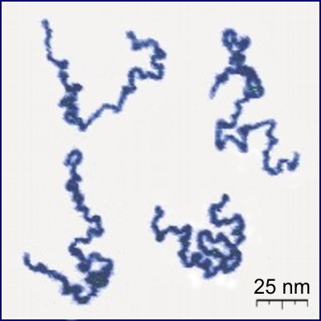

:Date: 04/07/2021
:Author: Carlos Félix Pardo Martín
:License: Creative Commons Attribution-ShareAlike 4.0 International
:tocdepth: 1

.. _material-plasticos:

Los materiales plásticos
========================
Son polímeros fabricados a partir del gas natural o del petróleo refinado.

.. contents:: Índice de contenidos:
   :local:
   :depth: 2

:index:`Polímeros`
------------------
Los `polímeros <https://es.wikipedia.org/wiki/Pol%C3%ADmero>`__
son grandes moléculas compuestas por muchas pequeñas moléculas, iguales
entre sí, llamadas monómeros.

   Fotografía de un polímero real usando un microscopio de fuerza atómica.

   `Yurko <https://commons.wikimedia.org/wiki/File:Single_Polymer_Chains_AFM.jpg>`__,
   `CC BY-SA 3.0 <https://creativecommons.org/licenses/by-sa/3.0/deed.es>`__,
   via Wikimedia Commons.

Los `monómeros <https://es.wikipedia.org/wiki/Mon%C3%B3mero>`__ son
pequeñas moléculas que se unen entre sí en largas cadenas formadas por
la unión de hasta de miles de elementos.
Estas largas cadenas pueden ser lineales, tener ramificaciones o
en forma de red.

Los polímeros generalmente son compuestos basados en uniones de átomos
de carbono, llamados compuestos orgánicos, aunque también pueden estar
basados en uniones de átomos de silicio, llamados siliconas.

Propiedades de los plásticos
----------------------------

Propiedades mecánicas de los plásticos
   En general los plásticos son blandos y con una resistencia
   mecánica media. La tenacidad depende del plástico. Hay plásticos muy
   resistentes a los golpes como el policarbonato y otros muy frágiles.

   Algunos plásticos especiales de altas prestaciones soportan mejor que
   los demás las altas temperaturas y tienen buena resistencia mecánica.
   Es el caso del Kevlar que se utiliza en los chalecos antibalas.

Densidad
   Los plásticos son ligeros, con una densidad parecida a la del agua
   (1 kg/litro)

   Algunos plásticos se fabrican con pompas de gas en su interior para
   conseguir que tengan muy baja densidad y sean buenos aislantes térmicos.
   Por ejemplo, la espuma de poliuretano o el poliestireno expandido
   (corcho blanco) tienen esta estructura.

Respuesta a la luz
   Algunos plásticos como el policarbonato o el metacrilato son muy
   transparentes y se utilizan para fabricar ventanas, DVDs, faros, etc.

   Los plásticos desechados en el medio ambiente se degradan con la
   luz del sol rompiéndose en microplásticos contaminantes
   y produciendo sustancias tóxicas.

Propiedades de fabricación de los plásticos
   Los plásticos son muy maleables, extremadamente dúctiles y fundibles.
   Todo esto facilita mucho la realización de soldaduras o la fabricación
   de láminas finas, hilos, o piezas moldeadas.

Conductividad de los plásticos
   Los plásticos tienen poca conductividad térmica y eléctrica, razón por
   la que se utilizan como aislantes eléctricos y térmicos.

Propiedades químicas de los plásticos
   Resisten muy bien la oxidación, a los ácidos y a los cáusticos.
   Por esa razón muchos contenedores de sustancias químicas están
   hechos de plástico.

Propiedades ecológicas de los plásticos
   La mayoría de plásticos no son biodegradables, son tóxicos en su
   fabricación y en el medio ambiente.

   Los microplásticos representan actualmente un gran problema
   medioambiental porque se incorporan en la cadena trófica como alimento
   de los animales, que más tarde terminamos comiendo los humanos.
   Se calcula que actualmente ingerimos en microplásticos el equivalente
   en peso a una tarjeta de crédito cada año.
   Los microplásticos emiten sustancias parecidas a las hormonas que
   afectan negativamente la salud de todos los animales.

   Los plásticos se pueden reciclar un pequeño número de veces porque al
   reciclarlos se degradan perdiendo sus propiedades originales
   y no sirven para fabricar el mismo producto.

   Se calcula que solo el 14% del plástico se recolecta para su reciclaje.

:index:`Termoplásticos`
-----------------------
Se pueden fundir o derretir a temperaturas no muy altas y vuelven a
endurecerse cuando se enfrían.

`Tereftalato de polietileno (PET) <https://es.wikipedia.org/wiki/Tereftalato_de_polietileno>`__
   Muy usado en envases de bebidas y textiles.

   .. figure:: material/_images/material-pet.jpg
      :width: 240px
      :alt: Botella de agua mineral, fabricada con PET.
      :align: center

      Botella de agua mineral, fabricada con PET.

      `Feralbt <https://commons.wikimedia.org/wiki/File:Botella_de_pl%C3%A1stico_-_PET.jpg>`__,
      `CC BY-SA 3.0 <https://creativecommons.org/licenses/by-sa/3.0/deed.es>`__,
      via Wikimedia Commons.

`Polietileno (PE) <https://es.wikipedia.org/wiki/Polietileno>`__
   Es uno de los plásticos más comunes por su bajo precio.
   Se usa en bolsas, film transparente, tuberías, envases, etc.

   Hay dos grandes tipos de polietileno que se diferencian por su densidad:

      * Polietileno de alta densidad **PEAD**
      * Polietileno de baja densidad **PEBD**

`Cloruro de polivinilo (PVC) <https://es.wikipedia.org/wiki/Cloruro_de_polivinilo>`__
   PVC rígido: se utiliza en envases, ventanas, tuberías.

   PVC flexible: se utiliza para fabricar recubrimiento de cables,
   juguetes, calzados, suelos, etc.
   
   
   

`Polipropileno (PP) <https://es.wikipedia.org/wiki/Polipropileno>`__
   Es el plástico más utilizado después del Polietileno.

   Se utiliza para fabricar envases de alimentos, láminas transparentes,
   tejidos, etc.

   .. figure:: material/_images/material-polipropileno.jpg
      :width: 320px
      :alt: Caja de CD hecha de polipropileno.
      :align: center

      Caja de CD hecha de polipropileno.

      `Hispalois <https://commons.wikimedia.org/wiki/File:Caja_CD_polipropileno.JPG>`__,
      `CC BY-SA 3.0 <https://creativecommons.org/licenses/by-sa/3.0/deed.es>`__,
      via Wikimedia Commons.

`Poliestireno (PS) <https://es.wikipedia.org/wiki/Poliestireno>`__
   Este plástico se funde con temperaturas relativamente bajas (100ºC).

   Se utiliza para fabricar envases de yogur, maquinillas de afeitar,
   poliestireno expandido ("corcho blanco" o poliexpan) aislante
   y de protección.

   .. figure:: material/_images/material-poliexpan.jpg
      :width: 320px
      :alt: Poliestireno expandido o poliexpan, también llamado "corcho blanco".
      :align: center

      Poliestireno expandido o poliexpan, también llamado "corcho blanco".

      `Phyrexian <https://commons.wikimedia.org/wiki/File:Polistirolo.JPG>`__,
      `CC BY-SA 3.0 <https://creativecommons.org/licenses/by-sa/3.0/deed.es>`__,
      via Wikimedia Commons.

Símbolos de reciclaje
   Los termoplásticos suelen identificarse con un símbolo que indica
   su composición, para facilitar su reciclaje.

   .. image:: material/_images/material-plasticos-simbolos-reciclables.jpg
      :alt: Símbolos de los diferentes plásticos reciclables
      :align: center

:index:`Termoplásticos de altas prestaciones`
---------------------------------------------
Son termoplásticos con mejores prestaciones mecánicas y de resistencia
al calor que los termoplásticos comunes.

`Nailon <https://es.wikipedia.org/wiki/Nailon>`__
   Se usa para hacer hilos muy resistentes como los de las medias,
   los paracaídas, el interior de los neumáticos, etc.
   También para fabricar mecanismos como engranajes y cojinetes,
   cremalleras, etc.

`Teflón <https://es.wikipedia.org/wiki/Tefl%C3%B3n>`__
   El politetrafluoroetileno, más conocido como teflón, es un polímero
   prácticamente inerte, por lo que no reacciona con otras sustancias.
   Tiene muy bajo rozamiento, es antiadherente y resiste temperaturas
   hasta 270ºC.

   Se usa como recubrimiento de sartenes, cintas para evitar fugas de agua
   en las roscas de grifos, mecanismos que no necesitan lubricación, etc.

`Policarbonato <https://es.wikipedia.org/wiki/Policarbonato>`__
   Es muy transparente y muy resistente a los impactos por lo que se
   utiliza como sustituto del vidrio. Con él se fabrican CD, DVD, ventanas,
   cristales antibalas, escudos antidisturbios, viseras de casco de
   motorista, paneles de separación COVID, etc.

`Metacrilato <https://es.wikipedia.org/wiki/Polimetacrilato_de_metilo>`__
   Es todavía más transparente que el policarbonato. De 10 a 20 veces más
   resistente al impacto que el vidrio, resiste a la intemperie y a la
   radiación ultravioleta.

   Se utiliza para fabricar fibra óptica, señales, expositores, acuarios,
   obras de arte, etc.

:index:`Termoestables`
----------------------
No se funden una vez fabricados.
Si la temperatura aumenta mucho se degradan sin fundirse, igual que la
madera.

`Baquelita <https://es.wikipedia.org/wiki/Baquelita>`__
   Fue el primer plástico sintético, creado en 1907.
   Se puede fundir y moldear durante su fabricación, pero una vez
   solidificada no se podrá fundir de nuevo.

   Aún hoy usa para fabricar mangos de sartén y asas para enseres de
   cocina, terminales eléctricos, etc.

`Melamina <https://es.wikipedia.org/wiki/Melamina>`__
   Su uso más conocido es para cubrir la madera aglomerada junto a papel
   de colores o imitación a madera. A los muebles que utilizan esta técnica
   se les llama también muebles de melamina.

`Resina epoxi <https://es.wikipedia.org/wiki/Epoxi>`__
   Se usa para hacer adhesivos de dos componentes muy resistentes con los
   que se fabrican aviones, automóviles, material deportivo, etc.

   Otro uso muy frecuente es la elaboración de paneles de fibra
   de vidrio o fibra de carbono, usados para fabricar barcos, carenados
   de automóviles de carreras, contenedores de vidrio, placas de circuito
   impreso, etc.

`Poliuretano <https://es.wikipedia.org/wiki/Poliuretano>`__
   Su uso más conocido es la fabricación de espumas adhesivas que sirven
   como aislante térmico de paredes o para pegar marcos de puertas y
   ventanas con gran capacidad de relleno de huecos.

:index:`Elastómeros`
--------------------
Son polímeros con una gran elasticidad, es decir que se pueden estirar
mucho al aplicar fuerza y, al cesar la fuerza, recuperan su tamaño
inicial.

`Látex <https://es.wikipedia.org/wiki/L%C3%A1tex>`__
   Es de origen natural, una resina que se extrae del árbol siringa
   (Hevea brasiliensis).

   Se usa en guantes, preservativos, colchones, ropa, pelotas,
   neumáticos, chicles, etc.

`Neopreno <https://es.wikipedia.org/wiki/Neopreno>`__
   Su uso más conocido es la fabricación de ropa y botas para el agua que
   son aislantes térmicos (trajes de buceo).

   También sirve para hacer cinta adhesiva, fundas protectoras, sacos de
   dormir, etc.

`Silicona <https://es.wikipedia.org/wiki/Silicona>`__
   La mayoría de los polímeros son compuestos orgánicos, porque están
   basados en largas cadenas de carbono.
   Por el contrario las siliconas se basan en largas cadenas de silicio,
   formando polímeros inorgánicos.

   Se puede destacar su uso como adhesivo para vidrios de ventana y
   juntas, moldes de cocina para horno o para hielo, prótesis médicas, etc.

Cuestionarios
-------------
Cuestionarios de tipo test sobre los materiales plásticos.

* `Materiales plásticos I.
  <../test/es-material-plastics-1.html>`__

* `Materiales plásticos II.
  <../test/es-material-plastics-2.html>`__

* `Materiales plásticos III.
  <../test/es-material-plastics-3.html>`__
