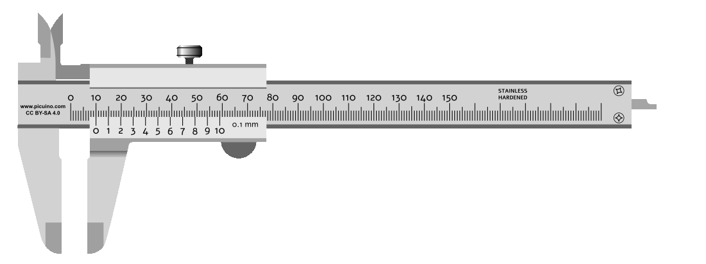
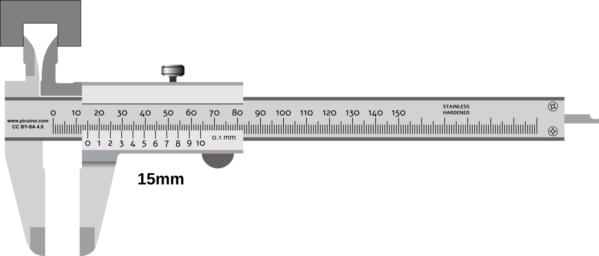
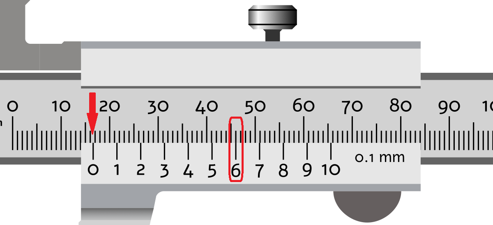
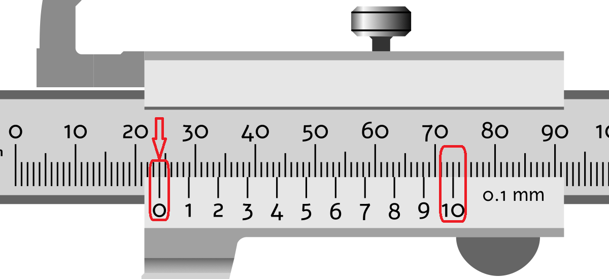

:Date: 01/12/2022
:Author: Carlos Félix Pardo Martín
:License: Creative Commons Attribution-ShareAlike 4.0 International
:tocdepth: 1

.. _mecan-calibre:

El :index:`Calibre`
===================

El **calibre**, también llamado **pie de rey**, es un instrumento
de medición de mayor precisión que una regla milimetrada.

El calibre dispone de varias mordazas y una sonda con las que se pueden
medir con facilidad diámetros exteriores, diámetros interiores
y profundidades.

Su **nonio** también llamado escala **vernier** es una escala auxiliar
que permite la medición de distancias con una precisión desde 0.1
milímetros hasta 0.02 milímetros.
Esta precisión mejora 10 veces o más la precisión de una regla milimetrada.

Partes del calibre
------------------

Un calibre está compuesto de las siguientes partes:

   Partes de un calibre o pie de rey.

1. Mordazas para medir exteriores.
2. Mordazas para medir interiores.
3. Sonda para medir profundidades.
4. Escala principal milimetrada.
5. Nonio para leer fracciones de milímetros.
6. Botón de deslizamiento.
7. Tornillo de freno.
8. Corredera (parte móvil del calibre).
9. Regla (parte fija del calibre).

   Corredera de un calibre moviéndose sobre la regla.

Realización de medidas
----------------------
En las siguientes imágenes se puede ver cómo se toman medidas de
exterior, interior y profundidad de una pieza.

.. figure:: mecan/_images/mecan-calibre-medidas-01.png
   :width: 800px
   :alt: Calibre tomando una medida exterior.
   :align: center

   Calibre tomando una medida exterior.

   Calibre tomando una medida interior.

   Calibre tomando una medida de profundidad.

Medición con el nonio
---------------------
La medida en milímetros de un calibre se puede observar en la escala
principal, donde coincide con la marca de 0 del nonio.

La medida en décimas de milímetro se puede observar en el punto donde
una de las líneas del nonio coincide exactamente con una línea de la
escala principal.

   Medición de una distancia de 16,6 milímetros.

   Medición de una distancia de 24,0 milímetros.

   Medición de una distancia de 9,9 milímetros.

Calibre virtual
---------------
Simulación de un `calibre con precisión de 0.05 milímetros
<https://www.stefanelli.eng.br/es/calibre-virtual-simulador-milimetro-05/>`__.

Ejercicios de medición
----------------------
Lámina con ejercicios para realizar lecturas de distancias con el calibre

:download:`Ejercicios de medidas con calibre. Formato PDF.
<mecan/mecan-calibre-medidas.pdf>`

Test de la unidad
-----------------

`Test online del calibre y sus componentes.
<../test/es-mecan-calibre-partes.html>`__

`Test online de medidas con el calibre.
<../test/es-mecan-calibre-medidas.html>`__
