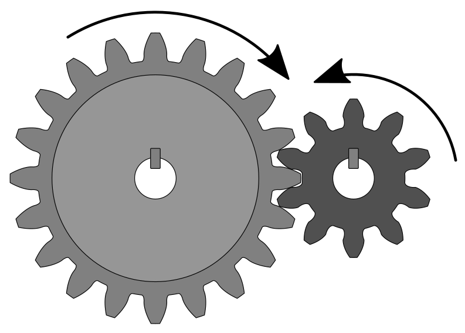
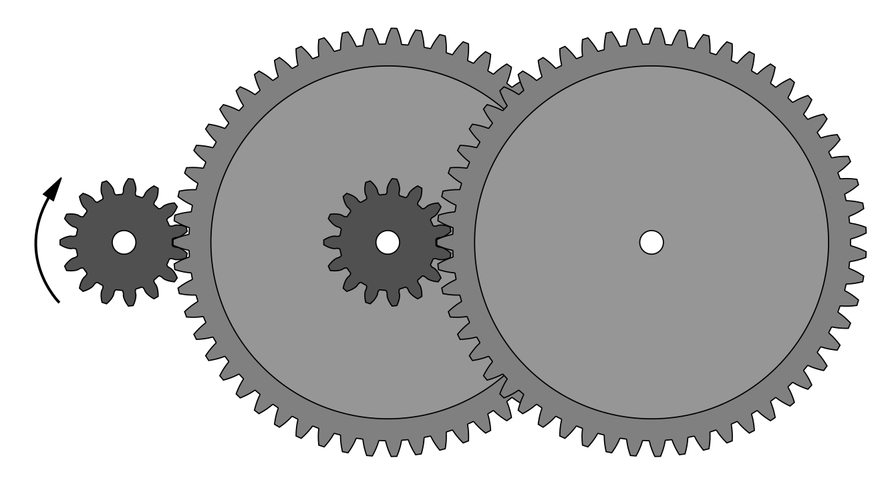

:Date: 28/05/2022
:Modified: 15/01/2026
:Author: Carlos Félix Pardo Martín
:License: Creative Commons Attribution-ShareAlike 4.0 International

.. _mecan-engranajes:

:index:`Engranajes`
===================
Un **engranaje** es un mecanismo compuesto por dos o más
**ruedas dentadas** que encajan entre sí.
Su función principal es **transmitir movimiento** circular y transformar
la velocidad y la fuerza de giro.

Cuando las ruedas tienen distinto tamaño, la rueda más grande se llama
**corona**, y la más pequeña, **piñón**.

   Engranaje de corona y piñón con flechas de sentido de giro.

Una de las aplicaciones más importantes de los engranajes es la
transformación de la velocidad de giro desde un motor, generalmente rápido
y con poco par de giro, hasta la aplicación que ha de realizar trabajo,
generalmente más lenta y con mayor par de giro.

Por ejemplo, en un automóvil, los engranajes transforman la alta
velocidad del motor (que gira muy rápido con poca fuerza) en una
velocidad más baja pero con más fuerza para mover las ruedas.

:index:`Par motor`
------------------
El par motor es la **fuerza de giro** que tiene un eje.

La denominación fuerza de empuje se suele reservar para el caso
de una fuerza que actúa en línea recta. En el caso de ejes giratorios,
el par motor podemos imaginarlo como la fuerza que haría falta aplicar
con una palanca de un metro de largo para conseguir el mismo efecto de
giro.

Por ejemplo, si un motor de automóvil tiene un par motor de 250
Newton·metro, es como si empujáramos un eje giratorio con una
palanca de un metro de longitud aplicando en el extremo 250 Newton
(unos 25 kilogramos de fuerza).

Los engranajes pueden aumentar el par motor (la fuerza de giro),
pero al hacerlo disminuyen la velocidad.

Del mismo modo, si un engranaje aumenta la velocidad, el par motor
disminuye en la misma proporción.

Esto ocurre en todos los mecanismos que transforman el movimiento:
si ganamos fuerza, perdemos velocidad y viceversa.

Cálculo de engranajes
---------------------
La **velocidad de giro** de cada rueda dentada de un engranaje depende del
número de dientes que tiene.

La relación entre ambas ruedas se puede calcular con esta fórmula:

.. math::

    Z_{1} \cdot N_{1} = Z_{2} \cdot N_{2}

Donde:

   Z1 = Dientes de la primera rueda dentada

   N1 = Velocidad angular de la primera rueda dentada

   Z2 = Dientes de la segunda rueda dentada

   N2 = Velocidad angular de la segunda rueda dentada

Es decir, que el número de dientes de una rueda multiplicado por la
velocidad de giro de esa rueda es igual para todas las ruedas.

La velocidad angular se suele medir en **revoluciones por minuto**
también escrito como **rpm**, que significa el número de
vueltas completas que gira la rueda en un minuto.
Un motor típico suele tener una velocidad angular en un rango
desde 600 rpm  hasta 6000 rpm.

Ejercicio aerogenerador
-----------------------
Queremos calcular un engranaje que multiplique la velocidad de giro de un
eje de un aerogenerador.

Las aspas de un aerogenerador giran a una velocidad de 20 rpm, pero el 
generador eléctrico necesita girar a 1000 rpm.
Si el **piñón** conectado al generador tiene 15 dientes
¿Cuántos dientes tendrá la corona conectada a las aspas?

El primer paso será escribir los datos del problema:

.. math::

   N_{1} = 20 \: rpm

.. math::

   N_{2} = 1000 \: rpm

.. math::

   Z_{2} = 15 \: dientes

A continuación escribimos la fórmula y sustituimos los valores conocidos:

.. math::

   Z_{1} \cdot N_{1} = Z_{2} \cdot N_{2}

.. math::

   Z_{1} \cdot 20 \: rpm = 15 \cdot 1000 \: rpm

Por último despejamos la ecuación y calculamos el valor de la incógnita:

.. math::

   Z_{1} = \cfrac{15 \cdot 1000 \: rpm}{20 \: rpm}

.. math::

   Z_{1} = 750 \: dientes

En la práctica, cuando la relación entre los dientes es tan grande, se
suele utilizar un tren de engranajes con más de dos ruedas conectadas
entre sí para reducir o aumentar la velocidad de giro en varias etapas.

   Tren de engranajes que reducen mucho la velocidad de giro del piñón

Ejercicio automóvil eléctrico
-----------------------------
Un automóvil eléctrico tiene el motor conectado mediante un **engranaje
reductor** a las ruedas. Sabemos que la velocidad máxima del motor es de
9000rpm y que la velocidad máxima de las ruedas es de 1500rpm.
Si el número de dientes del engranaje más pequeño debe ser de 8 ó más
dientes ¿Cuantos dientes debe tener cada engranaje?

Este ejercicio permite varias soluciones válidas porque no especifica
el tamaño del piñón.

El primer paso será escribir los datos del problema.
El motor estará conectado al primer engranaje y las ruedas al segundo
engranaje.

.. math::

   N_{1} = 9000 \: rpm

.. math::

   N_{2} = 1500 \: rpm

El engranaje 1, conectado al motor, es el que gira más rápido y, por lo
tanto, es el engranaje más pequeño de los dos. Ahora vamos a escoger
un tamaño para este engranaje pequeño, que sea igual o mayor a 8 dientes:

.. math::

   Z_{1} = 10 \: dientes

A continuación escribimos la fórmula y sustituimos los valores conocidos:

.. math::

   Z_{1} \cdot N_{1} = Z_{2} \cdot N_{2}

.. math::

   10 \cdot 9000 \: rpm = Z_{2} \cdot 1500 \: rpm

Por último despejamos la ecuación y calculamos el valor de la incógnita:

.. math::

   Z_{2} = \cfrac{10 \cdot 9000 \: rpm}{1500 \: rpm}

.. math::

   Z_{2} = 60 \: dientes

El número de dientes del segundo engranaje conectado a la rueda será
de 60 dientes.
