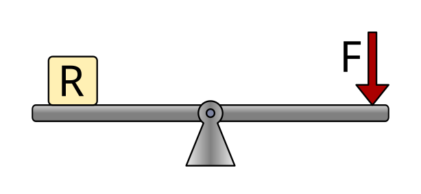

:date: 2018-12-10
:modified: 2026-06-13
:author: Carlos Félix Pardo Martín
:license: Creative Commons Attribution-ShareAlike 4.0 International
:license_url: https://creativecommons.org/licenses/by-sa/4.0/

.. _mecan-maquinas-index:

***********************
 Máquinas y Mecanismos
***********************

Máquinas y mecanismos que transforman las fuerzas y los
movimientos.

.. toctree::
   :maxdepth: 1
   :titlesonly:

   mecan-palancas.rst
   mecan-tornillos.rst
   mecan-poleas.rst
   mecan-engranajes.rst
   mecan-termicas.rst

..
   mecan-maquinas-intro.rst
   mecan-maquinas-lineales.rst
   mecan-maquinas-giratorios.rst
   mecan-maquinas-mixtos.rst
   mecan-maquinas-auxiliares.rst
