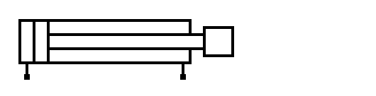
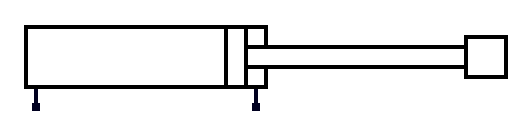
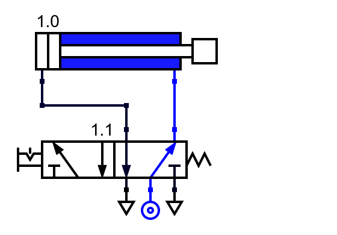
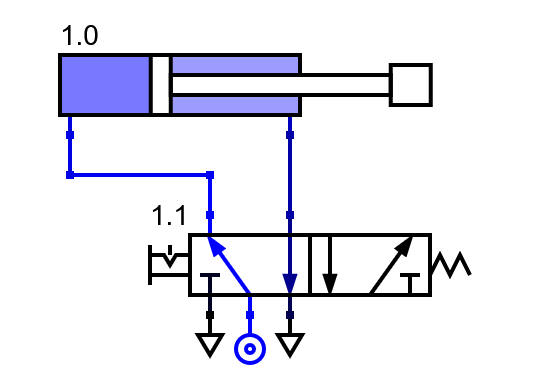
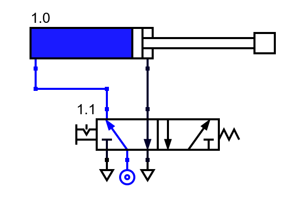

:Date: 03/04/2024
:Author: Carlos Félix Pardo Martín
:License: Creative Commons Attribution-ShareAlike 4.0 International

.. _mecan-neumatic-doble-efecto:

Cilindro de doble efecto
========================
Un cilindro de **doble efecto** es un cilindro que tiene dos vías de
entrada y salida de aire. El vástago puede salir con fuerza cuando se
inyecta aire en la parte trasera y puede entrar con fuerza cuando se
inyecta aire en la parte delantera.

   Cilindro de doble efecto con vástago dentro.

   Cilindro de doble efecto con vástago fuera.

En el caso de que el cilindro de doble efecto no tenga presión de aire
en ninguna de sus dos vías, no tendrá fuerza en ningún sentido y se
podrá mover libremente sin esfuerzo, tanto dentro como fuera.
Por esta razón, el cilindro siempre debe tener presión en una de sus dos
cámaras.

Los cilindros de doble efecto se pilotan mediante una **válvula 4/2**
o mediante una **válvula 5/2**. Ambas válvulas son semejantes y solo se
diferencian en el número de escapes que poseen (un escape la válvula 4/2
y dos escapes la válvula 5/2).

A continuación se muestra el esquema en reposo del cilindro de doble
efecto pilotado por una válvula 5/2:

   
   Cilindro de doble efecto pilotado por una válvula 5/2, en reposo.

Cuando accionamos la válvula 5/2, el aire que proviene de la unidad de
mantenimiento pasa hacia la vía superior izquierda de la válvula y entra
en la parte posterior del cilindro.
Como consecuencia, el cilindro se llena de aire en la parte trasera
mientras el aire de la parte delantera se escapa a la atmósfera.
El resultado es que el vástago del cilindro sale hacia fuera empujando
la carga que se encuentre delante:

   
   Cilindro de doble efecto pilotado por una válvula 5/2, saliendo.

Una vez que el vástago ha salido hasta el tope, nos encontramos con el
siguiente esquema:

   
   Cilindro de doble efecto pilotado por una válvula 5/2 accionada.

Cilindro doblemente pilotado
----------------------------
La fuerza de salida del vástago siempre es un poco mayor que la fuerza
de entrada porque el aire comprimido no puede hacer presión sobre la zona
que ocupa el vástago. Si inyectamos aire a presión en las dos vías del
cilindro, este saldrá hacia fuera con poca fuerza.

Para comprobarlo en el simulador, acciona primero la válvula 1.2 de la
derecha. Una vez accionada, acciona ahora la válvula 1.1 de la izquierda.
Podrás ver cómo el vástago del cilindro, poco a poco, sale hasta el tope:

.. raw:: html

   

   <iframe src="/neumatic/index.html?loadFile=double-32-manual.txt"></iframe>
   

Ejercicios
----------

#. Explica las características principales de un cilindro de doble
   efecto.

#. Dibuja un esquema de un cilindro de doble efecto en reposo,
   con el vástago dentro, comandado por una válvula 5/2.

#. Dibuja un esquema de un cilindro de doble efecto accionado,
   con el vástago fuera, comandado por una válvula 5/2.

#. Simula el funcionamiento de un cilindro de doble efecto
   comandado por una válvula 5/2.

   .. raw:: html

      

      <iframe src="/neumatic/index.html"></iframe>
      

#. ¿Qué ocurrirá si quitamos los escapes de la válvula 5/2?
   Simula el funcionamiento. Explica cómo cambia el funcionamiento al
   retirar el escape y explica porqué se comporta de esa manera.

#. Utiliza dos válvulas 3/2 para hacer funcionar un cilindro de doble
   efecto en el siguiente simulador:

   .. raw:: html

      

      <iframe src="/neumatic/index.html"></iframe>
      

#. ¿Qué puede pasar en el circuito anterior si accionamos las
   dos válvulas 3/2 a la vez?

#. ¿Qué puede pasar en el circuito anterior si no accionamos
   ninguna válvula 3/2?
