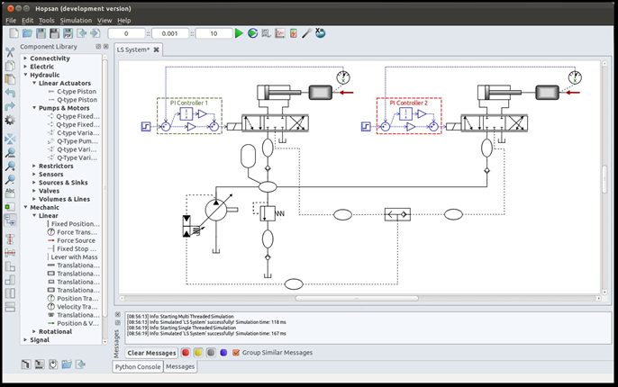

:date: 2021-05-19
:author: Carlos Félix Pardo Martín
:license: Creative Commons Attribution-ShareAlike 4.0 International
:tocdepth: 1

.. _mecan-neumatic-intro:

Introducción a la neumática
===========================
La neumática es la tecnología que emplea el aire comprimido
como medio de transmisión de energía para mover mecanismos y máquinas.

Simulador de neumática
----------------------

.. raw:: html

   

   <iframe src="/neumatic/index.html?loadFile=double-52-auto.txt"></iframe>
   

`Simulador de neumática a pantalla completa. </neumatic/index.html>`__

Teoría sobre neumática
----------------------

Libro del CIDEAD
   `Neumática e hidráulica I.
   <../_static/4esotecno/quincena9/pdf/quincena9.pdf>`__

   `Neumática e hidráulica II.
   <../_static/4esotecno/quincena10/pdf/quincena10.pdf>`__

Web Portal ESO
   `Unidad didáctica neumática e hidráulica (PDF).
   <http://www.portaleso.com/neumatica/unidad_didactica_neumatica_4_v1_c.pdf>`__

   `Transparencias de la unidad didáctica neumática e hidráulica (PPT).
   <http://www.portaleso.com/neumatica/unidad_neumatica_4_v1_c.ppt>`__

Simulador de neumática Hopsan
-----------------------------
`Hopsan <https://liu.se/en/research/hopsan>`__
es una herramienta de simulación de sistemas, open-source,
desarrollada por la Universidad de Linköping.

Vídeos de circuitos neumáticos
------------------------------

#. Vídeo: `Neumática Industrial, ¿Cómo Trabaja un Sistema Neumático? 
   <https://www.youtube.com/watch?v=Wee85cI6wwQ>`__

#. Vídeo: `¿Qué es la NEUMÁTICA? | Documental del AIRE COMPRIMIDO
   <https://www.youtube.com/watch?v=gu3u5TnuBx0>`__

#. Vídeo: `Explicación del funcionamiento de un cilindro neumático (animación)
   <https://www.youtube.com/watch?v=hmz1h5fk2bI>`__

#. Vídeo: `Circuitos neumáticos.
   <https://www.youtube.com/watch?v=PZUS_Eo4dKM>`__

#. Vídeo: `NEUMÁTICA BÁSICA | INTRODUCCIÓN
   <https://www.youtube.com/watch?v=gbQ3JBcjHFI>`__

#. Vídeo: `Pneumatic Aluminum Can Crusher
   <https://www.youtube.com/watch?v=L-8xOyK_tVA>`__

#. Vídeo: `Aplicaciones de la neumática en la industria
   <https://www.youtube.com/watch?v=3iblsY8OGh4>`__

#. Vídeo: `Aplicaciones de la Neumática en la Industria Alimenticia
   <https://www.youtube.com/watch?v=Jptn_Ib1048>`__
