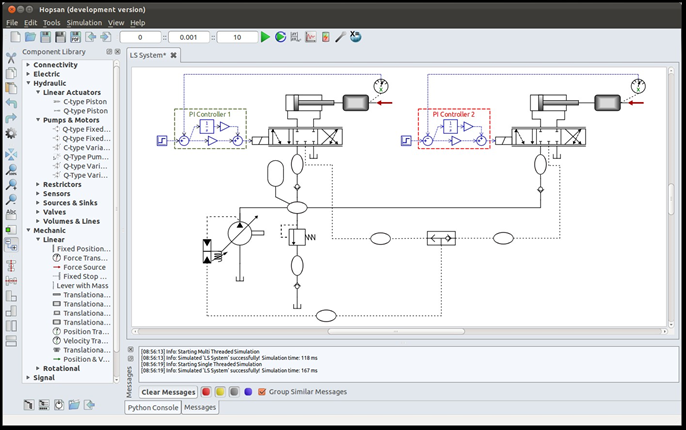

:Date: 19/05/2021
:Author: Carlos Félix Pardo Martín
:License: Creative Commons Attribution-ShareAlike 4.0 International
:tocdepth: 1

.. _mecan-neumatic-intro:

Introducción a la neumática
===========================
La neumática es la tecnología que emplea el aire comprimido
como medio de transmisión de energía para mover mecanismos y máquinas.

Simulador de neumática
----------------------

.. raw:: html

   

   <iframe src="/neumatic/index.html?loadFile=double-52-auto.txt"></iframe>
   

`Simulador de neumática a pantalla completa. </neumatic/index.html>`__

Teoría sobre neumática
----------------------

Libro del CIDEAD
   `Neumática e hidráulica I.
   <../_static/4esotecno/quincena9/pdf/quincena9.pdf>`__

   `Neumática e hidráulica II.
   <../_static/4esotecno/quincena10/pdf/quincena10.pdf>`__

Web Portal ESO
   `Unidad didáctica neumática e hidráulica (PDF).
   <http://www.portaleso.com/neumatica/unidad_didactica_neumatica_4_v1_c.pdf>`__

   `Transparencias de la unidad didáctica neumática e hidráulica (PPT).
   <http://www.portaleso.com/neumatica/unidad_neumatica_4_v1_c.ppt>`__

Simulador de neumática Hopsan
-----------------------------
`Hopsan <https://liu.se/en/research/hopsan>`__
es una herramienta de simulación de sistemas, open-source,
desarrollada por la Universidad de Linköping.

Vídeos de circuitos neumáticos
------------------------------

#. Vídeo: `¿Qué es la NEUMÁTICA? | Documental del AIRE COMPRIMIDO
   <https://www.youtube-nocookie.com/embed/gu3u5TnuBx0>`__

#. Vídeo: `Neumática Industrial, ¿Cómo Trabaja un Sistema Neumático?
   <https://www.youtube-nocookie.com/embed/Wee85cI6wwQ>`__

#. Vídeo: `Circuitos neumáticos.
   <https://www.youtube-nocookie.com/embed/PZUS_Eo4dKM>`__

#. Vídeo: `NEUMÁTICA BÁSICA | INTRODUCCIÓN
   <https://www.youtube-nocookie.com/embed/gbQ3JBcjHFI>`__

