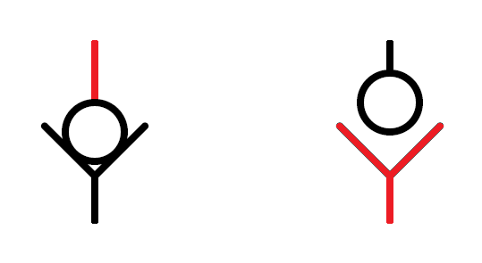

:Date: 10/04/2024
:Author: Carlos Félix Pardo Martín
:License: Creative Commons Attribution-ShareAlike 4.0 International

.. _mecan-neumatic-pilotaje-neumatico:

Válvula con pilotaje neumático
==============================

   Símbolos de la válvula antirretorno cerrada y abierta.

Ejercicios
----------

#. Dibuja el símbolo de una válvula 5/2 con doble pilotaje neumático.

#. 