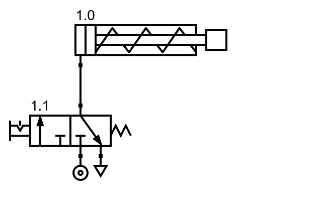
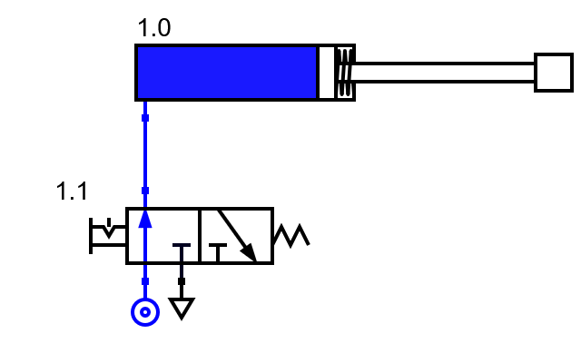

:Date: 02/04/2024
:Author: Carlos Félix Pardo Martín
:License: Creative Commons Attribution-ShareAlike 4.0 International

.. _mecan-neumatic-simple-efecto:

Cilindro de simple efecto
=========================
Un cilindro de **simple efecto** es un cilindro cuyo vástago sale fuera
debido al aire comprimido que se inyecta en la parte trasera.

El movimiento de entrada del vástago se realiza gracias a un muelle
que dispone de poca fuerza, por lo que no sirve para mover cargas
externas.

Este cilindro puede hacer fuerza hacia fuera, pero apenas hace fuerza al
moverse hacia dentro.

Los cilindros de simple efecto se comandan mediante una **válvula 3/2**
que puede inyectar aire comprimido por una vía o dejar escapar el aire
comprimido del cilindro por esa misma vía hacia la atmósfera.

A continuación se muestra el esquema en reposo del cilindro de simple
efecto:

Cuando accionamos la válvula 3/2, el aire que proviene de la unidad de
mantenimiento pasa hacia la vía superior de la válvula y entra en la parte
posterior del cilindro. Como consecuencia, el cilindro se llena de aire
y el pistón sale del cilindro empujando la carga que tenga delante:

Para finalizar, al llevar a reposo la válvula 3/2, el aire comprimido
del interior del cilindro vuelve hacia atrás y sale por la vía de escape
de la válvula 3/2:

.. image:: neumatic/_images/neumatic-32-simple-2.png
   :alt: Pistón de simple efecto (entrando) comandado por válvula 3/2.
   :width: 389px
   :align: center

Ejercicios
----------

#. Explica las características principales de un cilindro de simple
   efecto.

#. Dibuja un esquema de un cilindro de simple efecto en reposo,
   comandado por una válvula 3/2.

#. Dibuja un esquema de un cilindro de simple efecto accionado,
   comandado por una válvula 3/2.

#. Simula el funcionamiento de un cilindro de simple efecto
   comandado por una válvula 3/2.

   `Simulador de neumática. <../_static/flash/simulador-neumatica.html>`__

#. ¿Qué ocurrirá si quitamos el escape de la válvula 3/2?
   Simula el funcionamiento. Explica cómo cambia el funcionamiento al
   retirar el escape y explica porqué se comporta de esa manera.

   .. figure:: neumatic/_images/neumatic-escape.png
      :alt: Escape.
      :align: center

      Escape neumático.

#. Utiliza dos válvulas 3/2 para hacer funcionar un cilindro de simple
   efecto en el `simulador. <../_static/flash/simulador-neumatica.html>`__
   Solo una de las válvulas tendrá escape.

   Explica el funcionamiento del circuito:

   .. figure:: neumatic/_images/neumatic-32-simple-3.png
      :alt: Escape.
      :width: 421px
      :align: center

