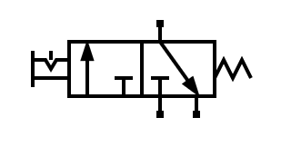
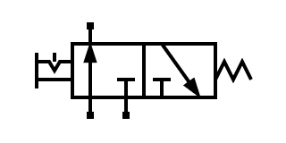
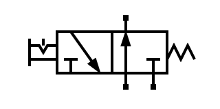
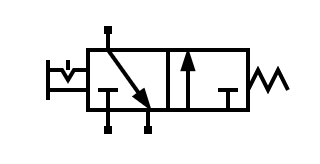
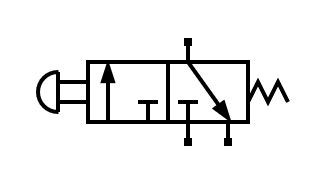
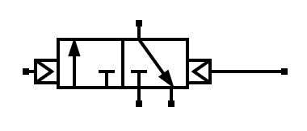

:Date: 30/12/2025
:Author: Carlos Félix Pardo Martín
:License: Creative Commons Attribution-ShareAlike 4.0 International

.. _mecan-neumatic-valvula-32:

Válvula 3/2
===========
Una válvula 3/2 tiene 3 vías de aire y 2 posiciones:

   Válvula 3/2 normalmente cerrada, en reposo.

   Válvula 3/2 normalmente cerrada, accionada.

Las dos vías de debajo se suelen conectar a la fuente de presión en su
izquierda y al escape a la derecha.
La vía superior se utiliza para llevar aire a un cilindro de simple
efecto o para retirar ese aire durante el reposo.

Esta válvula permite accionar el cilindro y llevarlo al reposo con un
solo elemento de control, tal y como se puede comprobar en la siguiente
simulación:

.. raw:: html

   

   <iframe src="/neumatic/index.html?loadFile=single-32.txt"></iframe>
   

* Al **accionar la válvula 3/2**, el aire pasa directamente desde la
  fuente de presión hacia el cilindro neumático, por lo que el vástago
  sale completamente hacia afuera. Este comportamiento es el mismo que
  tenía una válvula 2/2.

* Al **llevar a reposo la válvula 3/2**, el aire introducido en el
  cilindro tiene una vía de escape a través de la válvula, por lo que el 
  cilindro retorna a su posición de reposo. Esto es equivalente a abrir
  otra válvula 2/2 para permitir el escape de aire.

Válvula normalmente abierta
---------------------------
En ocasiones es necesario que la válvula deje pasar el aire cuando está 
en reposo y que corte el paso de aire cuando se acciona.
La válvula con este funcionamiento se denomina **Normalmente Abierta**
y tiene en su símbolo los dos estados intercambiados:

   Válvula 3/2 normalmente abierta, en reposo.

   Válvula 3/2 normalmente abierta, accionada.

Accionamientos
--------------
Las válvulas vistas hasta el momento tienen un accionamiento manual con
enclavamiento. Esto significa que la válvula se mueve con la mano y se 
mantiene en esa posición hasta que volvemos a accionarla manualmente.

Existen otros tipos de accionamientos como el accionamiento por 
**pulsador con retorno a muelle**.
Este accionamiento mueve la válvula mientras se está pulsando, 
pero vuelve a su posición de reposo al dejar de pulsar:

   Válvula 3/2 accionada por pulsador y retorno a muelle.

En el **accionamiento por rodillo con retorno a muelle**, un rodillo se 
mueve para accionar la válvula cuando choca con un pistón o con un objeto
que se mueve:

.. figure:: neumatic/_images/neumatic-valve-32-6.png
   :alt: Válvula 3/2 accionada por rodillo y retorno a muelle.
   :width: 160px
   :align: center

   Válvula 3/2 accionada por rodillo y retorno a muelle.

En el **accionamiento por pilotaje neumático** la manera de accionar la
válvula es aportando aire a presión en cada uno de sus extremos derecho o
izquierdo:

   Válvula 3/2 accionada neumáticamente.

Ejercicios
----------

#. ¿Qué es una válvula neumática 3/2 y de qué partes se compone?

#. Explica con tus palabras cómo funciona una válvula 3/2 en cada una
   de sus dos posiciones.

#. Dibuja una válvula 3/2 normalmente abierta y una válvula 3/2
   normalmente cerrada, ambas en reposo.

#. Dibuja en el siguiente simulador un cilindro de simple efecto accionado
   por una válvula 3/2 manual con enclavamiento, normalmente abierta.
   
   Para dibujar la válvula **normalmente abierta**, dibuja una válvula
   normalmente cerrada (por defecto) y luego elige en el menú 
   ``Editar... Voltear`` y al clicar sobre la válvula cambiará su
   funcionamiento.
  
   .. raw:: html

      

      <iframe src="/neumatic/index.html"></iframe>
      

#. Explica brevemente cada uno de los 4 accionamientos de una válvula
   neumática que se han visto más arriba.

#. Dibuja en el siguiente simulador un cilindro de simple efecto accionado
   por una válvula 3/2 con accionamiento por rodillo.
   
   Coloca el rodillo al comienzo de la carrera del cilindro y simula el 
   circuito para ver cómo se comporta.
  
   .. raw:: html

      

      <iframe src="/neumatic/index.html"></iframe>
      

#. Explica con tus palabras el comportamiento del circuito anterior
   y por qué funciona de esa manera.