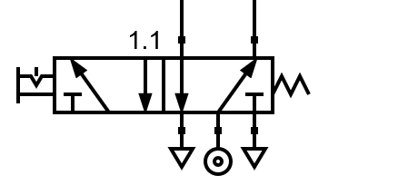
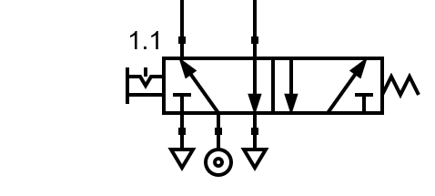

:Date: 02/01/2026
:Author: Carlos Félix Pardo Martín
:License: Creative Commons Attribution-ShareAlike 4.0 International

.. _mecan-neumatic-valvula-52:

Válvula 5/2
===========
Una válvula 5/2 tiene 5 vías de aire y 2 posiciones:

   Válvula 5/2 en reposo.

   Válvula 5/2 accionada.

Las tres vías de la parte inferior se conectan a la fuente de presión 
(vía de en medio) y a los escapes a la izquierda y a la derecha.
Las dos vías superiores se utilizan para llevar aire a dos lugares
distintos o para retirar ese aire durante el reposo. Esta válvula está
pensada para pilotar cilindros de dos vías que veremos más adelante.

En la siguiente simulación podemos ver cómo funciona esta válvula
pilotando dos cilindros de simple efecto:

.. raw:: html

   

   <iframe src="/neumatic/index.html?loadFile=single-52.txt"></iframe>
   

* Al **accionar la válvula 5/2**, el aire pasa directamente desde la
  fuente de presión hacia el cilindro neumático 1.0, por lo que el vástago
  sale completamente hacia afuera. Mientras tanto, el cilindro 2.0 se
  conecta con el escape, permitiendo que este vuelva a su posición de
  reposo.

* Al **llevar a reposo la válvula 5/2**, el aire antes introducido en el
  cilindro 1.0 tiene una vía de escape a través de la válvula, por lo que
  este cilindro retorna a su posición de reposo. 
  Mientras tanto, al cilindro 2.0 le llega toda la presión, por lo que el
  vástago sale completamente hacia fuera.

Ejercicios
----------

#. ¿Qué es una válvula neumática 5/2 y de qué partes se compone?

#. Explica con tus palabras cómo funciona una válvula 5/2 en cada una
   de sus dos posiciones.

#. Dibuja una válvula 5/2 de accionamiento manual en reposo.
   Dibuja también una válvula 5/2 de accionamiento manual accionada.
   
   En ambos casos dibuja las entradas de presión y los escapes.

#. Dibuja en el siguiente simulador dos cilindros de simple efecto
   accionados por una válvula 5/2 manual con enclavamiento.

   Comprueba que su funcionamiento es el mismo que el circuito simulado
   al comienzo de este tema.
   
   .. raw:: html

      

      <iframe src="/neumatic/index.html"></iframe>
      
