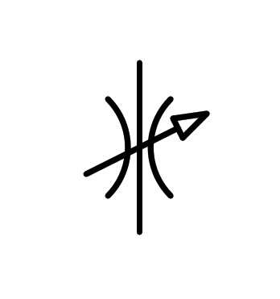
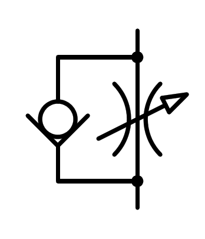
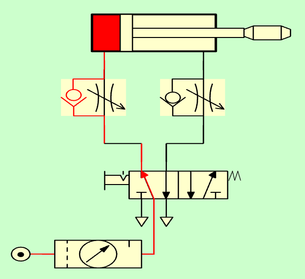
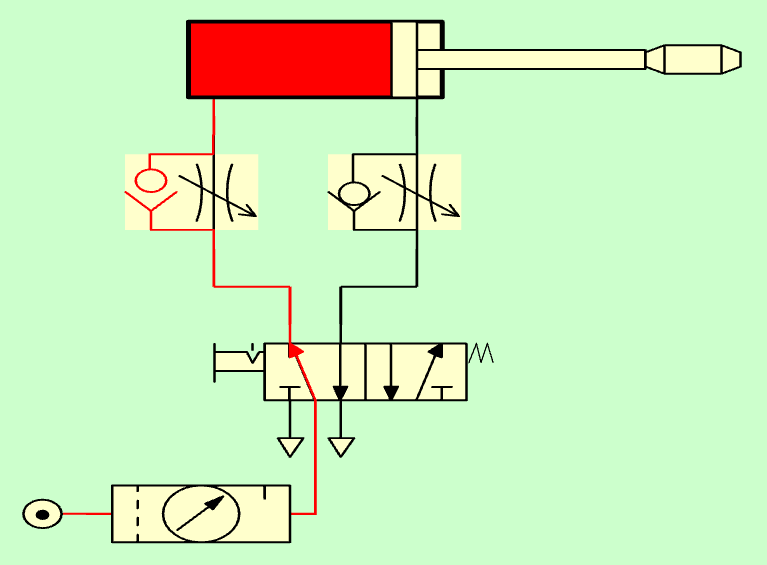

:Date: 09/04/2024
:Author: Carlos Félix Pardo Martín
:License: Creative Commons Attribution-ShareAlike 4.0 International

.. _mecan-neumatic-valvula-antirretorno:

La válvula antirretorno
=======================
Una válvula antirretorno, también llamada válvula de retención, tiene la
tarea de permitir el paso del aire a presión en un sentido y cortar por
completo el paso del aire a presión en el sentido contrario.

Su posición suele ser la que aparece en los siguientes símbolos, por lo
que estas válvulas permiten la circulación de aire a presión hacia arriba
y cortan el paso del aire a presión hacia abajo:

.. figure:: neumatic/_images/neumatic-simbolo-valvula-antirretorno-3.png
   :align: center
   :width: 270px
   :alt: Símbolos de la válvula antirretorno cerrada y abierta.

   Símbolos de la válvula antirretorno cerrada y abierta.

La construcción interna de estas válvulas puede hacerse con una esfera y
un cono como el de un embudo en el que encaja la esfera.

Cuando el aire a presión llega desde arriba, la esfera se enclava en
el embudo gracias a la presión del muelle y del propio aire a presión.
En esta posición la esfera no permite el paso de aire hacia abajo:

   Válvula antirretorno cerrada.

   `Chris828
   <https://commons.wikimedia.org/wiki/File:Checkvalveclosed.svg>`__,
   `CC BY-SA 3.0 <https://creativecommons.org/licenses/by-sa/3.0/>`__,
   via Wikimedia Commons.

Cuando el aire a presión llega desde abajo, la esfera se levanta por la
presión del aire (mucho mayor que la fuerza del muelle) permitiendo que
circule el aire a presión hacia arriba:

   Válvula antirretorno abierta.

   `Chris828
   <https://commons.wikimedia.org/wiki/File:Checkvalveopen.svg>`__,
   `CC BY-SA 3.0 <https://creativecommons.org/licenses/by-sa/3.0/>`__,
   via Wikimedia Commons.

La válvula estranguladora
-------------------------
Esta válvula, también llamada reguladora de caudal, es una válvula que
cierra parcialmente el paso al aire a presión para dejar que circule
solo una parte de todo el caudal de aire.

Su función es la misma que tiene un grifo de agua, que permite controlar
el chorro de agua con mayor o menor caudal, pero aplicado al aire a
presión.

   Símbolo de una válvula estranguladora o reguladora de caudal.

Internamente la válvula está constituida por un tornillo que acerca o aleja
un tapón a la abertura del aire a presión. Cuanto más cerca está el tapón
de la abertura, menos caudal de aire permitirá pasar.

   Visión interna de una válvula estranguladora o reguladora de caudal.

   `H Padleckas
   <https://commons.wikimedia.org/wiki/File:Valve_cross-section.PNG>`__,
   `CC BY-SA 3.0 <https://creativecommons.org/licenses/by-sa/3.0/>`__,
   via Wikimedia Commons.

La válvula estranguladora unidireccional
----------------------------------------
Esta válvula está formada por las dos válvulas anteriores en paralelo.
Su función es dejar paso libre del aire a presión en un sentido y
estrangular el paso del aire a presión en el sentido contrario.

   Símbolo de una válvula estranguladora unidireccional.

Esta válvula se utiliza normalmente para dejar el paso libre del aire
a presión que llega desde la válvula hacia el cilindro y para estrangular
el escape de aire desde el cilindro hacia la válvula.

Pistón de doble efecto con velocidad regulada
---------------------------------------------
Los pistones neumáticos se suelen mover a velocidades rápidas,
la misma velocidad rápida del aire al entrar y salir de las cámaras del
pistón.

En ocasiones es necesario reducir la velocidad del pistón para evitar
accidentes o empujes demasiado agresivos. Por ejemplo el pistón de apertura
y cierre de una puerta de autocar debe tener una velocidad lenta para no
golpear a ningún pasajero.

Para conseguir el efecto de movimiento lento del pistón se pueden seguir
dos esquemas distintos:

1. **Estrangular la entrada de aire al pistón y dejar el escape libre.**

   Este esquema da problemas porque el aire va entrando poco a poco en el
   pistón y va generando presión hasta que el pistón se mueve a
   trompicones.
   El movimiento no es fluido y el pistón tiene poca fuerza en su
   movimiento.

2. **Estrangular la salida de aire al escape y dejar entrar aire a presión
   al pistón sin estrangular.**

   Este es el esquema que se utiliza en la práctica porque consigue que
   el movimiento del pistón se realice con suavidad, sin dar trompicones
   y con toda la fuerza del cilindro.

.. figure:: neumatic/_images/neumatic-52-lenta-0.png
   :align: center
   :width: 295px
   :alt: Pistón de doble efecto con válvulas estranguladoras al escape.

   Pistón de doble efecto con válvulas estranguladoras al escape.

Funcionamiento de la velocidad regulada
---------------------------------------
En un primer momento el cilindro se encuentra en reposo con el vástago
dentro. La cámara de aire derecha está llena de aire a presión haciendo
fuerza para que el vástago permanezca dentro del cilindro.

.. figure:: neumatic/_images/neumatic-52-lenta-0.png
   :align: center
   :width: 295px
   :alt: Pistón de doble efecto con vástago dentro.

   Pistón de doble efecto con vástago dentro.

A continuación se acciona la válvula 5/2 y comienza a entrar aire a
presión en la cámara izquierda del cilindro. Esta entrada de aire no
está estrangulada, por lo que entra con toda la velocidad posible.

En la cámara derecha del cilindro sigue habiendo aire a presión, que
sale hacia el escape a través del estrangulador, por lo que esta cámara
se vaciará lentamente.

   Pistón de doble efecto con vástago saliendo de forma regulada.

Este vaciado lento de la cámara derecha es lo que produce un movimiento
lento del vástago hacia la derecha.

Al haber presión en ambas cámaras de aire, el pistón se encuentra sin
libertad para moverse fuera de la posición que le corresponde.
De manera que si intentamos mover el pistón con la mano nos encontraremos
que sigue desplazándose lentamente hacia fuera sin alterar su recorrido.

Por último la cámara derecha se vaciará del todo de aire y el vástago
saldrá en todo su recorrido.

   Pistón de doble efecto con vástago fuera del cilindro.

Ejercicios
----------

#. Dibuja el símbolo de una válvula antirretorno en reposo.

#. Describe el funcionamiento de una válvula antirretorno.

   Dibuja el interior de la válvula cuando deja paso al aire a presión.

#. Dibuja el símbolo de una válvula estranguladora.

#. Describe el funcionamiento de una válvula estranguladora.
   ¿Para qué sirve esta válvula?

#. Dibuja el símbolo de una válvula estranguladora unidireccional.

#. Describe el funcionamiento de una válvula estranguladora unidireccional.

#. Dibuja el esquema de un cilindro de doble efecto con la velocidad
   de salida y de entrada del vástago reguladas.

#. Simula el funcionamiento del circuito anterior.

   `Simulador de neumática. <../_static/flash/simulador-neumatica.html>`__

#. Explica el funcionamiento del circuito anterior.
   ¿Por qué se mueve el vástago lentamente?

#. Dibuja un esquema neumático de un cilindro de doble efecto que
   tenga regulada la velocidad de salida del vástago,
   pero que deje entrar al vástago a máxima velocidad.
