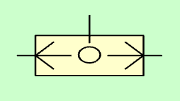
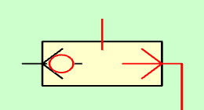
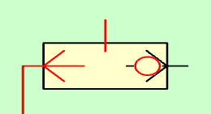
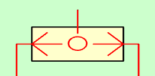
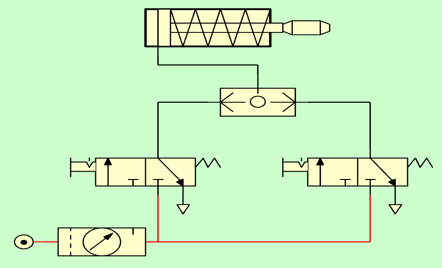
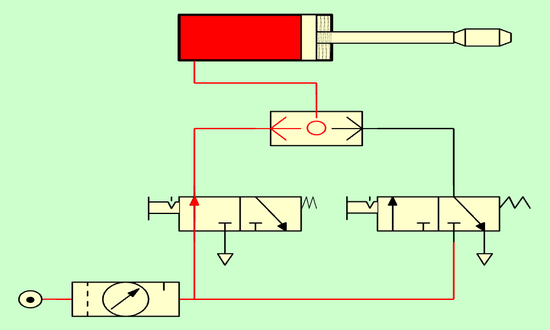
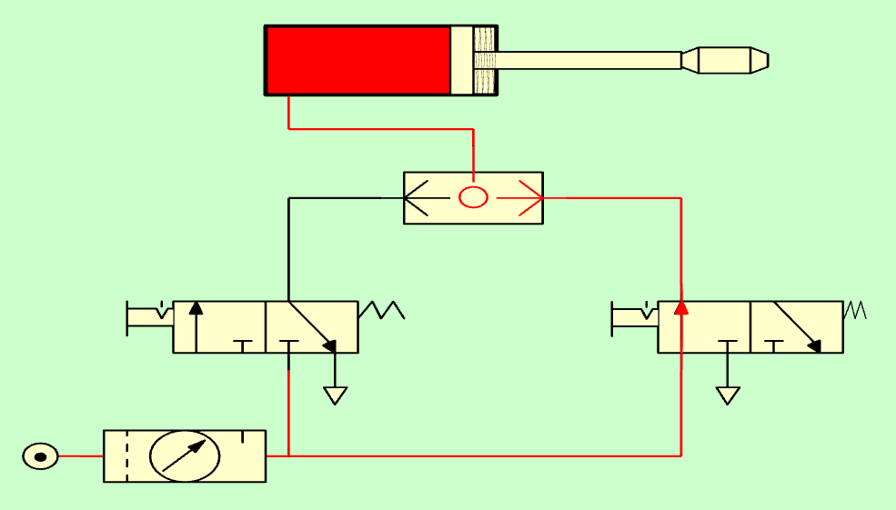

:Date: 06/04/2024
:Author: Carlos Félix Pardo Martín
:License: Creative Commons Attribution-ShareAlike 4.0 International

.. _mecan-neumatic-valvula-or:

La válvula selectora o válvula or
=================================
La **válvula selectora** o **válvula or** permite que el aire a presión
circule desde cualquiera de las vías de ambos lados hacia la vía superior.
Esta válvula no permite el paso del aire a presión desde la vía derecha
hacia la vía izquierda o viceversa.

El funcionamiento resumido puede explicarse diciendo que la válvula deja
pasar el aire a presión cuando le llega aire a presión por la vía izquierda
**o** por la vía derecha, de ahí su nombre.

El símbolo en reposo de la válvula selectora o válvula or es el siguiente:

   Válvula selectora o válvula or.

Cuando se inyecta aire a presión por la vía derecha, la bola central se
moverá hacia la izquierda, permitiendo el paso del aire hacia la vía
superior e impidiendo que el aire se escape por la vía izquierda.

   Válvula selectora con presión en la vía derecha.

El funcionamiento es semejante cuando se le inyecta aire a presión en
la vía izquierda, dejando pasar la presión por la vía superior y no
permitiendo que pase aire a presión por la vía derecha.

   Válvula selectora con presión en la vía izquierda.

Cuando se inyecta aire a presión por las vías derecha e izquierda,
el aire a presión sale por la vía superior.

   Válvula selectora con presión en ambas vías de entrada.

.. note::
   La válvula selectora es distinta a una simple unión de tubos porque
   impide que el aire a presión se escape por la vía que no tiene presión.

El funcionamiento de la válvula selectora o válvula or puede resumirse en
la siguiente tabla de verdad o tabla lógica:

.. list-table:: Tabla de verdad con el funcionamiento de la válvula selectora o válvula or.
   :widths: 20 20 20
   :align: center
   :header-rows: 1

   * - Vía izquierda
     - Vía derecha
     - Vía superior
   * - Sin presión
     - Sin presión
     - Sin presión
   * - Con presión
     - Sin presión
     - Con presión
   * - Sin presión
     - Con presión
     - Con presión
   * - Con presión
     - Con presión
     - Con presión

Si traducimos 'Sin presión' con un cero y 'Con presión' con un uno,
obtenemos la clásica tabla de verdad de la función or:

.. list-table::
   :widths: 20 20 20
   :align: center
   :header-rows: 1

   * - Vía izquierda
     - Vía derecha
     - Vía superior
   * - 0
     - 0
     - 0
   * - 1
     - 0
     - 1
   * - 0
     - 1
     - 1
   * - 1
     - 1
     - 1

Cilindro de simple efecto y válvula selectora
---------------------------------------------
En este circuito un cilindro de simple efecto es accionado por dos
válvulas 3/2 indistintamente. Es decir, al accionar cualquiera de las
dos válvulas el vástago del cilindro saldrá hacia fuera.

   Cilindro de simple efecto con válvula selectora.

En las siguientes figuras se puede ver al cilindro accionado desde la
válvula izquierda y desde la válvula derecha.

   Cilindro de simple efecto con válvula selectora con presión por por la izquierda.

   Cilindro de simple efecto con válvula selectora con presión por la derecha.

Es interesante comprobar cómo el aire a presión no se pierde a través
del escape de las válvulas en reposo, porque la válvula selectora impide
que el aire a presión salga por la vía que no tiene presión.

En el caso de accionar las dos válvulas, el vástago del cilindro también
saldrá hacia fuera.

Funcionamiento de una unión de tubos
------------------------------------
El funcionamiento de una unión de tubos neumáticos es algo parecida a la
de una válvula selectora, con la diferencia de que la presión de una vía
puede escaparse por la otra vía si esta se encuentra sin presión.

En el circuito anterior, el aire a presión que viene de la válvula
izquierda llega al cilindro y hace salir su vástago, pero también se
pierde presión por la válvula derecha que se encuentra conectada al
escape.

El resultado final es que el aire a presión saldrá todo el tiempo por el
escape de la válvula en reposo, haciendo mucho ruido y reduciendo la
presión del tubo y la fuerza con la que sale el cilindro de simple efecto.

Unión de válvulas selectoras
----------------------------
Las válvulas selectoras neumáticas se pueden disponer en cascada para unir
más de dos válvulas neumáticas de control en una sola vía de salida de
aire.

El funcionamiento de las válvulas en cascada es semejante al de una sola
válvula. Si cualquiera de las vías laterales recibe aire a presión,
este aire a presión se dirige hacia la vía superior.

   Unión de válvulas selectoras en cascada.

Ejercicios
----------

#. Dibuja el símbolo en reposo de una válvula selectora neumática.

#. Dibuja el funcionamiento de una válvula selectora neumática cuando
   recibe aire a presión por la vía derecha.

   Dibuja el funcionamiento de una válvula selectora neumática cuando
   recibe aire a presión por la vía izquierda.

#. Explica el funcionamiento de la válvula selectora y dibuja su tabla de
   verdad.

#. Simula el funcionamiento de un cilindro de simple efecto con un
   vástago que debe salir al accionar una cualquiera de las
   **dos válvulas 3/2** de maniobra.

   `Simulador de neumática. <../_static/flash/simulador-neumatica.html>`__

#. Dibuja el circuito anterior en papel y explica su funcionamiento.

#. Simula el funcionamiento de una unión de tubos neumáticos
   en el `simulador. <../_static/flash/simulador-neumatica.html>`__

#. Dibuja el circuito anterior en papel y explica su funcionamiento.

#. ¿Qué diferencias hay entre una válvula de simultaneidad neumática
   y una unión de tubos neumáticos?

#. ¿Para qué sirve la unión de válvulas selectoras neumáticas
   en cascada?

#. Simula un circuito que tenga tres válvulas 3/2 que accionen un
   cilindro de simple efecto. El vástago del cilindro debe salir fuera
   cuando se accione cualquiera de las tres válvulas individuales.

   `Simulador de neumática. <../_static/flash/simulador-neumatica.html>`__
