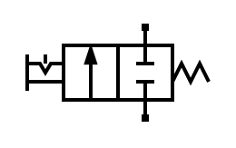
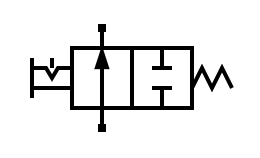

:Date: 30/12/2025
:Author: Carlos Félix Pardo Martín
:License: Creative Commons Attribution-ShareAlike 4.0 International

.. _mecan-neumatic-valvulas:

Válvulas neumáticas
===================
Las **válvulas neumáticas** son componentes que permiten cortar el paso
del aire comprimido o permitir el paso del aire comprimido a voluntad.

A continuación se muestra el símbolo de una válvula 2/2 normalmente
cerrada:

   
   Válvula 2/2 normalmente cerrada, en reposo.

La forma de denominar una válvula es la siguiente:
  * Primero, el nombre genérico **Válvula**
  * Segundo, el número de vías o tuberías por donde puede circular el aire.
    En este caso son **2** vías, una debajo y otra encima del cuerpo de
    la válvula.
  * Tercero, el número de posiciones de la válvula neumática. Son los 
    diferentes recuadros que tiene el símbolo, en este caso tiene **2**
    posiciones.  

Los **pilotajes** son los métodos que se utilizan para mover la válvula.
Las válvulas tienen 2 puntos de pilotaje, para accionarlas y para que 
pasen a reposo.
La válvula anterior **se acciona manualmente**, con enclavamiento y
pasa a reposo con ayuda de un **muelle**.

Válvula 2/2
-----------
Esta válvula es equivalente a un **grifo de pulsador**, como el que tienen
las fuentes de agua. Tiene dos posiciones, reposo y accionado.

Cuando la válvula está en **reposo**, el aire está cortado y no se permite
el flujo de aire a través de ella. Esto se indica con dos "T", que
representan el paso cerrado.

Cuando la válvula está **accionada**, el aire puede circular entre las dos
vías. Esto se indica mediante una flecha que une la vía inferior con la
superior:

   Válvula 2/2 normalmente cerrada, accionada.

.. note::
  Aunque la flecha indica el flujo preferente del aire desde la parte
  inferior hacia la superior, la válvula es como un grifo abierto y
  permite también que el flujo de aire circule a la inversa, desde 
  la vía superior a la vía inferior.

En neumática esta válvula no es muy utilizada, porque solo permite el 
paso de aire en un sentido y no permite el retorno de aire para vaciar
los cilindros neumáticos. 

De todas formas podemos encontrar ejemplos de uso de las válvulas 2/2 
en las máquinas para inflar neumáticos de las gasolineras,
en los gatillos de las pistolas de aire para limpieza
o en los pulsadores de los aerosoles.

Válvula 2/2 y cilindro
----------------------
Para comprobar los problemas que presenta una válvula 2/2 a la hora de
pilotar un cilindro neumático, vamos a simular su comportamiento
con el simulador:

.. raw:: html

   

   <iframe src="/neumatic/index.html?loadFile=single-22.txt"></iframe>
   

Primero vamos a seleccionar en el menú ``Simular... Iniciar`` para que
comience la simulación.

1. Al **accionar la válvula 2/2 de la izquierda**, permitimos el paso de
   aire desde el compresor hacia el cilindro y el vástago del cilindro
   saldrá hacia delante por completo.
2. Al **pasar a reposo la válvula 2/2 de la izquierda**, el paso de aire
   desde el compresor se cierra, pero el aire permanece almacenado en 
   el cilindro, que permanece extendido.
3. Ahora nos vemos obligados a **accionar la válvula 2/2 de la derecha**
   para permitir que el aire del cilindro se escape a la atmósfera y que
   el cilindro pueda volver a su posición inicial de reposo.

Este esquema es poco flexible porque necesita accionar dos válvulas
distintas para conseguir los dos movimientos del cilindro.
A pesar de eso, podemos ver ejemplos de su uso en los cilindros que
levantan automóviles en los talleres mecánicos.

Un problema que presenta este esquema es que si accionamos las dos
válvulas a la vez el aire del compresor se escapará rápidamente a la 
atmósfera, vaciando en poco tiempo el aire comprimido almacenado en el 
compresor. 

Ejercicios
----------

#. ¿Qué es una válvula neumática y de qué partes se compone?

#. ¿Cómo se nombra una válvula neumática?

#. Dibuja una válvula 2/2 en reposo y otra válvula 2/2 accionada.

#. Explica con tus palabras el funcionamiento de una válvula 2/2.

#. ¿Por qué la flecha del símbolo neumático está orientada hacia arriba?
   ¿Está permitido el paso de aire hacia abajo?

#. Escribe tres ejemplos de uso de las válvulas neumáticas 2/2.

#. Dibuja en el siguiente simulador el mismo circuito que puede verse
   en el simulador de más arriba. La simulación debe funcionar igual.

   .. raw:: html

      

      <iframe src="/neumatic/index.html"></iframe>
      

#. Explica con tus palabras el funcionamiento del circuito anterior.
  
#. ¿Qué pasará con el cilindro neumático en el circuito anterior si
   accionamos las dos válvulas a la vez?
   Simula este caso y explica el funcionamiento del circuito.
