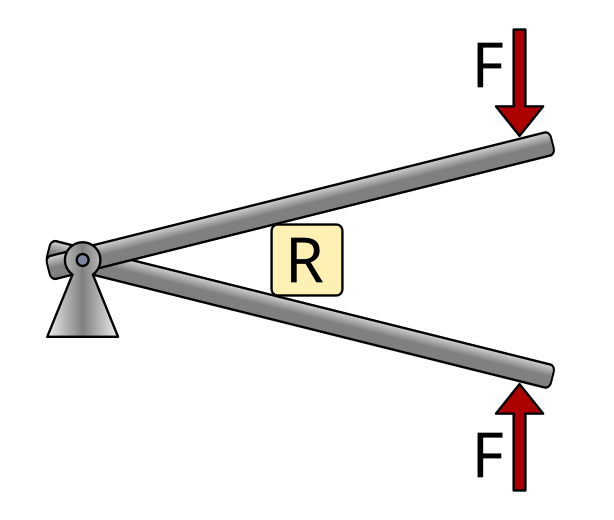
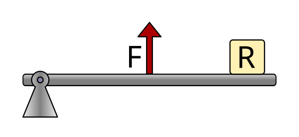
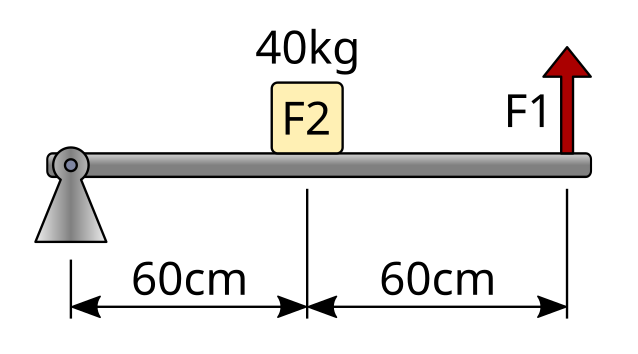

:Date: 25/05/2022
:Modified: 15/01/2026
:Author: Carlos Félix Pardo Martín
:License: Creative Commons Attribution-ShareAlike 4.0 International

.. _mecan-palancas:

:index:`Palancas`
=================
La **palanca** es una máquina simple formada por una **barra rígida**
que gira alrededor de un punto de apoyo llamado **fulcro**.

.. contents:: Índice de contenidos:
   :local:
   :depth: 2

Aplicaciones
------------
Las palancas se pueden utilizar para realizar varias funciones:

1. **Transmitir una fuerza** o un desplazamiento desde un punto a otro.
   Es el caso de unas tijeras que transmiten la fuerza y movimiento
   desde unos dedales adaptados a la mano, hasta la hoja de corte.
2. **Aumentar la fuerza** ejercida. Es el caso de un cascanueces o unos
   alicates.
3. **Aumentar el desplazamiento** aplicado. Es el caso de un remo o de
   una caña de pescar.

Dependiendo de la situación de la fuerza aplicada (F), de la resistencia
a mover (R) y del fulcro (△) podemos distinguir tres tipos de palancas.

Palancas de primer grado
------------------------
Las palancas de primer grado tienen el fulcro en el medio
de la barra, entre la fuerza aplicada y la resistencia.

Ejemplos de este tipo de palanca son un balancín, unas tijeras o
unos alicates.

.. image:: mecan/_images/mecan-palancas-04.png
   :alt: Palanca doble de primer grado
   :align: center
   :height: 213px

Palancas de segundo grado
-------------------------
Las palancas de segundo grado tienen la resistencia en el medio
de la barra, entre el fulcro y la fuerza aplicada.
El fulcro se encuentra en un extremo.

Ejemplos de este tipo de palanca son una carretilla, un cascanueces o
un sacacorchos.

Palancas de tercer grado
------------------------

Las palancas de tercer grado tienen la fuerza aplicada en el medio
de la barra, entre el fulcro y la resistencia.
El fulcro se encuentra en un extremo.

Ejemplos de este tipo de palanca son unas pinzas de depilar, nuestro
antebrazo cuando sube la mano o una caña de pescar.

Cálculo de fuerzas y distancias
-------------------------------
La fórmula para calcular las fuerzas y distancias involucradas en una
palanca iguala los torques producidos por las fuerzas.
El torque es el producto de una fuerza por su distancia al punto de
apoyo, de manera que la fórmula queda como sigue.

.. math::

   F_{1} \cdot d_{1} = F_{2} \cdot d_{2}

Siendo

   F1 = Fuerza aplicada 1

   d1 = Distancia desde la fuerza 1 hasta el punto de apoyo

   F2 = Resistencia o fuerza 2

   d2 = Distancia desde la fuerza 2 hasta el punto de apoyo

Las distancias pueden medirse en metros, centímetros, milímetros,
pulgadas, etc. Pero ambas distancias deben medirse siempre
con la misma unidad.

Las fuerzas pueden medirse en kilogramos-fuerza o en Newtons, siempre
que ambas fuerzas se midan con la misma unidad.

Ejercicio alicates
------------------
Como ejemplo, vamos a calcular la fuerza que realizan unos alicates
a los que aplicamos una fuerza de 10 kgf en el mango,
con las siguientes distancias:

El primer paso será escribir los datos del problema y traducir los
valores de distancia a la misma unidad, por ejemplo, a milímetros.

.. math::

   F_{1} = 10 \: kgf

.. math::

   d_{1} = 5,6 \: cm = 56 \: mm

.. math::

   d_{2} = 20 \: mm

A continuación escribimos la fórmula y sustituimos los valores conocidos:

.. math::

   F_{1} \cdot d_{1} = F_{2} \cdot d_{2}

.. math::

   10 \: kgf \cdot 56 \: mm = F_{2} \cdot 20 \: mm

Por último, despejamos la ecuación y calculamos el valor de la incógnita
con las mismas unidades que tenía la fuerza conocida:

.. math::

   \cfrac{10 \: kgf \cdot 56 \: mm}{20 \: mm} = F_{2}

.. math::

   F_{2} = \cfrac{560}{20} = 28 \: kgf

Ejercicio carretilla
--------------------
En este ejercicio vamos a calcular la fuerza que hay que realizar para
levantar una carretilla que lleva en su interior un peso de 40 kgf.
Las dimensiones de la carretilla simplificada son las siguientes:

El primer paso será escribir los datos del problema.
En este caso no es necesario convertir las unidades de distancia,
pues ambas distancias están dadas en centímetros.

.. math::

   F_{2} = 40 \: kgf

.. math::

   d_{1} = 60 \: cm + 60 \: cm = 120 \: cm

.. math::

   d_{2} = 60 \: cm

Como podemos ver, para calcular la distancia desde la fuerza 1 hasta el
punto de apoyo es necesario sumar las dos distancias que aparecen en
el dibujo.

A continuación escribimos la fórmula y sustituimos los valores conocidos:

.. math::

   F_{1} \cdot d_{1} = F_{2} \cdot d_{2}

.. math::

   F_{1} \cdot 120 \: cm = 40 \: kgf \cdot 60 \: cm

Por último despejamos la ecuación y calculamos el valor de la incógnita
(F1) con las mismas unidades que tenía la fuerza conocida,
kilogramo-fuerza:

.. math::

   F_{1} = \cfrac{40 \: kgf \cdot 60 \: cm}{120 \: cm}

.. math::

   F_{1} = \cfrac{2400}{120} = 20 \: kgf

Ejercicios de palancas
----------------------

:download:`Ejercicio para identificar palancas de primero, segundo
o tercer grado. Formato PDF <mecan/mecan-palancas-02.pdf>`

:download:`Ejercicio para identificar palancas de primero, segundo
o tercer grado. Formato DOC <mecan/mecan-palancas-02.doc>`

#. Un **martillo** se utiliza como palanca de primer grado para sacar un clavo.
   Se aplica una fuerza de 12 kgf en el extremo del mango.
   La distancia desde el punto de apoyo hasta la fuerza aplicada es de 
   30 cm, y la distancia desde el punto de apoyo hasta el clavo es de 30 mm.
   ¿Cuál es la fuerza que actúa sobre el clavo?

#. Unas **tijeras** funcionan como una palanca de primer grado.
   Se aplica una fuerza de 8 kgf en cada mango.
   La distancia desde el eje hasta el punto donde se aplica la fuerza es
   de 9 cm, y la distancia desde el eje hasta el punto de corte es de 3 cm.
   ¿Qué fuerza se ejerce en el punto de corte?

#. Una **barra** se utiliza como palanca de primer grado para levantar una
   piedra de 120 kgf de peso.
   La distancia desde el punto de apoyo hasta la piedra es de 40 cm, y 
   la distancia desde el punto de apoyo hasta donde se aplica la fuerza es
   de 160 cm. ¿Qué fuerza hay que aplicar para levantar la piedra?

#. Un **cascanueces** puede modelarse como una palanca de segundo grado.
   La nuez ejerce una resistencia de 15 kgf.
   La distancia desde el punto de apoyo hasta la nuez es de 4 cm,
   y la distancia desde el punto de apoyo hasta donde se aplica la fuerza
   es de 20 cm. ¿Qué fuerza hay que aplicar para romper la nuez?

#. Un **abridor de botellas** actúa como una palanca de segundo grado.
   La fuerza necesaria para levantar la chapa es de 25 kgf.
   La distancia desde el punto de apoyo hasta la chapa es de 2 cm, y la distancia desde el punto de apoyo hasta la fuerza aplicada es de 10 cm.
   ¿Cuánta fuerza debemos aplicar?

#. Una **prensa manual** para poner corchos en botellas funciona como una
   palanca de segundo grado.
   La prensa tiene las siguientes dimensiones:
   
   * La distancia desde el punto de apoyo hasta el corcho (carga) es de
     5 cm.
   * La distancia desde el corcho hasta el punto donde el operario
     aplica la fuerza es de 50 cm.

   Si el operario aplica una fuerza de 11 kgf en el mango de la prensa,
   ¿cuál es la fuerza que ejerce la prensa sobre el corcho?

#. Unas **pinzas** funcionan como una palanca de tercer grado.
   Se aplica una fuerza de 6 kgf con los dedos.
   La distancia desde el punto de apoyo hasta donde se aplica la fuerza
   es de 40 mm, y la distancia desde el punto de apoyo hasta el extremo
   de las pinzas es de 80 mm.
   ¿Qué fuerza se ejerce en el extremo de las pinzas?

#. El **antebrazo** puede modelarse como una palanca de tercer grado.
   El bíceps aplica una fuerza de 300 kgf.
   La distancia desde el codo hasta el punto donde actúa el bíceps es de
   50mm, y la distancia desde el codo hasta la mano es de 35 cm.
   ¿Con qué fuerza se puede levantar la mano?

#. Una **caña de pescar** funciona como una palanca de tercer grado.
   El pescador aplica una fuerza de 20 kgf con la mano tirando de la caña.
   La distancia desde el punto de apoyo (extremo de abajo de la caña, 
   apoyado en el suelo) hasta el punto donde se aplica la fuerza es de
   50 cm, y la longitud total de la caña es de 200 cm.
   ¿Cuál es la fuerza que ejerce el pez sobre la caña?