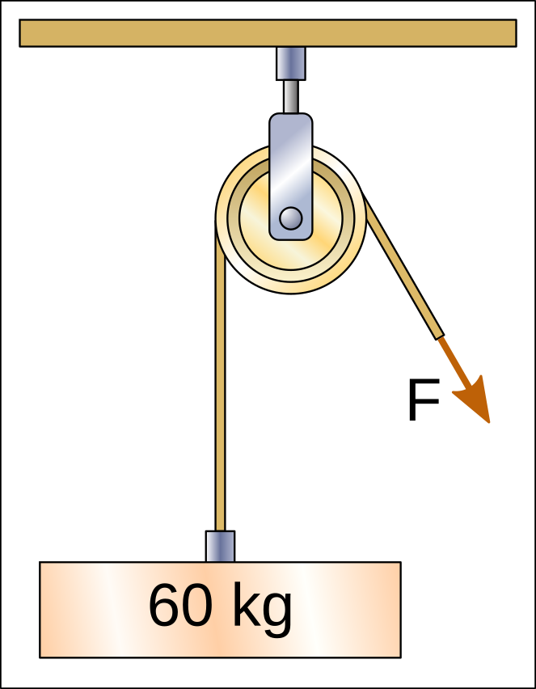
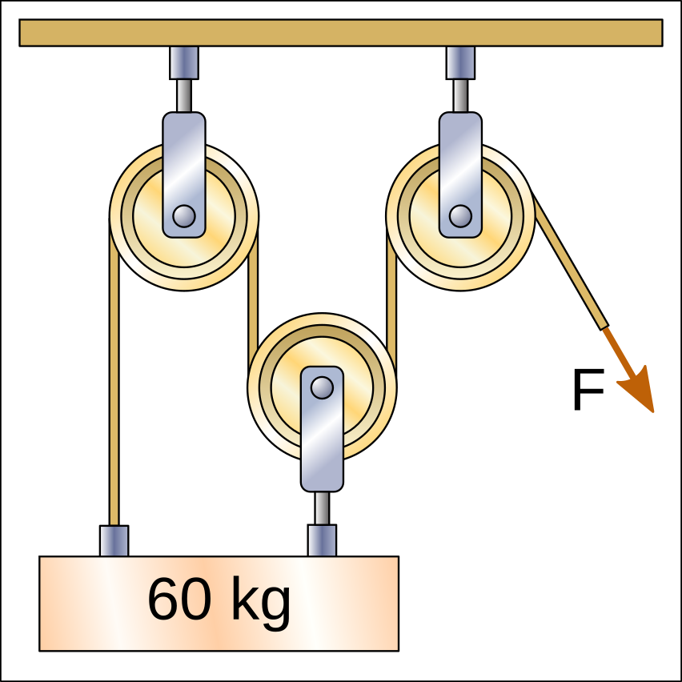

:Date: 22/05/2022
:Modified: 15/01/2026
:Author: Carlos Félix Pardo Martín
:License: Creative Commons Attribution-ShareAlike 4.0 International

.. _mecan-poleas:

:index:`Poleas` y :index:`Polipastos`
=====================================

Una **polea** es una **máquina simple** formada por una rueda con una
ranura alrededor por la que pasa una cuerda.

Las poleas se utilizan para **levantar objetos** o cambiar la dirección
de una fuerza.

Aplicaciones de las poleas
--------------------------
La **función** de la polea es desviar la dirección y la posición
de la cuerda, y por tanto, de la fuerza aplicada.

Por ejemplo:

* En un **pozo**, una polea permite levantar un cubo de agua
  tirando hacia abajo lejos del brocal, lo cual es más cómodo
  que tirar hacia arriba de la cuerda.

* En unas **cortinas**, las poleas permiten moverlas tirando de las
  cuerdas a la altura de la mano, aunque el raíl esté mucho más alto en
  el techo.

.. image:: mecan/_images/mecan-poleas-02.png
   :alt: Polea simple levantando una polea acoplada a un peso de 60kg.
   :align: center
   :height: 300px

.. image:: mecan/_images/mecan-poleas-09.png
   :alt: Doble polea levantando un peso de 60kg.
   :align: center
   :height: 284px

En todos estos ejemplos, las poleas solo cambian la dirección de la fuerza,
pero no reducen la cantidad de fuerza necesaria para levantar el peso.

Por lo tanto, para levantar un peso de 60 kgf (60 kilogramos-fuerza), hay
que estirar la cuerda con una fuerza de 60 kgf.

:index:`Polipastos`
-------------------
Un **polipasto** es un sistema formado por al menos una polea móvil,
unida al peso que queremos levantar.
El polipasto puede levantar pesos con ventaja mecánica, es decir,
que permite levantar un peso con menos fuerza.

Para calcular la fuerza necesaria para levantar el peso, hay que dividir
el peso entre el número de tramos de cuerda que están tirando del peso
hacia arriba.

En los siguientes polipastos hay **2 tramos de cuerda** que tiran del
peso hacia arriba y, por lo tanto, la fuerza que hay que realizar para
levantar el peso se divide entre los dos tramos, con un resultado de
30 kgf:

.. image:: mecan/_images/mecan-poleas-04.png
   :alt: Polipasto de dos poleas que levantan 60kg con la mitad de fuerza.
   :align: center
   :height: 284px

En los siguientes polipastos hay **3 tramos de cuerda** que tiran del
peso hacia arriba y, por lo tanto, la fuerza que hay que realizar para
levantar el peso se divide entre tres, con un resultado de 20 kgf.

.. image:: mecan/_images/mecan-poleas-05.png
   :alt: polipasto de dos poleas que levantan un peso de 60 kgf con
         un tercio de fuerza.
   :align: center
   :height: 284px

         un tercio de fuerza.
   :align: center
   :height: 284px

En los siguientes polipastos hay **4 tramos de cuerda** que tiran del
peso hacia arriba y, por lo tanto, la fuerza que hay que realizar para
levantar el peso se divide entre cuatro, con un resultado de 15 kgf.

         un cuarto de fuerza
   :align: center
   :height: 284px

.. image:: mecan/_images/mecan-poleas-08.png
   :alt: polipasto de cuatro poleas que levantan un peso de 60 kgf con
         un cuarto de fuerza.
   :align: center
   :height: 284px

Hay que tener en cuenta que, a veces, las poleas de no están enganchadas
al peso y, por lo tanto, no se cuentan a la hora de calcular la fuerza con
la que hay que tirar de la cuerda.

En el siguiente polipasto hay **2 tramos de cuerda** que tiran del peso
hacia arriba y, por lo tanto, la fuerza que hay que realizar para levantar
el peso se divide entre las dos, con un resultado de 30 kgf.

         la mitad de fuerza.
   :align: center
   :height: 284px

En el siguiente polipasto hay **3 tramos de cuerda** que tiran del peso
hacia arriba y, por lo tanto, la fuerza que hay que realizar para levantar
el peso se divide entre tres, con un resultado de 20 kgf.

.. image:: mecan/_images/mecan-poleas-11.png
   :alt: polipasto más poleas que levantan un peso de 60 kgf con
         un tercio de fuerza.
   :align: center
   :height: 284px

Polipastos anidados
-------------------
Un polipasto está anidado cuando un polipasto tira de la cuerda de
otro polipasto.

En este caso, cada uno divide la fuerza del otro, consiguiendo aún
más ventaja mecánica.

En el siguiente polipasto, la polea de abajo divide entre **dos
tramos de cuerda** el peso de 60 kgf, por lo que la primera cuerda
tendrá una tensión de solo 30 kgf.

La polea de arriba vuelve a dividir entre **dos tramos de cuerda** la
fuerza de la primera cuerda, por lo que la tensión será de 15 kgf.
Esta será la fuerza F que hay que realizar para subir el peso.

         con un cuarto de fuerza
   :align: center
   :height: 331px

Ejercicios
----------
Ejercicios de poleas y polipastos para calcular la fuerza
con la que debemos tirar de la cuerda para levantar un peso.

| :download:`Ejercicios de poleas y polipastos.
  Formato PDF. <mecan/mecan-poleas-ejercicios.pdf>`
|
| :download:`Ejercicios de poleas y polipastos.
  Formato editable ODT. <mecan/mecan-poleas-ejercicios.odt>`
