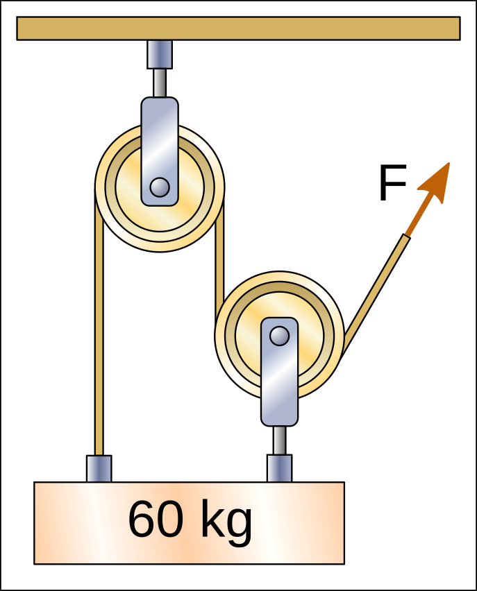

:Date: 22/05/2022
:Author: Carlos Félix Pardo Martín
:License: Creative Commons Attribution-ShareAlike 4.0 International

.. _mecan-poleas:

:index:`Poleas` y :index:`Polipastos`
=====================================

Una polea es una máquina simple formada por una rueda acanalada por
la que pasa una cuerda.

Aplicaciones de las poleas
--------------------------
La **función** de la polea es desviar la dirección y la posición
de la cuerda y por lo tanto de la fuerza de tensión aplicada.

De esta manera la cuerda de **un pozo** puede levantar un cubo de agua
haciendo fuerza hacia abajo lejos del brocal, lo que significa una
ventaja al poder tirar desde una posición más cómoda.

Unas **cortinas** pueden abrirse y cerrarse tirando de dos cuerdas
hacia abajo, al nivel de nuestra mano.
La función de las poleas aquí es mover la fuerza desde el nivel de
nuestra mano hasta el techo, donde se encuentra el raíl de las cortinas.

.. image:: mecan/_images/mecan-poleas-01.png
   :alt: Polea simple levantando un peso de 60kg.
   :align: center
   :height: 284px

.. image:: mecan/_images/mecan-poleas-02.png
   :alt: Polea simple levantando una polea acoplada a un peso de 60kg.
   :align: center
   :height: 300px

.. image:: mecan/_images/mecan-poleas-09.png
   :alt: Doble polea levantando un peso de 60kg.
   :align: center
   :height: 284px

En todos los casos anteriores las poleas desvían la dirección y la
posición de la fuerza, pero no reducen la fuerza necesaria para levantar
el peso.
Por lo tanto todas estas poleas necesitan que se estire el extremo de la
cuerda con una fuerza de 60kgf (60 kilogramos-fuerza) para poder levantar
los pesos.

:index:`Polipastos`
-------------------
Un polipasto está compuesto por al menos una polea móvil, enganchada
en el peso que se quiere mover. El polipasto puede levantar pesos
con ventaja mecánica, es decir, que podrá levantar un peso mayor que
la fuerza aplicada sobre la cuerda.

Para calcular la fuerza necesaria para levantar el peso, hay que dividir
el peso entre el número de tramos de cuerda que están tirando del peso
hacia arriba.

En los siguientes polipastos hay **2 tramos de cuerda** que tiran del
peso hacia arriba y por lo tanto la fuerza que hay que realizar para
levantar el peso se divide entre los dos tramos, con un resultado de
30kgf.

.. image:: mecan/_images/mecan-poleas-03.png
   :alt: polea acoplada a un peso de 60kg, que levanta con la mitad de fuerza.
   :align: center
   :height: 284px

En los siguientes polipastos hay **3 tramos de cuerda** que tiran del
peso hacia arriba y por lo tanto la fuerza que hay que realizar para
levantar el peso se divide entre tres, con un resultado de 20kgf.

         un tercio de fuerza.
   :align: center
   :height: 284px

.. image:: mecan/_images/mecan-poleas-07.png
   :alt: polipasto de tres poleas que levantan un peso de 60kg con
         un tercio de fuerza.
   :align: center
   :height: 284px

En los siguientes polipastos hay **4 tramos de cuerda** que tiran del
peso hacia arriba y por lo tanto la fuerza que hay que realizar para
levantar el peso se divide entre cuatro, con un resultado de 15kgf.

.. image:: mecan/_images/mecan-poleas-06.png
   :alt: polipasto de tres poleas que levantan un peso de 60kg con
         un cuarto de fuerza
   :align: center
   :height: 284px

.. image:: mecan/_images/mecan-poleas-08.png
   :alt: polipasto de cuatro poleas que levantan un peso de 60kg con
         un cuarto de fuerza.
   :align: center
   :height: 284px

Hay que tener en cuenta que a veces las poleas de no están enganchadas
al peso y por lo tanto no cuentan a la hora de calcular la fuerza con
la que hay que tirar de la cuerda.

En el siguiente polipasto hay **2 tramos de cuerda** que tiran del peso
hacia arriba y por lo tanto la fuerza que hay que realizar para levantar
el peso se divide entre las dos, con un resultado de 30kgf.

.. image:: mecan/_images/mecan-poleas-10.png
   :alt: polipasto más poleas que levantan un peso de 60kg con
         la mitad de fuerza.
   :align: center
   :height: 284px

En el siguiente polipasto hay **3 tramos de cuerda** que tiran del peso
hacia arriba y por lo tanto la fuerza que hay que realizar para levantar
el peso se divide entre tres, con un resultado de 20kgf.

         un tercio de fuerza.
   :align: center
   :height: 284px

Polipastos anidados
-------------------
Un polipasto puede tirar de la cuerda de otro polipasto y en ese
caso nos encontramos con un polipasto anidado.
Cada uno de los polipastos divide la fuerza que hay que realizar
sobre la cuerda.

En el siguiente polipasto, la polea de abajo divide entre **dos
tramos de cuerda** el peso de 60kg, por lo que la primera cuerda
tendrá una tensión de solo 30kgf.

La polea de arriba vuelve a dividir entre **dos tramos de cuerda** la
fuerza de la primera cuerda, por lo que la tensión será de 15kgf.
Esta será la fuerza F que hay que realizar para subir el peso.

.. image:: mecan/_images/mecan-poleas-12.png
   :alt: polipasto de dos poleas anidadas que levantan un peso de 60kg
         con un cuarto de fuerza
   :align: center
   :height: 331px

Ejercicios
----------
Ejercicios de poleas y polipastos para calcular la fuerza
con la que debemos tirar de la cuerda para levantar un peso.

| :download:`Ejercicios de poleas y polipastos.
  Formato PDF. <mecan/mecan-poleas-ejercicios.pdf>`
|
| :download:`Ejercicios de poleas y polipastos.
  Formato editable ODT. <mecan/mecan-poleas-ejercicios.odt>`
