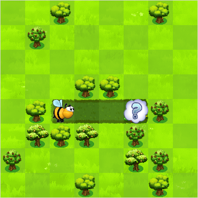

:Date: 10/12/2018
:Author: Carlos Félix Pardo Martín
:License: Creative Commons Attribution-ShareAlike 4.0 International
:tocdepth: 1

.. _prog-code-org:

Tutoriales Code
===============

.. image:: prog/_images/codeorg-logo.png
   :height: 120px
   :align: center

Code.org es una página que dispone de múltiples tutoriales para
aprender a programar, desde un nivel preescolar, hasta los
últimos cursos de secundaria.
Los cursos y tutoriales presentan problemas que se deben resolver
programando con bloques la solución.

.. image:: prog/_images/codeorg-37-program.png
   :align: center

La web permite realizar los ejercicios sin registrarse.
En el caso de querer registrarse, la página solo pide un e-mail,
que no tiene que ser real, y se almacenarán los resultados de una
sesión a otra.

Revisa el `catálogo completo de recursos de Code.org
<https://studio.code.org/catalog>`__ en su sitio web.

Cursos Code
-----------
Listado de cursos largos para aprender a programar. Cada una de las
etapas tiene un tiempo aproximado de realización de 40 minutos.

**Cursos modernos**

.. list-table::
   :widths: 20 20 50
   :header-rows: 1

   * - Curso
     - Edades
     - Etapas y ejercicios
   * - `Curso C <https://studio.code.org/s/coursec-2025>`__
     - De 6 a 10 años
     - 10 etapas con 111 ejercicios.
   * - `Curso D <https://studio.code.org/s/coursed-2025>`__
     - De 7 a 11 años
     - 12 etapas con 139 ejercicios.
   * - `Curso E <https://studio.code.org/s/coursee-2025>`__
     - De 8 a 12 años
     - 11 etapas con 130 ejercicios y proyecto final.
   * - `Curso F <https://studio.code.org/s/coursef-2025>`__
     - De 9 a 13 años
     - 14 etapas con 104 ejercicios y proyecto final.
   * - `Curso rápido <https://studio.code.org/s/express-2025>`__
     - De 9 a 18 años
     - 27 etapas largas con 318 ejercicios y proyecto.

Hora del código
---------------

*Hora del código* son pequeños tutoriales temáticos que se pueden
realizar en menos de una hora.

.. list-table::
   :widths: 15 60 15
   :header-rows: 1

   * - Número
     - Curso
     - Ejercicios
   * - 1
     - `Fiesta de baile <https://studio.code.org/s/dance/stage/1/puzzle/1>`__
     - 13
   * - 2
     - `¡Sigue bailando! <https://studio.code.org/s/dance-extras-2019/stage/1/puzzle/2>`__
     - 9
   * - 3
     - `Viaje acuático de Minecraft <https://studio.code.org/s/aquatic/lessons/1/levels/1>`__
     - 12
   * - 4
     - `Viaje del héroe de Minecraft <https://studio.code.org/s/hero/stage/1/puzzle/1>`__
     - 12
   * - 5
     - `Aventurero de Minecraft <https://studio.code.org/s/mc/lessons/1/levels/1>`__
     - 14
   * - 6
     - `Diseñador Minecraft <https://studio.code.org/s/minecraft/stage/1/puzzle/1>`__
     - 12
   * - 7
     - `Código Flappy <https://studio.code.org/flappy/1>`__
     - 10
   * - 8
     - `Hola Mundo <https://code.org/helloworld>`__
     - 11
   * - 9
     - `Compute it <https://compute-it.toxicode.fr/>`__
     - 60
   * - 10
     - `Arte del Poema <https://studio.code.org/s/poem-art-2021/lessons/1/levels/1>`__
     - 9
   * - 11
     - `AI para océanos <https://studio.code.org/s/oceans/lessons/1/levels/1>`__
     - 8
   * - 12
     - `Laberinto Angry Birds <https://studio.code.org/hoc/1>`__
     - 20
   * - 13
     - `Star Wars <https://studio.code.org/s/starwarsblocks/lessons/1/levels/1>`__
     - 15
   * - 14
     - `Frozen <https://studio.code.org/s/frozen/lessons/1/levels/1>`__
     - 20
   * - 15
     - `Simulador de epidemias <https://studio.code.org/s/outbreak/lessons/1/levels/1>`__
     - 10
   * - 16
     - `Artista <https://studio.code.org/s/artist/lessons/1/levels/1>`__
     - 10
   * - 17
     - `Juego de baloncesto <https://studio.code.org/s/basketball/lessons/1/levels/1>`__
     - 8
   * - 18
     - `Juego multideporte <https://studio.code.org/s/sports/lessons/1/levels/1>`__
     - 8
   * - 19
     - `Laboratorio de juegos clásico <https://studio.code.org/s/playlab/lessons/1/levels/1>`__
     - 10
   * - 20
     - `Laboratorio de juegos Ice Age <https://studio.code.org/s/iceage/lessons/1/levels/1>`__
     - 11
   * - 21
     - `Laboratorio de juegos Disney <https://studio.code.org/s/infinity/lessons/1/levels/1>`__
     - 10
   * - 22
     - `Laboratorio de juegos Gumball <https://studio.code.org/s/gumball/lessons/1/levels/1>`__
     - 11

Más ejercicios de `hora del código <https://code.org/learn>`__

Laboratorio de Apps
-------------------
Los laboratorios de programación de Apps permiten programar
en lenguaje java aplicaciones para smartphones.

