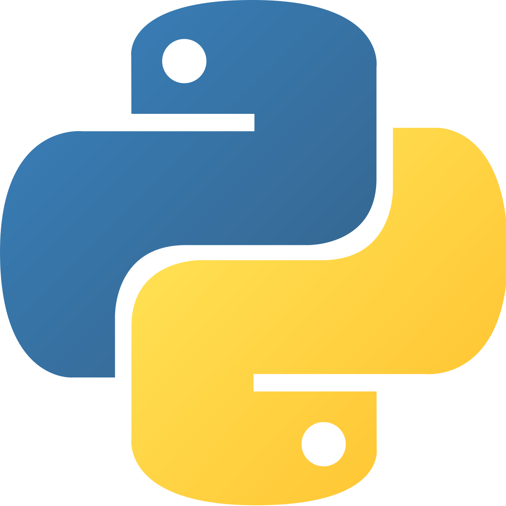
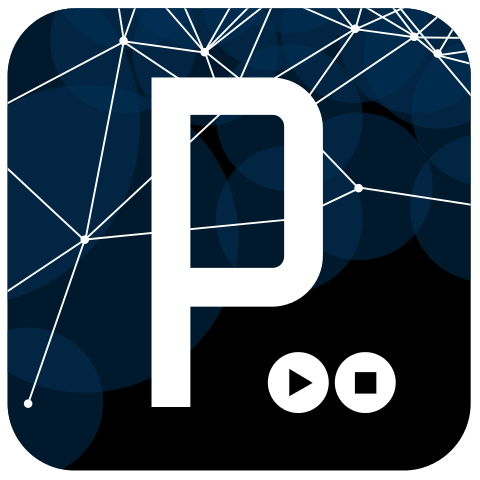

:Date: 10/12/2018
:Author: Carlos Félix Pardo Martín
:License: Creative Commons Attribution-ShareAlike 4.0 International
:tocdepth: 1

.. _prog-lang-edu:

Lenguajes de programación
=========================
Comparativa de diferentes lenguajes de programación para la enseñanza.

Programación por bloques
------------------------

Cursos Code
   .. image:: prog/_images/codeorg-logo.png
      :height: 120px

   * Website: `Code Studio <https://studio.code.org/courses>`__
   * Desarrollador: code.org
   * Programación: por bloques (basado en `Blockly
     <https://developers.google.com/blockly/>`__)
   * Gratuita. Multiplataforma (PC, Apple, Android) .

   Cursos guiados de diferentes niveles, desde 4 hasta 16 años, y de
   diferentes duraciones, desde 1 hasta 24 horas.

   Enseñan los fundamentos de la programación imperativa y estructurada.
   Secuencias, bucles, condicionales, variables, funciones y parámetros.

Scratch
   .. image:: prog/_images/scratch-logo.png
      :width: 240px

   * Website: `Scratch <https://scratch.mit.edu/>`__
   * Desarrollador: MIT
   * Programación: por bloques
   * Para programar: en navegador y PC
   * Multitarea
   * Software libre (con acceso al código). Mutiplataforma.

   Proyecto del MIT para enseñar programación a los niños en un
   entorno creativo. La web tiene multitud de proyectos compartidos
   que se pueden estudiar y reutilizar.

   Tutoriales scratch: :ref:`scratch-index`

Mblock
   .. image:: prog/_images/mblock-logo.png
      :height: 120px

   * Website: `mBlock <https://www.makeblock.es/soporte/mblock/>`__
   * Desarrollador: Makeblock, basado en Scratch
   * Programación: por bloques
   * Para programar: PC y Arduino
   * Multitarea
   * Software libre. Mutiplataforma.

   Proyecto basado en Scratch offline, que incluye instrucciones
   para Arduino y para los robots de Makeblock basados en Arduino.

   Se puede programar en Scratch y también se pueden hacer programas
   con bloques para Arduino. Una vez descargados a Arduino, los
   programas son independientes y funcionan sin conexión al PC.

Programación de Smartphones
---------------------------
Los smartphones Android, los más extendidos, se programan con el
lenguaje Java. Existen alternativas más sencillas orientadas a
la educación.

AppLab
   .. image:: prog/_images/applab-logo.png
      :height: 120px

   * Website: `AppLab <https://code.org/educate/applab>`__
   * Desarrollador: code.org
   * Programación: por bloques o en texto JavaScript
   * Gratuita y multiplataforma
   * Requiere crear una cuenta
   * Las apps se ejecutan en cualquier **smartphone** a
     través del navegador

AppInventor
   .. image:: prog/_images/appinventor-logo.png
      :width: 240px

   * Website: `AppInventor <http://appinventor.mit.edu>`__
   * Desarrollador: MIT
   * Programación: por bloques
   * Para programar: smartphones

Programación en texto
---------------------
Estos lenguajes tienen un nivel de dificultad más alto al programarse
escribiendo código en formato texto. Requiere aprender una gramática
que es más complicada que el simple movimiento de bloques.
Como ventaja, son mucho más potentes y flexibles.

Arduino
^^^^^^^

.. image:: prog/_images/arduino-logo.png
   :height: 120px

* Website: `Arduino <https://www.arduino.cc/>`__
* Desarrollador: Arduino
* Programación: texto, basado en lenguaje C
* Para programar: placas electrónicas Arduino y similares
* Software libre
* Gran cantidad de tutoriales de diversos niveles y calidad,
  orientados a proyectos DIY

Arduino se programa en lenguaje C con añadidos para hacerlo más
sencillo. Está dirigido a la programación de circuitos electrónicos,
montajes Maker y robots. Su objetivo es acercar la programación de
los microcontroladores a los estudiantes sin preparación técnica.

Python
^^^^^^

* Website: `Python <https://www.python.org>`__
* Desarrollador: Python foundation
* Programación: texto
* Para programar: PC
* Software libre. Mutiplataforma
* Muchos Tutoriales de muchos niveles, también en castellano.

Tutoriales:

* `Learn Python <http://www.learnpython.org/>`__
* `Code Academy <https://www.codecademy.com/learn/learn-python>`__

Lenguaje multiparadigma, muy sencillo de programar y de entender.
Es el lenguaje preferido por muchos colegios y universidades de
todo el mundo [1]_ para enseñar a programar.
Con este lenguaje se pueden programar proyectos desde cero con
gran rapidez y sencillez.

Python es uno de los lenguajes más usados y más populares
en la actualidad [2]_.
Está apoyado por Google y es el lenguaje seleccionado para
desarrollar sus aplicaciones de inteligencia artificial y Machine
Learning, el futuro de la informática.

Tiene multitud de tutoriales de todo tipo, de todos los niveles,
en inglés y en español y en formato libre y gratuito.

El entorno `Pygame <https://www.pygame.org/tags/all>`__ facilita
mucho la tarea de programar entornos gráficos y juegos para ordenador
y ofrece multitud de ejemplos didácticos y prácticos de programas
creados por diferentes autores.

A su vez, el entorno `Python Turtle
<https://docs.python.org/3.3/library/turtle.html>`__ emula al
entorno del lenguaje LOGO, creado por `Seymour Papert
<https://es.wikipedia.org/wiki/Seymour_Papert>`__ en el
MIT para enseñar a los niños a programar.

Processing
^^^^^^^^^^

* Website: `Processing <https://processing.org/>`__
* Desarrollador: Processing foundation
* Programación: texto. Basado en lenguaje Java
* Para programar: PC y smartphones
* Grandes posibilidades gráficas
* Software libre. Mutiplataforma
* Tutoriales solo en ingles y con nivel Bachillerato.

Tutoriales:

* `Tutoriales oficiales <https://processing.org/tutorials/>`__
* `Hour of code <http://hello.processing.org/editor/>`__

Processing es un entorno de programación en Java que ofrece muchas
facilidades para acercar la programación a los artistas permitiendo
desarrollar aplicaciones visuales con dibujos e imágenes en pantalla.

Al programar en Java, las aplicaciones se pueden subir a los
smartphones y tablets basadas en Android.

La desventaja de este lenguaje consiste en que los tutoriales se
encuentran en inglés y tienen un nivel relativamente alto,
de Bachillerato.
Por otro lado, con este lenguaje resulta complicado iniciarse en
el aprendizaje de la programación.

Machine Learning
----------------
El Machine Learning o aprendizaje automático es una rama de la inteligencia
artificial, muy de moda últimamente, que es capaz de generar modelos que
pueden predecir y clasificar datos a partir de un aprendizaje guiado o
autónomo.

En la página de `LearningML <https://web.learningml.org/>`__ se puede
leer una explicación más exhaustiva y se puede jugar con modelos
sencillos y fácilmente entrenables de Machine Learning para identificar
textos e imágenes.

El lenguaje de programación utilizado es Scratch 3 con el añadido de
las instrucciones necesarias para utilizar los modelos ML una vez
entrenados.

Otros recursos en Internet
--------------------------

`Lenguajes de programación educativa.
<https://www.educaciontrespuntocero.com/recursos/programacion/lenguajes-programacion-educativa-alternativas-a-scratch/35925.html>`__

`Qué lenguaje o herramientas de programación deberían enseñarse a
los niños según su edad.
<https://www.xataka.com/otros/que-lenguaje-o-herramientas-de-programacion-deberian-ensenarse-a-los-ninos-segun-su-edad>`__

-----

.. [1] `Schools using Python
       <https://wiki.python.org/moin/SchoolsUsingPython>`__

.. [2] `Índice Tiobe de lenguajes de programación
       <https://www.tiobe.com/tiobe-index/>`__
