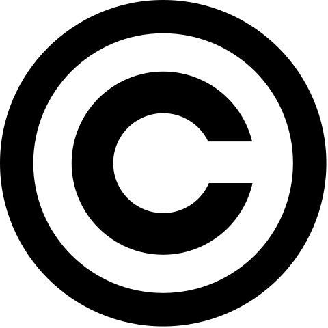
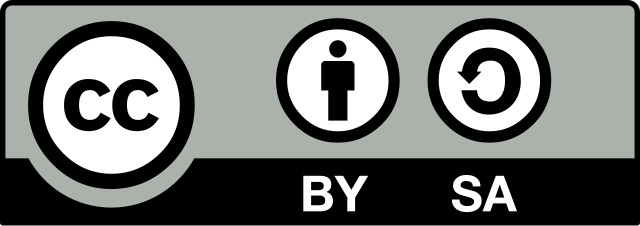
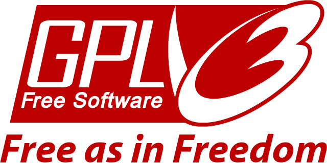
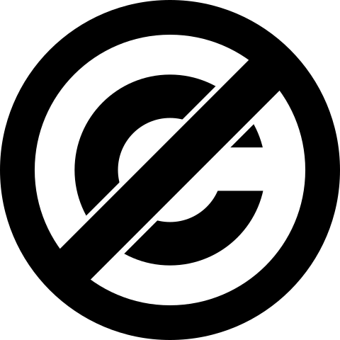

:Date: 28/08/2025
:Author: Carlos Félix Pardo Martín
:License: Creative Commons Attribution-ShareAlike 4.0 International
:tocdepth: 1

.. _recursos-copyright:

El derecho de autor
===================
El `derecho de autor o copyright
<https://es.wikipedia.org/wiki/Copyright>`__
es una **ley** que protege las obras creativas y permite
que solo el autor decida cómo se usan, copian, distribuyen, adapten o
exhiban sus obras.

Entre las `obras creativas protegidas por derecho de autor
<https://www.cultura.gob.es/cultura/areas/propiedadintelectual/mc/rpi/registro-obras/que-registrar.html>`__
se incluyen fotografías, dibujos, películas y vídeos, obras literarias,
trabajos escolares, esculturas, música, investigaciones científicas,
programas de ordenador, entre otras.

   Logotipo de derechos de autor reservados (copyright).

   `Masur <https://es.wikipedia.org/wiki/Archivo:Copyright.svg>`__,
   dominio público,
   via Wikimedia Commons.

El derecho de autor protege las expresiones creativas, pero no las ideas,
hechos, conocimientos o conceptos generales. Por eso, una obra puede
tratar sobre un niño que descubre que es mago y asiste a una escuela de
magia sin infringir ningún derecho de autor, ya que lo protegido es la
novela de Harry Potter, no su estilo ni su idea general.

No todas las creaciones están protegidas por **derecho de autor** 
(copyright).
Por ejemplo, los inventos se protegen mediante patentes, mientras que los
logotipos y marcas comerciales cuentan con otras formas de protección 
legal.

Todas las obras quedan protegidas por derechos de autor desde el momento
en que se crean. Aunque no es obligatorio registrarlas, sí es recomendable
hacerlo `en el registro de propiedad intelectual
<https://www.cultura.gob.es/cultura/areas/propiedadintelectual/mc/rpi/inicio.html>`__
para poder demostrar la autoría.

Tipos de derechos
-----------------

Derechos morales.
   Estos derechos no se pueden ceder a otros ni se pierden.
   
   * Reconocimiento de quién es el autor de la obra.
   * Oposición a modificaciones de la obra que atenten contra el honor
     o reputación del autor.
   
   
Derechos económicos.
   Estos derechos se pueden ceder a través de una licencia.
   
   * Reproducción.
   * Distribución.  
   * Traducción a otras lenguas.
   * Adaptación o modificación de la obra.

Cesión de derechos
------------------
Un autor puede ceder a otras personas o empresas sus derechos de copia,
distribución o exhibición de una obra, por ejemplo a una editorial, una
discográfica o una red social.
Esto se realiza mediante contratos donde se establecen las condiciones
de la cesión.

Al crear una cuenta en una red social, aceptamos un contrato de cesión
por el cual nuestras fotos, textos o vídeos pueden ser publicados y 
utilizados por la plataforma, a menudo con muy pocas limitaciones.

Existen también contratos estándar llamados **licencias libres**.
Estas permiten a un autor conceder permisos a cualquier persona interesada
en su obra sin necesidad de pedir autorización directa, favoreciendo
la difusión y creación de nuevas obras a partir de las originales.

Copyleft
--------
Las licencias **copyleft** son un tipo de licencias libres que el autor
puede aplicar a su obra para permitir que otras personas la usen, copien,
distribuyan o modifiquen.
La condición principal es que cualquier versión modificada o derivada debe
mantenerse bajo la **misma licencia copyleft**, garantizando que la obra
y sus derivados sigan siendo libres.

   Logotipo de copyleft (algunos derechos de autor reservados).

   `Zscout370 <https://commons.wikimedia.org/wiki/File:Copyleft.svg>`__,
   dominio público,
   via Wikimedia Commons.

Este tipo de licencias fomentan el acceso al conocimiento, su difusión y
la creación colaborativa de cultura, lo que explica su gran importancia.

Algunos ejemplos de licencias copyleft son la licencia Creative Commons
BY-SA y la licencia de software GPL.

Creative Commons BY-SA
----------------------
La organización sin ánimo de lucro **Creative Commons** ha creado varias
licencias estándar de cesión de derechos para fomentar la cultura libre.

Una de las licencias más conocidas es la **CC BY-SA**
(Reconocimiento-Compartir Igual), utilizada por **Wikipedia** para
difundir sus contenidos.
Esta licencia permite copiar, publicar y crear obras derivadas,
siempre que se reconozca al autor original y que las obras resultantes se
publiquen bajo la misma licencia CC BY-SA.

   Logotipo de la licencia Creative Commons Reconocimiento-Compartir igual.

   `Creative Commons <https://en.wikipedia.org/wiki/File:CC_BY-SA_icon.svg>`__,
   `licencia de uso <https://creativecommons.org/policies/>`__.

Licencia GPL
------------
La **licencia GPL (General Public License)** es una licencia destinada
exclusivamente al software de ordenador.
Por ejemplo, se utiliza en Linux, que es el núcleo de los teléfonos
Android.

Esta licencia permite usar el software libremente, estudiar su
funcionamiento, copiarlo y modificarlo.
La única condición que impone es que cualquier modificación se publique
también como **código abierto** y bajo la misma licencia libre GPL,
garantizando que siga siendo libre.

   Logotipo de la licencia de software GPL versión 3.

   `Free Software Foundation <https://es.wikipedia.org/wiki/Archivo:GPLv3_Logo.svg>`__,
   `licencia de uso <https://www.gnu.org/graphics/license-logos.html>`__.

La idea principal de la licencia GPL es fomentar la **colaboración y la
transparencia**.
Esta licencia garantiza que el software siga siendo libre, incluso cuando
otras personas lo modifican o mejoran.

Dominio público
---------------
Cuando han pasado muchos años desde la muerte del autor (por lo general
70), sus obras se vuelven de **dominio público**.
Esto quiere decir que cualquier persona puede copiarla, modificarla,
publicarla o usarla libremente sin pedir permiso.

   Logotipo de dominio público (sin derechos de autor).

   `Waldir <https://commons.wikimedia.org/wiki/File:PD-icon-black.svg>`__,
   dominio público,
   via Wikimedia Commons.

El autor también puede decidir regalar su obra al dominio público en
cualquier momento, para que todos puedan usarla libremente sin pedir
permiso.

Ejercicios
----------

#. ¿Qué es el derecho de autor o copyright?
   ¿Alguna vez has creado una obra que tenga derecho de autor?
   Explica brevemente.
#. ¿Qué derechos tiene un autor sobre su obra solo por crearla?
#. ¿Desde cuándo una obra está protegida por derechos de autor?
#. ¿Qué diferencia hay entre derechos de autor y una patente?
#. ¿Qué obras están protegidas por derechos de autor?
   Escribe 5 ejemplos.
#. Nombra tres ideas, hechos o conceptos que **no** estén protegidos
   por derechos de autor.
#. Escribe dos tipos de obras que no estén protegidas por los derechos
   de autor. Da un ejemplo de cada una.
#. ¿Qué significa ceder los derechos de una obra a una red social?
#. Escribe con tus palabras qué es copyleft.
#. Escribe dos ejemplos de licencias copyleft.
#. ¿Por qué crees que las licencias de Creative Commons fomentan la
   difusión y creación cultural?
   Escribe un ejemplo práctico de su uso.
#. ¿Para qué sirve una licencia GPL? 
   Escribe un ejemplo que utilice esta licencia.
#. ¿Qué significa que una obra esté en dominio público?
#. Da un ejemplo de una obra clásica que sea de dominio público.
#. ¿Cuándo pasa una obra a dominio público?

Recursos
--------
* `Guía práctica de licencias de uso para docentes
  <https://descargas.intef.es/cedec/proyectoedia/guias/contenidos/guiadelicencias/>`__.
* `Derechos de autor y licencias
  <https://formacion.intef.es/aulaenabierto/mod/book/tool/print/index.php?id=4360>`__.