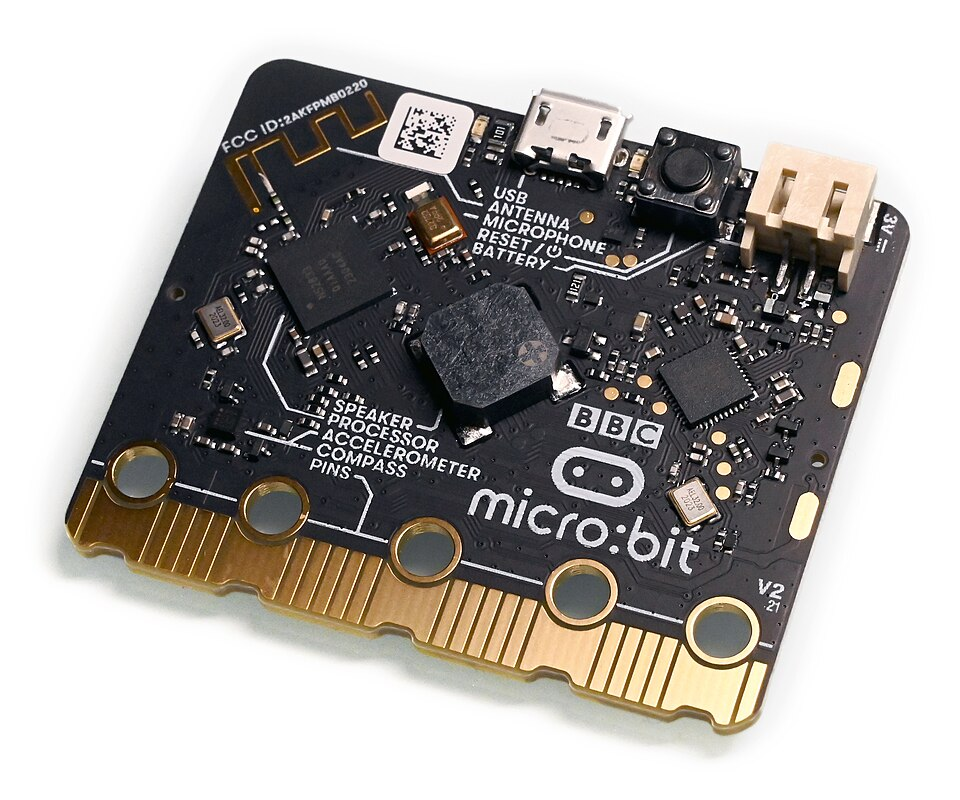

:Date: 13/09/2025
:Author: Carlos Félix Pardo Martín
:License: Creative Commons Attribution-ShareAlike 4.0 International

.. _robotica-microbit-index:

Micro:bit
=========
Placa controladora micro:bit. Teoría y proyectos.

   
   Placa controladora BBC micro:bit v2.
   
   `SimonWaldherr <https://commons.wikimedia.org/wiki/File:BBC_micro_bit_v2_(1).jpg>`__,
   `CC BY-SA 4.0 international <https://creativecommons.org/licenses/by/4.0/deed.en>`__,
   vía Wikimedia Commons.

.. toctree::
   :maxdepth: 1
   :titlesonly:

   robotica-microbit-makeit.rst