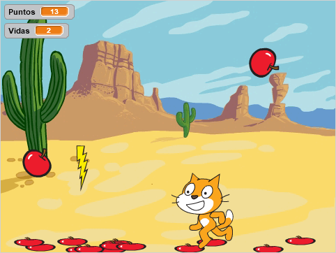

:Date: 10/12/2018
:Author: Carlos Félix Pardo Martín
:License: Creative Commons Attribution-ShareAlike 4.0 International

.. include:: scratch-subs.rst

.. _scratch-manzanas:

Atrapar manzanas
================

En esta práctica vamos a programar un juego que consiste en
atrapar manzanas con el gato y evitar los rayos que matan.
El gato se moverá con las teclas derecha e izquierda.
Cuando el gato pierda sus tres vidas, el juego se acabará.

|br|

1. Iniciamos el |editor_de_Scratch|.

   |br|

2. Cambiaremos el fondo del escenario a un **desierto**.

   Pulsamos el botón de Fondo nuevo.

   |cambia-escenario|

   A continuación pulsamos en **Tema Naturaleza**.

   Luego seleccionamos el fondo **Desert**.

   La pantalla quedará de la siguiente manera.

   .. image:: scratch/_images/scratch-p03-escenario.png

   |br|

3. Ahora debemos pulsar sobre el gato para realizar su
   programa. El icono del gato debe estar seleccionado.

   |gato-seleccionado|

   |br|

4. Pulsando en la letra **i** dentro del icono gato, podemos
   cambiar su nombre.

   .. image:: scratch/_images/scratch-p03-cambiar-nombre-gato.png

   |br|

5. En la pestaña programas del gato crearemos una nueva función
   llamada **Inicio**

   Primero pulsamos en el botón más bloques

   |mas-bloques|

   A continuación pulsamos en crear un bloque |crear-bloque|

   Luego cambiamos el nombre del nuevo bloque a **Inicio**

   .. image:: scratch/_images/scratch-bloque-inicio.png

   Por último pulsamos el botón **OK**

   |br|

6. Ahora crearemos la variable **Vidas**.

   Dentro de la pestaña Datos |datos|,

   pulsamos crear una variable  |crear-variable|

   Cambiamos el nombre de la variable a **Vidas**

   .. image:: scratch/_images/scratch-p03-variable-vidas.png

   Por último pulsamos el botón **OK**

   Esta variable va a almacenar las vidas que aún tiene el gato.
   Cuando su valor llegue a cero, el gato morirá.

   |br|

7. Ahora escribiremos el bloque de **Inicio**.

   Primero pulsamos en el botón más bloques

   |mas-bloques|

   A continuación pulsamos en crear un bloque |crear-bloque|

   Luego cambiamos el nombre del nuevo bloque a **Inicio**

   Colocamos los siguientes bloques en **Inicio**.

   .. image:: scratch/_images/scratch-p03-programa-inicio.png
      :width: 494px

   Este programa le da tres vidas al gato al comenzar.

   Coloca al gato en la parte baja de la pantalla, con el modo
   de rotación izquierda-derecha.

   También borra todas las imágenes de la pantalla.

   Por último espera a que se pulse la tecla espacio para continuar.

   |br|

8. Ahora programaremos un bloque que moverá al gato a
   derecha y a izquierda con las teclas de dirección.
   El nuevo bloque se llamará **Mover_gato**

   .. image:: scratch/_images/scratch-p03-programa-mover-gato.png
      :width: 507px

   |br|

9. Para terminar este apartado, realizaremos un pequeño
   programa que pondrá a prueba todo lo que hemos programado
   hasta el momento.

   .. image:: scratch/_images/scratch-p03-programa-gato1.png
      :width: 182px

   Al presionar la bandera verde |bandera-verde|,
   el gato esperará primero a que presionemos la barra de espacio,
   a continuación el gato se moverá a izquierda y a derecha
   al presionar las **teclas izquierda y derecha**.

Programa de las manzanas
------------------------

.. warning::

   A partir de este punto, todas las instrucciones se deben
   añadir en la pestaña Programas del objeto
   **manzana**.

|br|

10.
   Lo primero que haremos será añadir un nuevo personaje,
   una **manzana**

   Pulsamos el botón de nuevo objeto |nuevo-objeto|

   A continuación pulsamos en **Categoría Cosas**.

   Luego seleccionamos el objeto **Apple**.

   .. image:: scratch/_images/scratch-p03-manzana.png

   |br|

11.
   Ahora crearemos una nueva variable
   llamada **Puntos**

   Dentro de la pestaña Datos |datos|,

   pulsamos crear una variable  |crear-variable|

   Cambiamos el nombre de la variable a **Puntos**

   .. image:: scratch/_images/scratch-variable-puntos.png

   Por último pulsamos el botón **OK**

   Esta variable contará los puntos que acumula el personaje
   del juego.

   El gato ganará un punto cada vez que atrape una manzana
   y perderá dos puntos si la manzana cae al suelo.

   |br|

12.
   Ahora añadimos un nuevo mensaje
   llamado **Iniciar**

   Pulsamos el botón de Eventos.

   |eventos|

   y movemos a programas el bloque "al recibir mensaje1".

   Pinchando en la flecha, seleccionamos **nuevo mensaje...**

   |nuevo-mensaje|

   Nombramos el nuevo mensaje como **Iniciar**.

   .. image:: scratch/_images/scratch-p03-mensaje-iniciar.png

   Por último pulsamos el botón **OK**

   Este mensaje servirá para avisar a las **manzanas** de que
   pueden empezar a caer después de que se presione la tecla
   espacio.

   También borra los puntos para iniciar la partida y los
   muestra en la pantalla.

   |br|

13.
   Ahora podemos programar las instrucciones necesarias
   para que caigan las manzanas al recibir el mensaje **Iniciar**.

   .. image:: scratch/_images/scratch-p03-programa-manzana1.png
      :width: 518px

   El programa esconde el objeto para que no se vea en la pantalla,
   inicia el contador de puntos a cero,
   y crea copias de la manzana (clones de la manzana)
   cada cierto tiempo aleatorio, mientras el gato tenga vidas.

   |br|

14.
   Vamos a crear otro disfraz que represente a la manzana
   aplastada en el suelo en el suelo.

   Primero seleccionamos la pestaña disfraces |disfraces| de la manzana.

   A continuación seleccionamos con el botón derecho del ratón
   sobre el disfraz de la manzana para duplicarle.

   .. image:: scratch/_images/scratch-p03-duplicar-manzana.png

   En el disfraz Apple2 recién creado, aplastamos la imagen.

   .. image:: scratch/_images/scratch-p03-aplastar-manzana.png

   |br|

15.
   En este apartado definiremos cómo se comportan los clones
   de la manzana. Crearemos los siguientes programas.

   .. image:: scratch/_images/scratch-p03-programa-manzana2.png
      :width: 429px

   .. image:: scratch/_images/scratch-p03-programa-manzana3.png
      :width: 392px

   La manzana se coloca en la parte superior de la pantalla y
   va cayendo poco a poco (cambiar y por -10) hasta que toque al
   gato o hasta que caiga al suelo.

   Si la manzana toca al gato, aumenta los puntos y desaparece.

   Si la manzana toca el suelo, se aplastara y sonará un golpe.

   El programa se ha dividido en varias funciones para simplificar
   cada uno de los bloques.

   |br|

16.
   Ahora vamos a comprobar que funcionan las nuevas instrucciones.
   **Modificamos el programa del gato** para añadir el
   mensaje **Iniciar**

   .. image:: scratch/_images/scratch-p03-programa-gato2.png
      :width: 181px

   |br|

17.
   En este momento, el gato podrá jugar a recoger manzanas.
   Debemos mover al gato con las flechas izquierda y derecha
   para que toque las manzanas antes de que caigan al suelo.

Programa de los rayos
---------------------

En este apartado vamos a programar que varios rayos caigan
desde lo alto y que quiten vidas al gato. De esta forma damos
al juego mayor dificultad y emoción.

.. warning::

   A partir de este punto, todas las instrucciones se deben
   añadir en la pestaña Programas del objeto
   **rayo**.

|br|

18.
   Lo primero que haremos será añadir un nuevo personaje,
   un **rayo**.

   Pulsamos el botón de nuevo objeto |nuevo-objeto|

   A continuación pulsamos en **Categoría Cosas**.

   Luego seleccionamos el objeto **Lightning**.

   .. image:: scratch/_images/scratch-p03-rayo.png

   |br|

19.
   Ahora vamos a programar la caída de los rayos desde la
   parte alta de la pantalla. Al igual que pasaba con las
   manzanas, caerán rayos mientras el gato tenga vidas.

   .. image:: scratch/_images/scratch-p03-programa-rayo.png
      :width: 446px

   |br|

20.
   Vamos a añadir un sonido nuevo al rayo, para que el gato
   se queje al caerle un rayo.

   Seleccionamos la pestaña Sonidos |sonidos| del rayo.

   Pulsamos en seleccionar un sonido nuevo desde la
   librería |sonido-nuevo|.

   En la **Categoría Animal** seleccionamos el sonido **meow**

   .. image:: scratch/_images/scratch-p03-sonido-meow.png

   |br|

21.
   Ahora debemos crear un programa para cada
   clon del rayo.

   .. image:: scratch/_images/scratch-p03-programa-rayo-clon.png
      :width: 430px

   Estos programas situarán a cada rayo en una posición
   aleatoria cada vez que se cree un clon.
   A continuación el rayo caerá (cambiar y por -1) hasta
   que toque al gato o toque el borde inferior.

   Si el rayo toca al gato, le quitará una vida y se borra.

   Si el rayo toca el suelo, desaparece.

   |br|

22.
   Comprobaremos pulsando la bandera verde |bandera-verde| que todo
   funciona bien.

Muerte del gato
---------------

Cuando el gato pierde todas sus vidas el juego termina
y dejan de caer manzanas y rayos, pero el gato sigue en movimiento.
En esta sección vamos a añadir las instrucciones necesarias
para que el gato parezca muerto al acabar el juego.

.. warning::

   A partir de este punto, todas las instrucciones se deben
   añadir en la pestaña Programas del objeto
   **gato**.

|br|

23.
   Añadimos la función Gato_muere, que se ejecuta cuando
   el gato pierde todas sus vidas.

   .. image:: scratch/_images/scratch-p03-programa-gato-muere.png
      :width: 374px

   |br|

24.
   Y modificamos el programa
   del gato.

   .. image:: scratch/_images/scratch-p03-programa-gato3.png
      :width: 305px

   |br|

25.
   En este punto, para finalizar, vamos a añadir un sonido
   de fondo al juego.

   .. image:: scratch/_images/scratch-p03-programa-sonido.png
      :width: 332px

   |br|

26.
   Prueba el juego para comprobar que todo funciona
   correctamente.

-----

Ejercicios
----------

1. Modifica el programa para que el número de rayos aumente con
   el tiempo, de manera que el juego se haga cada vez más difícil.

