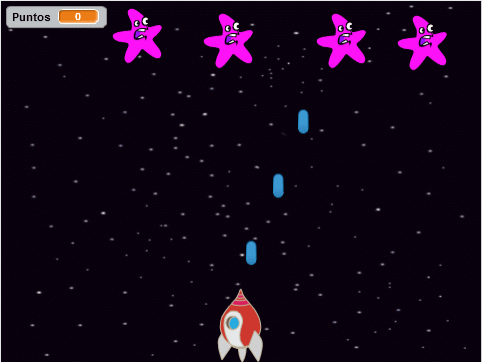

:Date: 10/12/2018
:Author: Carlos Félix Pardo Martín
:License: Creative Commons Attribution-ShareAlike 4.0 International

.. include:: scratch-subs.rst

.. _scratch-marcianitos:

Matar marcianitos
=================

En esta práctica vamos a programar un juego que consiste en matar
marcianos que caen desde la parte alta de la pantalla con el láser
de una nave espacial.

|br|

1. Iniciamos el |editor_de_Scratch|.

   |br|

2. Borramos al gato presionando sobre él con el botón derecho
   del ratón y luego pulsamos borrar.

   |borrar-gato|

   |br|

3. Cambiaremos el fondo del escenario con **estrellas**.

   Pulsamos el botón de Fondo nuevo.

   |cambia-escenario|

   A continuación pulsamos en **Tema Espacio**.

   Luego seleccionamos el fondo **stars**.

   La pantalla quedará de la siguiente manera.

   .. image:: scratch/_images/scratch-p05-stars.png

   |br|

4. Añadimos un nuevo personaje, una **nave espacial**.

   Pulsamos el botón de nuevo objeto |nuevo-objeto|

   A continuación pulsamos en **Tema Espacio**.

   Luego seleccionamos el objeto **Spaceship**.

   .. image:: scratch/_images/scratch-spaceship.png

   |br|

5. Añadimos un nuevo personaje, un **botón azul** que
   servirá para hacer los disparos.

   Pulsamos el botón de nuevo objeto |nuevo-objeto|

   A continuación pulsamos en **Categoría Cosas**.

   Luego seleccionamos el objeto **Button2**.

   .. image:: scratch/_images/scratch-button2.png

   Ahora, pulsando en el botón **i** del objeto, cambiamos
   su nombre a **Disparo**

   .. image:: scratch/_images/scratch-p05-disparo.png

   |br|

6. Añadimos una **estrella de mar**, que hará las veces de marciano.

   Pulsamos el botón de nuevo objeto |nuevo-objeto|

   A continuación pulsamos en **Categoría Animales**.

   Luego seleccionamos el objeto **Starfish**.

   .. image:: scratch/_images/scratch-starfish.png

   |br|

7. Añadimos la variable **Puntos**, que contará el número de
   puntos acumulados mientras jugamos.

   Dentro de la pestaña Datos |datos|,

   pulsamos crear una variable  |crear-variable|

   Cambiamos el nombre de la variable a **Puntos**

   .. image:: scratch/_images/scratch-variable-puntos.png

   Por último pulsamos el botón **OK**

   |br|

8. Ahora iremos al programa de la nave espacial

   .. image:: scratch/_images/scratch-p05-spaceship.png

   y allí creamos el siguiente programa.

   .. image:: scratch/_images/scratch-p05-spaceship-prog1.png
      :width: 443px

   Estas instrucciones inician el programa borrando la variable
   puntos, cambia el tamaño de la nave espacial y la coloca en
   la parte baja de la pantalla.

   |br|

9. Continuamos programando la nave espacial.

   .. image:: scratch/_images/scratch-p05-spaceship-prog2.png
      :width: 487px

   Este bloque mueve la nave espacial de izquierda a derecha y
   finaliza el programa cuando un marciano toque la nave.

   |br|

10.
   Con otra pequeña función, la nave podrá
   disparar su láser.

   .. image:: scratch/_images/scratch-p05-spaceship-prog3.png
      :width: 514px

   |br|

11.
   Probaremos que todo funciona correctamente presionando la
   bandera verde y moviendo la nave a izquierda y a derecha
   con las teclas de cursor.

   El láser funcionara más adelante cuando programemos el
   objeto **Disparo**.

Disparo láser
-------------

12.
   Ahora iremos al programa del
   objeto **Disparo**

   .. image:: scratch/_images/scratch-p05-disparo.png

   y allí programaremos su funcionamiento.

   .. image:: scratch/_images/scratch-p05-disparo-prog1.png
      :width: 628px

   Este programa sitúa el inicio del láser en la parte baja de
   la pantalla (y = -120),

   coloca al botón en posición vertical (dirección 0)

   y reduce el tamaño para que el botón azul parezca un
   disparo (tamaño a 20%)

   A continuación, cada clon aparece en la posición actual de
   la nave espacial y se mueve hacia arriba hasta llegar al
   final de la pantalla, lugar donde desaparece.

   |br|

13.
   En este punto ya se puede probar el funcionamiento de
   los disparos con la nave espacial.

Marcianos
---------

14.
   Ahora iremos al programa del
   objeto **Starfish**

   .. image:: scratch/_images/scratch-p05-starfish.png

   Y vamos a programar el comportamiento de los
   marcianos al comenzar el programa.

   .. image:: scratch/_images/scratch-p05-starfish-prog1.png
      :width: 519px

   Este programa inicia 10 marcianos en la parte alta de la
   pantalla y va creando cada cierto tiempo más marcianos.

   |br|

#. El programa que maneja cada uno de los marcianos
   será el siguiente.

   .. image:: scratch/_images/scratch-p05-starfish-prog2.png
      :width: 494px

   Al iniciarse un nuevo marciano, aparece en la parte alta de la
   pantalla, en una posición aleatoria.

   Si un disparo toca a un marciano, este desaparece
   y el contador de puntos aumenta un punto

   Si el marciano toca el borde inferior, esta desaparece
   y el contador de puntos disminuye 10 puntos.

   Cada medio segundo, el marciano baja hacia la parte baja
   de la pantalla.

   |br|

#. Este es el momento de probar todos los programas juntos y
   jugar un rato a los marcianitos.

   |br|

-----

Ejercicios
----------

1. Cambia los parámetros del programa para ajustar su dificultad
   haciendo que aparezcan más marcianos por segundo y que bajen
   más rápido.

#. Añade una función de disparo doble para la nave espacial
   al pulsar la tecla "flecha arriba"

#. Añade una barrera que proteja durante un segundo a la nave
   espacial al pulsar "flecha abajo".

#. Inventa otra modificación original para el programa.

