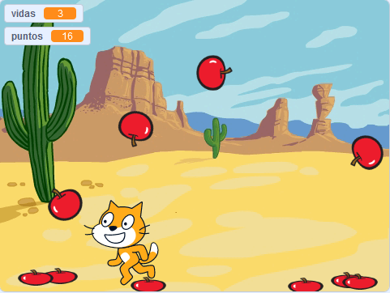

:Date: 25/09/2019
:Author: Carlos Félix Pardo Martín
:License: Creative Commons Attribution-ShareAlike 4.0 International

.. include:: scratch3-subs.rst

.. _scratch3-atrapar-manzanas:

Atrapar manzanas
================

En esta práctica vamos a programar un juego que consiste
en atrapar manzanas con un gato y evitar los rayos que matan.
El gato se moverá con las teclas derecha e izquierda.
Cuando el gato pierda sus tres vidas, el juego se acabará.

|br|

1. Iniciamos el |editor_de_Scratch|.

   |br|

#. Pulsamos el botón idioma |boton-idioma| en la barra
   superior y elegimos **Español**.

   |br|

#. Ahora escogemos un fondo adecuado para nuestro juego.
   Cambiamos el fondo de escenario por **un desierto**.

   Pulsamos el botón elige un fondo |seleccionar-fondo|.

   Buscamos en la sección **Exteriores**.

   y seleccionamos el fondo **Desert**.

   .. image:: scratch3/_images/scratch3-fondo-desert.png

   |br|

#. Cambiamos el nombre del objeto por **Gato**.

   .. image:: scratch3/_images/scratch3-objeto-nombre-gato.png

   |br|

#. Creamos la variable **vidas** que guardará el número de vidas
   que tiene el Gato.
   Cuando esta variable valga cero, el programa terminará.

   Pulsamos el botón de variables |boton-variables|,

   pulsamos en crear una variable  |boton-crear-variable|.

   Cambiamos el nombre de la variable a **vidas**

   .. image:: scratch3/_images/scratch3-crear-variable-vidas.png

   Por último pulsamos el botón **Aceptar**

   |br|

#. Ahora programamos las instrucciones de iniciación para el
   objeto Gato.
   Este programa dará tres vidas al gato, mostrará el valor
   en pantalla, colocará al gato debajo de la pantalla y
   el estilo de rotación a derecha e izquierda.

   .. image:: scratch3/_images/scratch3-p08-gato-01.png
      :width: 333px

   |br|

#. Continuamos dando al gato movimiento a un lado y a otro.
   El siguiente programa comprueba si se ha pulsado una tecla
   de flecha izquierda o de flecha derecha y en caso afirmativo,
   mueve al gato en una u otra dirección.

   .. image:: scratch3/_images/scratch3-p08-gato-02.png
      :width: 446px

   |br|

#. Pulsamos la bandera verde |bandera-verde|
   para probar el funcionamiento del programa.

   |br|

#. Ahora creamos la variable **puntos** que guardará el número
   de puntos que hemos conseguido al atrapar las manzanas.

   Pulsamos el botón de variables |boton-variables|,

   pulsamos en crear una variable  |boton-crear-variable|.

   Cambiamos el nombre de la variable a **puntos**

   .. image:: scratch3/_images/scratch3-crear-variable-puntos.png

   Por último pulsamos el botón **Aceptar**

   |br|

#. A continuación añadimos un nuevo personaje, una **manzana**.

   Pulsamos el botón elige un objeto |seleccionar-objeto|.

   Buscamos en la sección **Comida**.

   y seleccionamos el objeto **Apple**.

   .. image:: scratch3/_images/scratch3-objeto-apple.png

   |br|

#. Vamos a crear otro disfraz para la manzana, una manzana aplastada.
   Primero vamos a la pestaña de disfraces |pestania-disfraces|

   A continuación duplicamos el disfraz de la manzana.

   .. image:: scratch3/_images/scratch3-p08-duplicar-disfraz-manzana.png

   |br|

   Ahora seleccionamos el disfraz duplicado y lo aplastamos.

   .. image:: scratch3/_images/scratch3-p08-seleccionar-disfraz-manzana.png

   .. image:: scratch3/_images/scratch3-p08-aplastar-disfraz-manzana.png

   |br|

#. Ya podemos realizar el programa de la manzana dentro de la
   pestaña de código |pestania-codigo| de la manzana.

   Primero vamos a esconder la manzana, asignamos cero a los puntos
   y vamos creando clones de la manzana para que aparezcan
   en pantalla, mientras el gato tenga vidas.

   .. image:: scratch3/_images/scratch3-p08-manzana-01.png
      :width: 431px

#. Antes de realizar el siguiente programa, se debe definir el
   bloque "caer suelo".
   Dentro del apartado Mis bloques |boton-misbloques|
   pulsamos "Crear un bloque" |boton-crear-bloque|
   y en el nombre del bloque escribimos "**caer suelo**".

#. El siguiente programa hará aparecer cada clon de la manzana
   en la parte superior en una posición aleatoria, para que luego
   caiga hacia el suelo.

   .. image:: scratch3/_images/scratch3-p08-manzana-02.png
      :width: 423px

#. Por último programamos el bloque que hace caer la manzana
   hasta el suelo.
   En caso de tocar al gato, aumentará un punto y el clon de
   la manzana desaparece.
   Si el clon de la manzana toca el suelo, se aplastará.

   .. image:: scratch3/_images/scratch3-p08-manzana-03.png
      :width: 410px

   |br|

#. Pulsamos la bandera verde |bandera-verde|
   para probar el funcionamiento del programa.

   |br|

#. Añadimos un nuevo objeto, un **rayo**.

   Pulsamos el botón elige un objeto |seleccionar-objeto|.

   Buscamos en la sección **Todos**.

   y seleccionamos el objeto **Lightning**.

   .. image:: scratch3/_images/scratch3-objeto-lightning.png

   |br|

#. Ahora realizamos el programa para que el se generen clones
   del rayo cada pocos segundos.

   .. image:: scratch3/_images/scratch3-p08-rayo-01.png
      :width: 427px

   |br|

#. Cada vez que se genera un clon su comportamiento será el
   siguiente.

   Bajará desde la parte alta de la pantalla.
   Si toca al gato, las vidas se reducen en una.
   Si toca el borde inferior, el rayo desaparece.

   .. image:: scratch3/_images/scratch3-p08-rayo-02.png
      :width: 416px

   |br|

#. Por último programamos al gato para que se muera al llegar
   las vidas a cero. Primero seleccionamos el objeto gato.

   .. image:: scratch3/_images/scratch3-p08-seleccionar-gato.png

   A continuación añadimos el programa.

   .. image:: scratch3/_images/scratch3-p08-gato-03.png
      :width: 378px

   |br|

#. Pulsamos la bandera verde |bandera-verde|
   para probar el funcionamiento del programa.

   |br|

-----

Retos
-----

1. Añade un nuevo personaje que quite vidas igual que el rayo.
   Este nuevo personaje debe aparecer después de 10 segundos de
   juego.

   |br|

#. Modifica el programa para que el número de rayos aumente con el
   tiempo, de manera que el juego se haga cada vez más difícil.

   Para conseguirlo, debes crear una nueva variable llamada
   Tiempo_entre_rayos. La variable debe iniciarse a 2 (dos segundos)
   al presionar la bandera verde. Al cabo de 10 segundos,
   cambiaremos el valor de la variable a 1 (un segundo).
   Después de otros 10 segundos cambiaremos el valor de la variable
   a 0.5 (medio segundo).

   Para que los rayos aparezcan a diferentes velocidades, debes
   cambiar el tiempo de espera entre creación de rayos por el valor
   de la variable 'Tiempo_entre_rayos'.