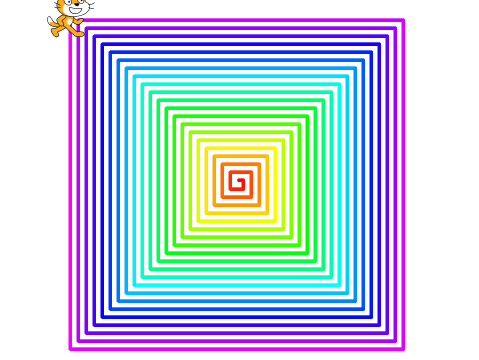

:Date: 29/09/2019
:Author: Carlos Félix Pardo Martín
:License: Creative Commons Attribution-ShareAlike 4.0 International

.. include:: scratch3-subs.rst

.. _scratch3-dibujar-espirales:

Dibujar espirales
=================

En esta práctica vamos a mover a un personaje por la
pantalla para que dibuje varias espirales con colores.

|br|

1. Iniciamos el |editor_de_Scratch|.

   |br|

#. Pulsamos el botón idioma |boton-idioma| en la barra
   superior y elegimos **Español**.

   |br|

#. Añadimos una nueva variable **Lado** que guardará
   el tamaño del lado que se está dibujando en este momento.

   Pulsamos el botón de variables |boton-variables|,

   pulsamos en crear una variable  |boton-crear-variable|.

   Cambiamos el nombre de la variable a **Lado**

   |br|

#. Añadimos una nueva extensión con el botón **añadir extensión**
   |aniadir-extension| abajo a la izquierda.

   Seleccionamos la extensión **Lápiz** para poder dibujar.

   .. image:: scratch3/_images/scratch3-extension-lapiz.png

   En la barra de código aparecerá un nuevo icono, el Lápiz
   |boton-lapiz|, con instrucciones de color verde oscuro.

   |br|

#. Creamos un nuevo bloque llamado **inicio**.

   Primero pulsamos en el botón mis bloques  |boton-misbloques|

   A continuación pulsamos en crear un bloque |boton-crear-bloque|

   Luego cambiamos el nombre del nuevo bloque a **inicio**

   |br|

#. El bloque **inicio** servirá para iniciar el programa.
   Moverá al gato al centro de la pantalla con tamaño pequeño.
   Esconde la variable Lado, baja el lápiz para que pinte,
   establece el grosor y color del lápiz y borra la pantalla.

   .. image:: scratch3/_images/scratch3-p10-inicio.png
      :width: 284px

   |br|

#. Creamos un nuevo bloque llamado **cuadrado**.

   Primero pulsamos en el botón mis bloques  |boton-misbloques|

   A continuación pulsamos en crear un bloque |boton-crear-bloque|

   Luego cambiamos el nombre del nuevo bloque a **cuadrado**

   |br|

#. El bloque **cuadrado** servirá para dibujar una espiral
   cuadrada en la pantalla.

   El tamaño del lado se inicia con el valor 5 y va creciendo
   de 4 en 4 hasta que valga igual o más que 340.

   En cada paso se dibuja una línea de tamaño "Lado",
   aumenta el tamaño del lado, gira 90º y
   aumenta el color del lápiz.

   .. image:: scratch3/_images/scratch3-p10-cuadrado.png
      :width: 338px

   |br|

#. Si hacemos clic sobre el bloque **"definir cuadrado"**,
   en la pantalla aparecerá la espiral cuadrada.

   .. image:: scratch3/_images/scratch3-p10-screen-cuadrado.png

   |br|

#. Ahora vamos a crear un nuevo bloque llamado **triangulo**.

   Primero pulsamos en el botón mis bloques  |boton-misbloques|

   A continuación pulsamos en crear un bloque |boton-crear-bloque|

   Luego cambiamos el nombre del nuevo bloque a **triangulo**

   |br|

#. El bloque **triángulo** es muy parecido al bloque **cuadrado**,
   solo cambia el ángulo de giro.

   Para aprovechar el programa ya realizado, vamos a pulsar
   con el botón derecho del ratón sobre las instrucciones
   de **cuadrado** y elegimos la opción duplicar.

   .. image:: scratch3/_images/scratch3-p10-duplicar.png

   una vez duplicado el programa, lo enganchamos en el bloque
   triángulo y cambiamos el ángulo de giro.

   .. image:: scratch3/_images/scratch3-p10-triangulo.png
      :width: 337px

#. Si hacemos clic sobre el bloque **"definir triangulo"**,
   en la pantalla aparecerá la espiral triangular.

   .. image:: scratch3/_images/scratch3-p10-screen-triangulo.png

-----

Retos
-----

1. Haz un nuevo bloque que dibuje una espiral en estrella.
   Modifica los parámetros del nuevo bloque para girar 150 grados.

   .. image:: scratch3/_images/scratch3-p10-screen-estrella.png

   |br|

#. Crea un nuevo bloque para dibujar una espiral octogonal.
   Los giros deben ser de 45 grados.
   El lado debe sumar 1 en cada repetición y
   se debe repetir hasta que el lado sea mayor que 150.

   .. image:: scratch3/_images/scratch3-p10-screen-octogono.png

   |br|

#. Experimenta con el programa para crear nuevos dibujos originales.